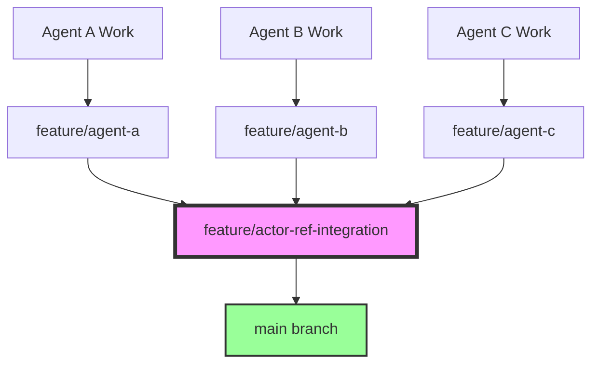

# 🤖 Agent-Centric Development Workflow Guide

> **Complete guide to parallel agent development using Git worktrees, automation scripts, and intelligent guardrails**

## ⚡ Quick Reference

### 🚀 Essential Commands
```bash
# One-time setup
./scripts/setup-agent-worktrees.sh

# Daily routine
cd ../actor-web-[your-area]                    # Go to your workspace
./scripts/agent-workflow.sh sync               # Get latest changes (MANDATORY)
./scripts/agent-workflow.sh status             # Check your status

# During development
./scripts/agent-workflow.sh save               # Quick save (commit + push)
./scripts/agent-workflow.sh validate           # Check only your files

# Feature completion
./scripts/agent-workflow.sh ship               # Full workflow to integration

# Maintenance
./scripts/worktree-maintenance.sh check        # Health check
```

### 🎭 Agent Workspaces
- **🏛️ Agent A (Architecture)**: `cd ../actor-web-architecture`
- **⚙️ Agent B (Implementation)**: `cd ../actor-web-implementation`  
- **🧪 Agent C (Testing)**: `cd ../actor-web-tests`

---

## 📋 Table of Contents

1. [🎯 Overview](#-overview)
2. [🌿 Git Worktree Architecture](#-git-worktree-architecture)
3. [🤖 Agent Coordination Model](#-agent-coordination-model)
4. [🛠️ Scripts & Automation](#-scripts--automation)
5. [🛡️ Guardrails & Safety](#-guardrails--safety)
6. [📅 Daily Workflows](#-daily-workflows)
7. [🚨 Troubleshooting](#-troubleshooting)
8. [🎯 Best Practices](#-best-practices)

---

## 🎯 Overview

This workflow solves the **fundamental problem of multiple agents (human or AI) working on the same codebase simultaneously** without conflicts, merge chaos, or coordination overhead.

### 🚀 Key Benefits

- **🚫 Zero Branch Conflicts**: Each agent has their own isolated workspace
- **⚡ Instant Context Switching**: No more `git checkout` delays
- **🔄 Automated Coordination**: Smart scripts handle integration complexity
- **🛡️ Built-in Safety**: Guardrails prevent common mistakes
- **📊 Targeted Validation**: Only validates files you actually changed
- **🤝 Seamless Collaboration**: Agents work independently but stay coordinated

---

## 🌿 Git Worktree Architecture

### The Problem We Solved

**Before**: Shared workspace chaos
```bash
# Agent A working on feature
git checkout feature/agent-a

# Agent B tries to switch branches
git checkout feature/agent-b  # ❌ Conflicts with Agent A's work!

# Result: Branch thrashing, lost work, merge conflicts
```

**After**: Isolated agent workspaces
```bash
# Each agent has their own directory
actor-web/                     # Main repo (integration)
../actor-web-architecture/     # Agent A workspace
../actor-web-implementation/   # Agent B workspace  
../actor-web-tests/            # Agent C workspace
```

> **💡 Pro Tip**: The agent workspace paths are fully customizable! See the [Configuration](#configuration) section below to learn how to override the default paths.

### 🏗️ Directory Structure

```
🏠 Development/
├── actor-web/                          # 🎯 Integration Hub
│   ├── .git/                           # 📚 Shared Git Database
│   ├── docs/, src/, scripts/           # 🔄 Integration Branch Files
│   └── README.md
│
├── actor-web-architecture/             # 🏛️ Agent A (Architecture)
│   ├── .git -> ../actor-web/.git       # 🔗 Symlink to shared Git
│   ├── docs/, src/, scripts/           # 📁 Agent A's Working Files
│   └── Branch: feature/agent-a
│
├── actor-web-implementation/           # ⚙️ Agent B (Implementation)
│   ├── .git -> ../actor-web/.git       # 🔗 Symlink to shared Git
│   ├── docs/, src/, scripts/           # 📁 Agent B's Working Files
│   └── Branch: feature/agent-b
│
└── actor-web-tests/                    # 🧪 Agent C (Testing)
    ├── .git -> ../actor-web/.git       # 🔗 Symlink to shared Git
    ├── docs/, src/, scripts/           # 📁 Agent C's Working Files
    └── Branch: feature/agent-c
```

### 🎯 Why This Works

1. **Shared Git History**: All worktrees share the same `.git` database
2. **Isolated Working Files**: Each agent's files are independent
3. **No Branch Conflicts**: Agents can't interfere with each other
4. **Minimal Disk Usage**: Only working files are duplicated, not Git history
5. **Tool Compatibility**: IDEs, terminals work independently

---

## ⚙️ Configuration

### 🎛️ Customizing Agent Workspace Paths

The agent workflow system supports flexible configuration of workspace paths through multiple methods:

#### 1. Configuration File (Recommended)

Create a configuration file in your project root:

```javascript
// agent-workflow.config.js
module.exports = {
  agents: [
    {
      agentId: 'agent-a',
      branch: 'feature/agent-a',
      path: '../my-project-architecture',  // Custom path
      role: 'Architecture',
    },
    {
      agentId: 'agent-b',
      branch: 'feature/agent-b',
      path: '../my-project-implementation',  // Custom path
      role: 'Implementation',
    },
    {
      agentId: 'agent-c',
      branch: 'feature/agent-c',
      path: '../my-project-tests',  // Custom path
      role: 'Testing',
    },
  ],
  baseDir: process.cwd(),  // Base directory for relative paths
  integrationBranch: 'main',  // Integration branch name
};
```

**Supported config file names:**
- `agent-workflow.config.js`
- `agent-workflow.config.json`
- `.awconfig.js`
- `.awconfig.json`

#### 2. Environment Variables

```bash
export AW_BASE_DIR="/path/to/your/workspaces"
export AW_AGENT_A_PATH="../custom-architecture"
export AW_AGENT_B_PATH="../custom-implementation"
export AW_AGENT_C_PATH="../custom-tests"
export AW_INTEGRATION_BRANCH="main"
```

#### 3. CLI Options

```bash
# Initialize with custom paths
pnpm aw init \
  --agent-a-path "../my-architecture" \
  --agent-b-path "../my-implementation" \
  --agent-c-path "../my-tests" \
  --base-dir "/path/to/workspaces" \
  --integration-branch "main"

# Use a specific config file
pnpm aw init --config-path "./my-config.js"
```

#### 4. Configuration Precedence

Configuration sources are applied in order of precedence (highest to lowest):

1. **CLI Options** (highest precedence)
2. **Environment Variables**
3. **Configuration File**
4. **Default Values** (lowest precedence)

### 🔧 Advanced Configuration

#### Custom Directory Structures

```javascript
// Support for deeply nested structures
module.exports = {
  agents: [
    {
      agentId: 'agent-a',
      branch: 'feature/agent-a',
      path: '/Users/dev/projects/my-project/agents/architecture',
      role: 'Architecture',
    },
    {
      agentId: 'agent-b',
      branch: 'feature/agent-b',
      path: '/Users/dev/projects/my-project/agents/implementation',
      role: 'Implementation',
    },
  ],
  baseDir: '/Users/dev/projects/my-project',
  integrationBranch: 'develop',
};
```

#### Team-Specific Configurations

```javascript
// Different configs for different team members
const os = require('os');
const username = os.userInfo().username;

const teamConfigs = {
  'john': {
    baseDir: '/Users/john/dev',
    agents: [/* John's preferred paths */],
  },
  'jane': {
    baseDir: '/Users/jane/projects',
    agents: [/* Jane's preferred paths */],
  },
};

module.exports = teamConfigs[username] || /* default config */;
```

---

## 🤖 Agent Coordination Model

### 🎭 Agent Roles & Responsibilities

| Agent | Role | Focus Areas | Branch |
|-------|------|-------------|--------|
| **🏛️ Agent A** | Tech Lead / Architecture | Core interfaces, complex algorithms, supervision patterns | `feature/agent-a` |
| **⚙️ Agent B** | Senior Developer | Implementation, integrations, performance optimization | `feature/agent-b` |
| **🧪 Agent C** | Testing Specialist | Tests, documentation, utilities, quality assurance | `feature/agent-c` |

### 🔄 Integration Flow



### 📡 Communication Protocols

1. **Integration Branch**: `feature/actor-ref-integration` serves as central coordination point
2. **Daily Sync**: Agents pull integration changes every morning
3. **Smart Merging**: Automated scripts handle coordination complexity
4. **Conflict Resolution**: Clear ownership and escalation paths

---

## 🛠️ Scripts & Automation

### 📋 Complete Script Reference

| Script | Purpose | When to Use | Example |
|--------|---------|-------------|---------|
| `setup-agent-worktrees.sh` | One-time worktree setup | Initial project setup | `./scripts/setup-agent-worktrees.sh` |
| `agent-workflow.sh` | Core workflow automation | Daily development | `./scripts/agent-workflow.sh sync` |
| `worktree-maintenance.sh` | Health monitoring & cleanup | Weekly maintenance | `./scripts/worktree-maintenance.sh check` |
| `sync-integration.sh` | Pull integration changes | Morning routine | Called by `agent-workflow.sh sync` |
| `push-to-integration.sh` | Push to integration branch | Feature completion | Called by `agent-workflow.sh ship` |

### 🚀 agent-workflow.sh - The Power Tool

This is your primary interface for agent coordination:

#### 📊 Status Command
```bash
./scripts/agent-workflow.sh status
```
**What it shows:**
- Current branch and agent type
- Uncommitted changes
- Integration sync status
- Quick validation results
- Suggested next actions

#### 🔄 Sync Command
```bash
./scripts/agent-workflow.sh sync
```
**What it does:**
- Pulls latest integration changes
- Merges them into your branch
- Handles conflicts intelligently
- Shows summary of incoming changes

#### 💾 Save Command
```bash
./scripts/agent-workflow.sh save
```
**What it does:**
- Auto-commits with smart message generation
- Pushes to your agent branch
- Backs up your work to remote

#### 🚢 Ship Command
```bash
./scripts/agent-workflow.sh ship
```
**What it does:**
- Validates only your changed files
- Auto-commits if needed
- Pushes to your branch
- Merges to integration branch
- Full end-to-end workflow

#### 🔍 Validate Command
```bash
./scripts/agent-workflow.sh validate
```
**What it does:**
- **Smart validation**: Only checks files you actually changed
- TypeScript compilation for your files
- Linting for your files
- Fast tests (optional)

### 🧹 worktree-maintenance.sh - Health Monitor

#### 🔍 Health Check
```bash
./scripts/worktree-maintenance.sh check
```
Shows active worktrees, expected vs actual, orphaned worktrees

#### 🛡️ Safety Check
```bash
./scripts/worktree-maintenance.sh safety-check
```
Comprehensive audit of:
- Git configuration
- Uncommitted changes across all worktrees
- Potential artifacts
- Disk usage
- Safety recommendations

#### 🚮 Cleanup
```bash
./scripts/worktree-maintenance.sh prune
```
Safely removes orphaned worktrees

---

## 🛡️ Guardrails & Safety

### 🎯 Smart Validation System

Unlike traditional CI that validates everything, our system **only validates files you actually changed**:

```bash
# Traditional: Validate entire codebase (slow, noisy)
pnpm typecheck  # ❌ 500+ files, many unrelated errors

# Our approach: Validate only your changes (fast, focused)
# Agent workflow automatically detects:
changed_files=$(git diff --name-only origin/integration..HEAD)
# Then validates only those files ✅
```

**Benefits:**
- ⚡ **Faster validation**: Only check what matters
- 🎯 **Focused feedback**: Only errors in your code
- 📈 **Higher success rate**: Don't fail on unrelated issues
- 🤝 **Better collaboration**: Agents don't block each other

### 🔐 Safety Mechanisms

#### 1. Automatic Stashing
```bash
# Before any operation that might conflict:
if ! git diff --quiet; then
    git stash push -m "Auto-stash before sync"
fi
```

#### 2. Conflict Detection
```bash
# Before merging:
if ! git merge origin/integration --no-commit; then
    echo "Conflicts detected - safe resolution process"
fi
```

#### 3. Rollback Capability
```bash
# Every operation can be undone:
git reflog  # Shows all operations
git reset --hard HEAD@{1}  # Rollback last operation
```

#### 4. Branch Protection
- Integration branch requires validation
- No direct commits to integration
- All changes via agent branches

### 📁 .gitignore Guardrails

Automatically ignores worktree artifacts:
```gitignore
# Git worktree artifacts and patterns
worktree-*/
.git/worktrees/*/logs/
*.worktree
```

---

## 📅 Daily Workflows

### 🌅 Morning Routine (All Agents)

```bash
# 1. Navigate to your agent workspace
cd ../actor-web-[architecture|implementation|tests]

# 2. Check your status
./scripts/agent-workflow.sh status

# 3. Sync with integration (MANDATORY)
./scripts/agent-workflow.sh sync

# 4. Start working!
```

### 💻 Development Flow

```bash
# Make your changes
vim src/core/my-feature.ts

# Quick save (commit + push to your branch)
./scripts/agent-workflow.sh save

# Continue working...
```

### 🚢 Feature Completion

```bash
# When feature is ready:
./scripts/agent-workflow.sh ship

# This will:
# ✅ Validate your changes
# ✅ Commit if needed  
# ✅ Push to your branch
# ✅ Merge to integration
# ✅ Notify other agents
```

### 🕐 End of Day

```bash
# Ensure your work is saved and shared
./scripts/agent-workflow.sh save

# Check overall health
./scripts/worktree-maintenance.sh safety-check
```

### 📅 Weekly Maintenance

```bash
# Clean up any orphaned worktrees
./scripts/worktree-maintenance.sh all

# Update dependencies (rotate among agents)
pnpm update
```

---

## 🚨 Troubleshooting

### Common Issues & Solutions

#### 🔥 "Git won't let me switch branches"
**Problem**: Someone else is using the shared workspace
**Solution**: You're not in your agent workspace!
```bash
# Check where you are:
pwd
git branch --show-current

# Go to your workspace:
cd ../actor-web-[your-agent-area]
```

#### 🔥 "Merge conflicts in integration"
**Problem**: Multiple agents changed the same files
**Solution**: Use the conflict resolution tools
```bash
# 1. Check which agent owns the conflicting area
./scripts/agent-workflow.sh status

# 2. Use smart merge:
git mergetool

# 3. Or escalate to tech lead (Agent A)
```

#### 🔥 "Validation failing for files I didn't change"
**Problem**: Traditional validation is too broad
**Solution**: Our validation is file-specific!
```bash
# This only validates YOUR changed files:
./scripts/agent-workflow.sh validate

# See what files are being validated:
./scripts/agent-workflow.sh status
```

#### 🔥 "Can't find my work after sync"
**Problem**: Work was stashed during sync
**Solution**: Check the stash
```bash
git stash list
git stash pop  # Restore most recent stash
```

#### 🔥 "Worktree seems corrupted"
**Problem**: Worktree directory issues
**Solution**: Use maintenance tools
```bash
# Check health:
./scripts/worktree-maintenance.sh check

# Clean up:
./scripts/worktree-maintenance.sh prune

# Recreate if needed:
./scripts/setup-agent-worktrees.sh
```

### 🆘 Emergency Procedures

#### Nuclear Option: Reset Agent Workspace
```bash
# 1. Backup any uncommitted work
git stash push -m "Emergency backup"

# 2. Reset to known good state
git reset --hard origin/feature/agent-[a|b|c]

# 3. Restore work if safe
git stash pop
```

#### Recovery: Recreate Worktree
```bash
# 1. From main repo:
cd ../actor-web

# 2. Remove broken worktree:
git worktree remove ../actor-web-[broken-area]

# 3. Recreate:
git worktree add ../actor-web-[area] feature/agent-[a|b|c]
```

---

## 🎯 Best Practices

### 🏅 Agent Coordination

1. **Communicate Before Big Changes**
   ```bash
   # Announce in chat before major merges:
   "🚢 Agent A: Shipping actor-ref architecture changes to integration"
   ```

2. **Sync Daily**
   ```bash
   # Every morning, before starting work:
   ./scripts/agent-workflow.sh sync
   ```

3. **Keep Commits Focused**
   ```bash
   # Use descriptive, scoped commit messages:
   git commit -m "feat(mailbox): add bounded queue implementation"
   ```

4. **Test Before Shipping**
   ```bash
   # Always validate before pushing to integration:
   ./scripts/agent-workflow.sh validate
   ```

### 🔧 Technical Best Practices

1. **Work Only in Your Workspace**
   ```bash
   # Always verify you're in the right place:
   pwd  # Should show: .../actor-web-[your-area]
   ```

2. **Use Agent Scripts**
   ```bash
   # Don't use raw git commands - use our scripts:
   ./scripts/agent-workflow.sh save  # ✅ Better than git add/commit/push
   ```

3. **Regular Health Checks**
   ```bash
   # Weekly:
   ./scripts/worktree-maintenance.sh safety-check
   ```

4. **Respect Agent Boundaries**
   - 🏛️ Agent A: Architecture, interfaces, supervision
   - ⚙️ Agent B: Implementation, performance, integration
   - 🧪 Agent C: Testing, documentation, utilities

### 📊 Performance Optimization

1. **Shallow Clones for New Worktrees**
   ```bash
   git worktree add --depth 1 ../new-feature feature/new-feature
   ```

2. **Prune Regularly**
   ```bash
   # Monthly:
   ./scripts/worktree-maintenance.sh prune
   ```

3. **Monitor Disk Usage**
   ```bash
   # Check repo size:
   du -sh .
   # Should stay under reasonable limits
   ```

---

## 🎉 Summary

This agent-centric workflow gives you:

✅ **No More Branch Conflicts**: Each agent works independently  
✅ **Intelligent Automation**: Scripts handle the complexity  
✅ **Smart Validation**: Only check files you actually changed  
✅ **Built-in Safety**: Guardrails prevent common mistakes  
✅ **Seamless Collaboration**: Stay coordinated without blocking each other  
✅ **Professional Workflow**: Production-ready development process  

### 🚀 Quick Start Reminder

```bash
# 1. One-time setup:
./scripts/setup-agent-worktrees.sh

# 2. Daily routine:
cd ../actor-web-[your-area]
./scripts/agent-workflow.sh sync

# 3. Save your work:
./scripts/agent-workflow.sh save

# 4. Ship features:
./scripts/agent-workflow.sh ship
```

**Happy coding! 🎭 Your agent workspace is ready for parallel development.** 