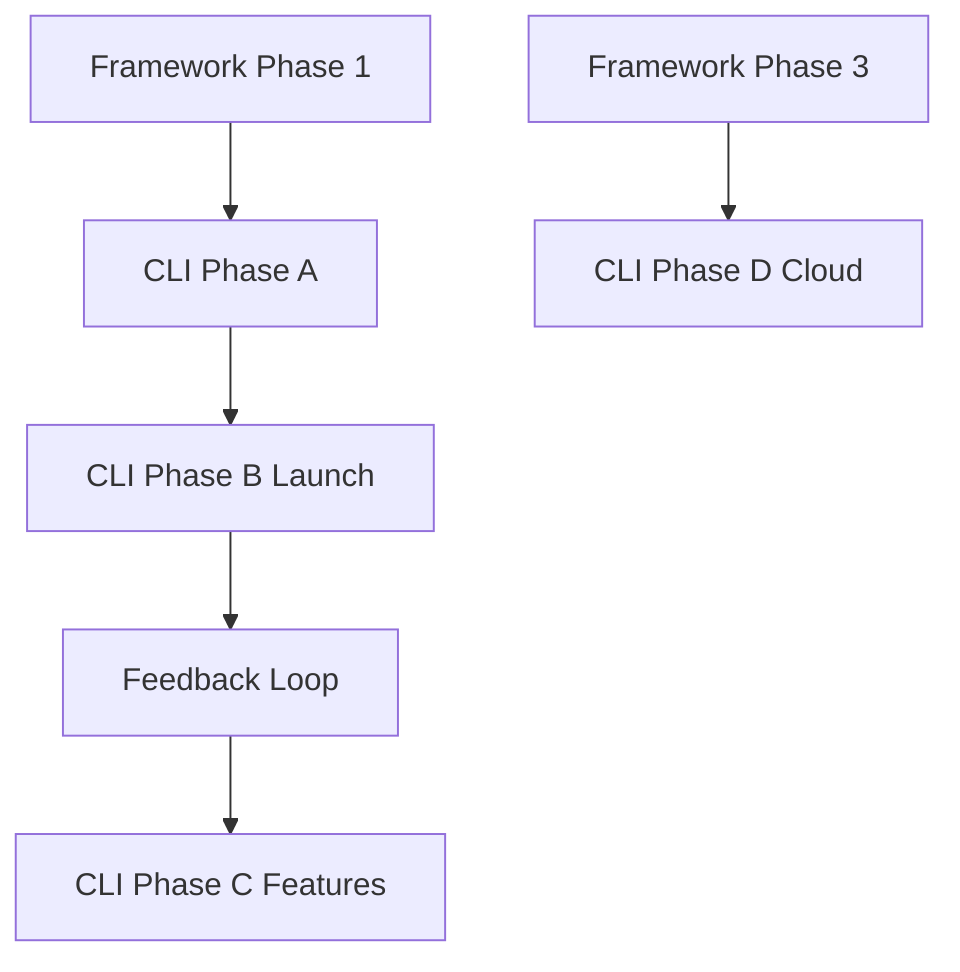

# 🗺️ Actor-Web Framework & Agent-Workflow-CLI Roadmap

> **Vision**: Deliver a complete actor-centric development ecosystem with a pure actor web runtime and a CLI tool implementing agent-based workflows for collaborative development.

## 📋 Executive Summary

| Track | Current Status | Next Phase | Progress |
|-------|---------------|------------|----------|
| **Actor-Web Framework** | Phase 1 - ActorRef API | Complete core implementation | 40% |
| **Agent-Workflow-CLI** | Phase A - Actor Architecture | Complete actor migration | 20% |

---

## 🎯 Track 1: Actor-Web Framework

### ✅ Phase 0: Foundation (COMPLETE)

| Component | Status | Description |
|-----------|--------|-------------|
| `createComponent` API | ✅ | Minimal API with machine + template |
| XState v5 Integration | ✅ | Full integration with type safety |
| Reactive Event Bus | ✅ | Event delegation and smart extraction |
| Animation Services | ✅ | XState-based animation system |
| Testing Infrastructure | ✅ | Vitest + actor test utilities |
| Enhanced Components | ✅ | Accessibility, ARIA, keyboard navigation |
| Documentation | ✅ | API.md, README.md, BEST_PRACTICES.md |

### 🚀 Phase 1: ActorRef API Implementation (IN PROGRESS)

**Goal:** Complete the pure actor reference abstraction that hides internal state

#### 1.1 Core ActorRef Interface ✅ COMPLETE

#### 1.2 Message Passing System
| Task | Status | Owner | Blocking | Done Criteria |
|------|--------|-------|----------|---------------|
| Event emission (`TEmitted` support) | ⬜ | TBD | None | All actors can emit typed events |
| Message interceptors | ⬜ | TBD | Event emission | Middleware chain tested |
| Correlation ID tracking | ✅ | Complete | - | - |
| Request/Response patterns | ✅ | Complete | - | - |

#### 1.3 Actor Lifecycle Management
| Task | Status | Owner | Blocking | Done Criteria |
|------|--------|-------|----------|---------------|
| Graceful shutdown | ⬜ | TBD | None | Zero resource leaks in tests |
| Cleanup hooks | ⬜ | TBD | Graceful shutdown | All subscriptions cleaned |
| Resource tracking | ⬜ | TBD | Cleanup hooks | Memory profiler shows flat line |

#### 1.4 Actor Supervision
| Task | Status | Owner | Blocking | Done Criteria |
|------|--------|-------|----------|---------------|
| Restart strategy | ⬜ | TBD | None | Unit tests pass for restart scenarios |
| Escalate strategy | ⬜ | TBD | None | Parent notified on child failure |
| Stop strategy | ⬜ | TBD | None | Clean termination verified |
| Supervision tree visualizer | ⬜ | TBD | All strategies | D3.js tree rendering |
| Dead letter queue | ⬜ | TBD | All strategies | Undelivered messages captured |

#### 1.5 Code Quality
| Task | Status | Owner | Done Criteria |
|------|--------|-------|---------------|
| Remove `[actor-web] TODO` comments | ⬜ | TBD | All 15 TODOs resolved |
| Eliminate `any` types | ⬜ | TBD | Zero `any` in production code |
| Comprehensive error messages | ⬜ | TBD | All errors have actionable text |

### 📅 Phase 2: Reactive State Management

**Goal:** Advanced reactive patterns for UI synchronization  
**Dependencies:** Phase 1 complete

#### Key Deliverables:
- Computed observables with memoization
- Observable operators (map, filter, debounce)
- Multi-actor state composition
- Component two-way binding helpers
- State persistence adapters (LocalStorage, IndexedDB)

### 📅 Phase 3: Distributed Actor System

**Goal:** Enable actor communication across boundaries  
**Dependencies:** Phase 2 complete

#### Key Deliverables:
- WebSocket/WebRTC transports
- Actor registry service
- Circuit breakers and retry strategies
- Cross-frame communication

### 📅 Phase 4: Performance & Optimization

**Goal:** Production-ready performance  
**Dependencies:** Phase 3 stable

### 📅 Phase 5: Developer Tools

**Goal:** Best-in-class developer experience  
**Dependencies:** Phase 4 complete

### 📅 Phase 6: General Availability

**Goal:** Production-ready framework with stability guarantees  
**Dependencies:** All previous phases complete

---

## 🛠️ Track 2: Agent-Workflow-CLI

### ✅ Current Status: v0.1.0-alpha (Feature Complete)

| Feature | Status | Description |
|---------|--------|-------------|
| Git Worktree Management | ✅ | `pnpm aw:init` - Zero-conflict setup |
| Agent Detection | ✅ | Automatic agent type detection |
| Smart Validation | ✅ | Validate only changed files |
| Integration Workflow | ✅ | Ship and sync commands |
| Status Dashboard | ✅ | Rich CLI interface |
| Performance | ✅ | 10x faster validation |

### 🚀 Phase A: Actor-Based Architecture (IN PROGRESS)

**Goal:** Align CLI with framework's actor principles

#### Implementation Sequence (⚠️ Order matters):

0. **GitActor** ✅ COMPLETE
   - XState v5 implementation with `fromPromise` actors
   - Zero `any` types, full type safety

1. **ConfigurationActor** ⬜
   - **Blocking:** None (must be first)
   - **Done Criteria:** Project detection works in all environments
   - States: `detecting` → `validating` → `ready`

2. **ValidationActor** ⬜
   - **Blocking:** ConfigurationActor
   - **Done Criteria:** Parallel TS + Biome validation with progress
   - States: `idle` → `filtering` → `validating` → `reporting`

3. **WorkflowActor** ⬜
   - **Blocking:** GitActor ✅ + ValidationActor
   - **Done Criteria:** All commands use centralized workflow
   - Orchestrates command sequences with rollback support

4. **UIActor** ⬜
   - **Blocking:** All other actors emitting standardized events
   - **Done Criteria:** Zero direct console.log in codebase
   - Centralized formatting and progress management

### 📦 Phase B: Production Launch

**Goal:** Release v1.0.0 on npm  
**Dependencies:** Phase A complete

#### Checklist:
- [ ] Production build configuration
- [ ] Cross-platform testing (Windows, Mac, Linux)
- [ ] Security audit
- [ ] Installation guide
- [ ] Video tutorials
- [ ] npm publish

### 🚀 Phase C: Enhanced Features

**Goal:** Advanced workflow capabilities  
**Dependencies:** Phase B launched

#### Deliverables:
- Plugin API design
- Custom validation rules
- CI/CD integrations (GitHub Actions, GitLab CI)
- Pre-commit hooks

### 🌐 Phase D: Cloud Integration

**Goal:** Enterprise features  
**Dependencies:** Framework Phase 3 (Distributed Actors) - **BLOCKED**

#### Deliverables:
- Cloud coordination API
- Team dashboards
- Real-time collaboration

---

## 📊 Success Metrics

### Actor-Web Framework
| Metric | Current | Target | Measurement |
|--------|---------|--------|-------------|
| ActorRef completion | 40% | 100% | Checklist items above |
| TODO comments | 15 | 0 | `grep "[actor-web] TODO"` |
| Type coverage | ~95% | 100% | No `any` in src/ |
| Actor spawn time | Unknown | <200ms | Performance test suite |
| Bundle overhead | Unknown | <5KB | Webpack analyzer |

### Agent-Workflow-CLI
| Metric | Current | Target | Measurement |
|--------|---------|--------|-------------|
| Validation speed | ✅ 10x | Maintain | Benchmark suite |
| Setup time | Unknown | <30s | Fresh 2-core VM, cold npm cache |
| Weekly active users | 0 | 100+ | npm stats + telemetry (opt-in) |
| Satisfaction | Unknown | 90%+ | In-CLI NPS prompt (opt-in) |

---

## ⚠️ Risk Register

| Risk | Likelihood | Impact | Mitigation |
|------|------------|--------|------------|
| ActorRef complexity stalls | Medium | High | Time-box design; defer middleware to Phase 2 |
| Windows file-watch issues | High | Medium | Windows CI matrix; dedicated Windows maintainer |
| TypeScript 6.0 breaking changes | Low | High | Pin TS version; test against beta releases |
| Framework/CLI dependency cycles | Medium | Medium | Clear API contracts; version pinning |
| AI agent coordination conflicts | Low | Low | Clear ownership assignments in tasks |

---

## 🎯 Immediate Actions

### Actor-Web Framework
1. **Lock ActorRef scope** - Focus only on `TEmitted` + graceful shutdown
2. **Assign owners** - Each 1.x task needs a responsible party
3. **Daily progress tracking** - Burndown chart for Phase 1 completion
4. **Remove deprecated files** - Clean up `src/core/actor-ref.ts`

### Agent-Workflow-CLI
1. **Spike ConfigurationActor** - Prove pattern before other actors
2. **ValidationActor prototype** - Demo parallel validation by next milestone [[memory:2987389]] [[memory:2895458]]
3. **Document actor message schemas** - Before implementing WorkflowActor
4. **Beta release** - v0.2.0-beta once 2+ actors complete [[memory:2890251]]

---

## 🔗 Dependencies & Coordination

**Critical Dependencies:**
- CLI cannot use ActorRef until Framework Phase 1 ships
- CLI Phase D (Cloud) blocked by Framework Phase 3 (Distributed)
- Framework benefits from CLI's real-world usage patterns

---

_Status: Living Document - Review at each phase completion_  
_Next Review: When Phase 1 reaches 60% or any blocking issue arises_
