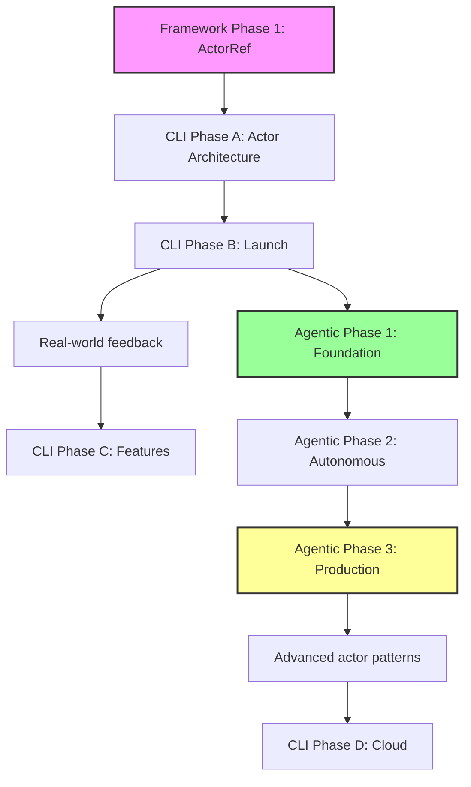

# 🗺️ Actor-Web Framework & Agent-Workflow-CLI Roadmap

> **Vision**: Deliver a universal actor-centric development ecosystem where state, side-effects, and all communication are managed **exclusively** through message-passing actors. Create a pure actor web runtime, CLI tooling, and **autonomous agentic workflow system** that demonstrates these principles in practice.

## 🎭 Pure Actor Model Principles

### Core Tenets (Updated from Research)
1. **Message-Only Communication**: No direct state access between actors - all interactions via async message passing
2. **Location Transparency**: Actors can run anywhere (main thread, workers, remote) with identical APIs
3. **Supervision & Fault Tolerance**: Hierarchical "let it crash" philosophy with configurable restart strategies
4. **Event-Driven Architecture**: All interactions through typed events with proper serialization
5. **Zero Shared State**: Complete isolation between actor boundaries - no singleton registries
6. **Virtual Actor System**: Actors exist logically, instantiated on-demand like Orleans grains
7. **🆕 Autonomous Behavior**: AI-driven actors with memory, planning, and tool usage

### Benefits
- **Isolation**: Actors cannot corrupt each other's state (no shared memory)
- **Scalability**: Seamless distribution across workers/networks (10,000+ messages/sec)
- **Fault Tolerance**: Supervisor strategies for resilience ("let it crash" philosophy)
- **Mental Model**: Clear, consistent programming model (no hidden state)
- **Host-Agnostic**: Deploy anywhere - SPA, MPA, SSR, Edge, Desktop
- **🆕 Intelligence**: Self-improving workflows with persistent memory
- **🆕 True Distribution**: Actors can span processes, machines, and networks transparently

---

## 📋 Executive Summary

| Track | Current Status | Next Phase | Progress |
|-------|---------------|------------|----------|
| **Actor-Web Framework** | Phase 1 - ActorRef API | Complete core implementation | 40% |
| **Agent-Workflow-CLI** | Phase A - Actor Architecture | Complete actor migration | 20% |
| **🆕 Agentic Workflow System** | Research Complete | Begin Foundation Phase | 0% |

---

## 🎯 Track 1: Actor-Web Framework

### ✅ Phase 0: Foundation (COMPLETE)

| Component | Status | Description |
|-----------|--------|-------------|
| `createComponent` API | ✅ | Minimal API with machine + template |
| XState v5 Integration | ✅ | Full integration with type safety |
| Reactive Event Bus | ✅ | Event delegation and smart extraction |
| Animation Services | ✅ | XState-based animation system |
| Testing Infrastructure | ✅ | Vitest + actor test utilities |
| Enhanced Components | ✅ | Accessibility, ARIA, keyboard navigation |
| Documentation | ✅ | API.md, README.md, BEST_PRACTICES.md |

### 🚀 Phase 0.5: Pure Actor Model Migration (URGENT)

**Goal:** Migrate from current hybrid model to pure actor model based on research findings

#### 0.5.1 Current Architecture Issues (Research-Validated)
| Issue | Status | Owner | Blocking | Done Criteria |
|-------|--------|-------|----------|---------------|
| Singleton ActorRegistry violates distribution | ⬜ | TBD | None | Registry replaced with distributed directory |
| Direct function calls (askGitActor, lookupGitActor) | ⬜ | TBD | None | All interactions via message passing |
| Local event systems can't span processes | ⬜ | TBD | None | WebSocket/Worker Thread transport |
| Hard-coded actor addresses | ⬜ | TBD | None | Location-transparent addressing |

#### 0.5.2 Message-Based Communication
| Task | Status | Owner | Blocking | Done Criteria |
|------|--------|-------|----------|---------------|
| Replace direct function calls with messages | ⬜ | TBD | None | No direct actor.method() calls |
| Implement message serialization (JSON→MessagePack) | ⬜ | TBD | None | Cross-process message passing |
| Add message correlation IDs | ⬜ | TBD | None | Request/response tracking |
| Type-safe message protocols | ⬜ | TBD | None | Discriminated unions for all messages |

#### 0.5.3 Location Transparency
| Task | Status | Owner | Blocking | Done Criteria |
|------|--------|-------|----------|---------------|
| Distributed actor directory (Orleans-style) | ⬜ | TBD | None | 90%+ cache hit rate for actor lookup |
| WebSocket transport for cross-machine | ⬜ | TBD | None | Actors can run on different machines |
| Worker Thread transport for parallelism | ⬜ | TBD | None | CPU-intensive actors in separate threads |
| Actor addressing scheme (actor://system/id) | ⬜ | TBD | None | Location-independent actor references |

### 🚀 Phase 1: ActorRef API Implementation (BLOCKED - awaiting Phase 0.5)

**Goal:** Complete the pure actor reference abstraction that hides internal state

#### 1.1 Core ActorRef Interface ✅ COMPLETE

#### 1.2 Message Passing System
| Task | Status | Owner | Blocking | Done Criteria |
|------|--------|-------|----------|---------------|
| Event emission (`TEmitted` support) | ⬜ | TBD | Phase 0.5 | All actors can emit typed events |
| Message interceptors | ⬜ | TBD | Event emission | Middleware chain tested |
| Correlation ID tracking | ✅ | Complete | - | - |
| Request/Response patterns | ✅ | Complete | - | - |

#### 1.3 Actor Lifecycle Management
| Task | Status | Owner | Blocking | Done Criteria |
|------|--------|-------|----------|---------------|
| Graceful shutdown | ⬜ | TBD | None | Zero resource leaks in tests |
| Cleanup hooks | ⬜ | TBD | Graceful shutdown | All subscriptions cleaned |
| Resource tracking | ⬜ | TBD | Cleanup hooks | Memory profiler shows flat line |

#### 1.4 Actor Supervision (Erlang/OTP Style)
| Task | Status | Owner | Blocking | Done Criteria |
|------|--------|-------|----------|---------------|
| "Let it crash" restart strategy | ⬜ | TBD | Phase 0.5 | Unit tests pass for restart scenarios |
| Escalate strategy (bubble up failures) | ⬜ | TBD | Phase 0.5 | Parent notified on child failure |
| Stop strategy (permanent termination) | ⬜ | TBD | Phase 0.5 | Clean termination verified |
| Resume strategy (ignore error) | ⬜ | TBD | Phase 0.5 | Error handling without restart |
| Supervision tree visualizer | ⬜ | TBD | All strategies | D3.js tree rendering |
| Dead letter queue | ⬜ | TBD | All strategies | Undelivered messages captured |
| Backoff supervisors | ⬜ | TBD | All strategies | Exponential backoff for failing actors |

#### 1.5 Code Quality
| Task | Status | Owner | Done Criteria |
|------|--------|-------|---------------|
| Remove `[actor-web] TODO` comments | ⬜ | TBD | All 15 TODOs resolved |
| Eliminate `any` types | ⬜ | TBD | Zero `any` in production code |
| Comprehensive error messages | ⬜ | TBD | All errors have actionable text |

### 📅 Phase 2: Reactive State Management

**Goal:** Advanced reactive patterns for UI synchronization  
**Dependencies:** Phase 1 complete

#### Key Deliverables:
- Computed observables with memoization
- Observable operators (map, filter, debounce)
- Multi-actor state composition
- Component two-way binding helpers
- State persistence adapters (LocalStorage, IndexedDB)
- Auto-unsubscribe helpers for Web Components

### 📅 Phase 3: Distributed Actor System (Research-Driven)

**Goal:** Enable actor communication across boundaries following pure actor model  
**Dependencies:** Phase 2 complete

#### Key Deliverables (Based on Research):
- **WebSocket transport** (primary for cross-machine communication)
- **Worker Thread transport** (for CPU-intensive actors)
- **Distributed Actor Directory** (Orleans-style with 90%+ cache hit rate)
- **Message serialization** (JSON initial, MessagePack for optimization)
- **Location-transparent addressing** (actor://system/id format)
- **Cross-process actor spawning** (actors can run anywhere)
- **Circuit breakers and retry strategies** (fault tolerance)
- **Event sourcing + snapshots** (for persistent actor state)

### 📅 Phase 4: Host-Agnostic Runtime

**Goal:** Support all deployment modes through pure actor patterns  
**Dependencies:** Phase 3 complete

#### Key Deliverables:

##### Multi-Page Application Support
- Browser ↔ Service Worker transport adapter
- IndexedDB mailbox for cross-page persistence
- Actor system discovery/reinstantiation

##### Server-Side Rendering
- `renderToString(actorRef, templateFn)` for snapshots
- `hydrate(actorRef, snapshot)` for resumption
- Serialization adapters for actor context

##### Cross-Deployment Examples
- Islands/Micro-frontends via postMessage
- Electron/Tauri via IPC
- Edge Workers (Cloudflare, Deno) via RemoteActorRef

### 📅 Phase 5: Performance & Optimization

**Goal:** Production-ready performance with back-pressure handling  
**Dependencies:** Phase 4 stable

#### Key Deliverables:
- Event throughput benchmarks
- Configurable mailbox size + overflow strategy
- Message batching for high-frequency events
- Memory footprint optimization
- Actor pooling and lazy creation
- Compile-time optimizations

### 📅 Phase 6: Developer Tools

**Goal:** Best-in-class developer experience  
**Dependencies:** Phase 5 complete

#### Key Deliverables:
- Browser DevTools extension (actor tree, message timeline)
- Time-travel replay via message log
- VS Code snippets and generators
- Actor hierarchy visualizer
- Performance profiler
- State inspector

### 📅 Phase 7: Enhanced Architecture & Testing

**Goal:** Enterprise-grade actor system with comprehensive testing  
**Dependencies:** Phase 6 complete

#### 7.1 Unified Actor Registry & Addressing
- Central registry for actor discovery
- Hierarchical addresses: `actor://system/parent/child`
- Pattern-based discovery: `actor://auth/*`
- Location-transparent routing

#### 7.2 Actor Testing Framework
- `ActorTestHarness` for scenario testing
- Deterministic message replay
- Property-based testing for message flows
- Chaos testing with failure injection

#### 7.3 Security & Error Patterns
- Message validation/sanitization framework
- Trust boundary enforcement
- Encrypted actor communication
- Dead letter queue patterns

#### 7.4 Performance Monitoring
- Built-in metrics collection
- Message throughput tracking
- Mailbox depth monitoring
- Actor lifecycle timing

### 📅 Phase 8: General Availability

**Goal:** Production-ready framework with stability guarantees  
**Dependencies:** All previous phases complete

#### Release Gates (Pure Actor Model):
- 🔒 **Zero** direct state access in framework code
- 📨 **Zero** direct function calls between actors (message-only communication)
- 🌐 **Location transparency** verified (actors can run anywhere)
- 📊 **Distributed actor directory** with 90%+ cache hit rate
- 🛡️ All critical actors protected by supervisors ("let it crash" philosophy)
- ⚙️ Performance benchmarks meet targets (10,000+ messages/sec)
- 🌍 Host-agnostic deployment verified across all target environments
- 📖 Complete documentation and tutorials
- 🧪 Pure actor model compliance verified by comprehensive tests

---

## 🛠️ Track 2: Agent-Workflow-CLI

### ✅ Current Status: v0.1.0-alpha (Feature Complete)

| Feature | Status | Description |
|---------|--------|-------------|
| Git Worktree Management | ✅ | `pnpm aw:init` - Zero-conflict setup |
| Agent Detection | ✅ | Automatic agent type detection |
| Smart Validation | ✅ | Validate only changed files |
| Integration Workflow | ✅ | Ship and sync commands |
| Status Dashboard | ✅ | Rich CLI interface |
| Performance | ✅ | 10x faster validation |

### 🚀 Phase A: Pure Actor Model Migration (URGENT)

**Goal:** Migrate CLI from hybrid to pure actor model based on research findings

#### A.1 Current Architecture Issues (Research-Validated)
| Issue | Status | Owner | Blocking | Done Criteria |
|-------|--------|-------|----------|---------------|
| GitActor uses singleton ActorRegistry | ⬜ | TBD | None | Distributed directory implemented |
| Direct function calls (askGitActor, lookupGitActor) | ⬜ | TBD | None | All interactions via message passing |
| subscribeToGitActor violates message-only rule | ⬜ | TBD | None | Subscription via actor messaging |
| Hard-coded actor addresses in CLI | ⬜ | TBD | None | Location-transparent addressing |

#### A.2 Message-Based CLI Architecture
| Task | Status | Owner | Blocking | Done Criteria |
|------|--------|-------|----------|---------------|
| Replace CLI direct calls with actor messages | ⬜ | TBD | None | No direct actor.method() calls |
| Implement CLI → Actor message protocols | ⬜ | TBD | None | Type-safe message interfaces |
| Add actor-to-actor communication | ⬜ | TBD | None | Actors communicate via messages only |
| Message serialization for CLI actors | ⬜ | TBD | None | CLI can run actors in separate processes |

#### A.3 Distributed CLI Actors
| Task | Status | Owner | Blocking | Done Criteria |
|------|--------|-------|----------|---------------|
| Implement distributed actor directory | ⬜ | TBD | None | Actors can be discovered across processes |
| CLI actor location transparency | ⬜ | TBD | None | CLI commands work regardless of actor location |
| Worker Thread support for heavy operations | ⬜ | TBD | None | Git operations can run in parallel |
| Actor supervision for CLI fault tolerance | ⬜ | TBD | None | Failed actors restart automatically |

#### Implementation Sequence (⚠️ Order matters):

0. **GitActor** ⚠️ NEEDS PURE ACTOR MIGRATION
   - Current: Uses singleton registry and direct function calls
   - Target: Pure message-based with location transparency

1. **ConfigurationActor** ⬜
   - **Blocking:** GitActor pure actor migration
   - **Done Criteria:** Project detection works in all environments
   - States: `detecting` → `validating` → `ready`

2. **ValidationActor** ⬜
   - **Blocking:** ConfigurationActor
   - **Done Criteria:** Parallel TS + Biome validation with progress
   - States: `idle` → `filtering` → `validating` → `reporting`

3. **WorkflowActor** ⬜
   - **Blocking:** GitActor ✅ + ValidationActor
   - **Done Criteria:** All commands use centralized workflow
   - Orchestrates command sequences with rollback support

4. **UIActor** ⬜
   - **Blocking:** All other actors emitting standardized events
   - **Done Criteria:** Zero direct console.log in codebase
   - Centralized formatting and progress management

### 📦 Phase B: Production Launch

**Goal:** Release v1.0.0 on npm as showcase of actor patterns  
**Dependencies:** Phase A complete

#### Checklist:
- [ ] Production build configuration
- [ ] Cross-platform testing (Windows, Mac, Linux)
- [ ] Security audit
- [ ] Installation guide with actor architecture explanation
- [ ] Video tutorials showing actor coordination
- [ ] npm publish

### 🚀 Phase C: Enhanced Features

**Goal:** Advanced workflow capabilities using actor patterns  
**Dependencies:** Phase B launched

#### Deliverables:
- Plugin system (plugins as supervised actors)
- Custom validation rules via actor composition
- CI/CD integrations with actor-based pipelines
- Distributed team coordination actors

### 🌐 Phase D: Cloud Integration

**Goal:** Distributed actor coordination for teams  
**Dependencies:** Framework Phase 3 (Distributed Actors) - **BLOCKED**

#### Deliverables:
- Cloud actor coordination service
- Real-time team dashboards
- Cross-machine actor messaging
- Shared state actors

---

## 🤖 Track 3: Agentic Workflow System

> **🆕 NEW TRACK**: Based on comprehensive research findings from three independent studies

### 🔬 Research Phase (COMPLETE)

**Goal:** Establish technical foundation for autonomous agentic behavior  
**Status:** ✅ Complete - Three comprehensive research reports delivered

#### Key Findings:
- **Tool Actor Protocol**: Standardized JSON message schemas for CLI command wrapping
- **LLM Integration**: Hybrid local/cloud strategy with vLLM and Ollama
- **Memory Architecture**: Vector databases (SQLite-VSS → Chroma → Pinecone scaling path)
- **Safety Framework**: Human-in-the-loop patterns and behavioral constraints
- **Performance**: Maintain 10K+ msg/sec with optimized planning loops
- **Implementation Path**: 3-phase approach over 6-12 months

### 🚀 Phase 1: Foundation (Months 1-3)

**Goal:** Actor-ize current commands and implement basic agentic loops  
**Dependencies:** CLI Phase A complete

#### 1.1 Tool Actor Protocol
| Task | Status | Owner | Blocking | Done Criteria |
|------|--------|-------|----------|---------------|
| Tool Actor base class | ⬜ | TBD | None | Message schema standardized |
| GitActor tool wrapper | ⬜ | TBD | Base class | All git operations as messages |
| ValidationActor tool wrapper | ⬜ | TBD | Base class | Validation as tool invocation |
| TestActor implementation | ⬜ | TBD | Base class | Test execution via messages |
| Tool discovery registry | ⬜ | TBD | All tools | Dynamic tool registration |

#### 1.2 LLM Integration
| Task | Status | Owner | Blocking | Done Criteria |
|------|--------|-------|----------|---------------|
| LLM client abstraction | ⬜ | TBD | None | OpenAI/Anthropic/Ollama support |
| PlannerActor implementation | ⬜ | TBD | LLM client | Goal → action plans |
| Prompt engineering templates | ⬜ | TBD | PlannerActor | Git/dev workflows optimized |
| Token budget management | ⬜ | TBD | PlannerActor | Cost controls implemented |
| Local model integration (Ollama) | ⬜ | TBD | None | Privacy-first option |

#### 1.3 Memory Architecture
| Task | Status | Owner | Blocking | Done Criteria |
|------|--------|-------|----------|---------------|
| Vector store abstraction | ⬜ | TBD | None | SQLite-VSS/Chroma/Pinecone |
| MemoryActor implementation | ⬜ | TBD | Vector store | Episodic memory storage |
| Embedding generation | ⬜ | TBD | MemoryActor | Code/commit context vectors |
| Memory query optimization | ⬜ | TBD | Embedding | <50ms similarity search |
| Memory pruning strategies | ⬜ | TBD | Query optimization | Growth management |

#### 1.4 Safety Framework
| Task | Status | Owner | Blocking | Done Criteria |
|------|--------|-------|----------|---------------|
| Safety supervisor extension | ⬜ | TBD | None | Behavioral constraints |
| Command allow/deny lists | ⬜ | TBD | Safety supervisor | Risk categorization |
| Human-in-the-loop patterns | ⬜ | TBD | Allow/deny | Approval workflows |
| Audit logging system | ⬜ | TBD | None | Compliance tracking |
| Rollback mechanisms | ⬜ | TBD | Audit logging | Safe failure recovery |

### 📅 Phase 2: Autonomous Behavior (Months 4-6)

**Goal:** Implement autonomous planning and execution capabilities  
**Dependencies:** Phase 1 complete

#### 2.1 Goal-Oriented Planning
- Goal Actor implementation (high-level objectives)
- Plan Actor implementation (task decomposition)
- Planning Supervisor with behavioral monitoring
- Multi-step workflow execution

#### 2.2 Learning & Adaptation
- Episodic memory integration with planning
- User feedback incorporation
- Pattern recognition for repeated tasks
- Continuous improvement mechanisms

#### 2.3 Advanced Tool Integration
- CI/CD pipeline actors
- VS Code extension integration
- Plugin architecture for custom tools
- Cross-system communication

### 📅 Phase 3: Production Deployment (Months 7-12)

**Goal:** Production-ready autonomous development workflows  
**Dependencies:** Phase 2 stable

#### 3.1 Enterprise Features
- Advanced security and compliance
- Team coordination capabilities
- Performance monitoring and optimization
- Scalability improvements

#### 3.2 Ecosystem Integration
- GitHub Actions integration
- IDE plugin ecosystem
- Third-party tool connectors
- Migration tooling and guides

---

## 🌍 Deployment Mode Support Matrix

| Mode | Status | Phase | Actor Pattern Application |
|------|--------|-------|--------------------------|
| **Classic SPA** | ✅ Native | 1-4 | Single actor system in browser |
| **Multi-Page App** | 🔄 Planned | 4 | Shared actors via Service Worker |
| **SSR / Hydration** | 🔄 Planned | 4 | Server actors → client actors |
| **Islands / Micro-frontends** | 🔄 Planned | 4 | Cross-island actor messaging |
| **PWA / Offline** | 🔄 Planned | 4 | Persistent actor mailboxes |
| **Electron / Tauri** | 🔄 Planned | 4 | Main process supervisor actors |
| **Edge / Workers** | 🔄 Planned | 4 | Distributed actor mesh |
| **🆕 Agentic CLI** | 🔄 Planned | Agentic 1-3 | Autonomous development actors |

---

## 🛠️ Technology Stack

### Core Framework
- **Runtime**: Actor-Web Framework with XState v5
- **Language**: TypeScript with zero `any` types
- **Testing**: Vitest with actor test utilities
- **Formatting**: Biome (not Prettier) [[memory:2987393]]

### 🆕 Agentic Infrastructure
- **LLM Integration**: OpenAI/Anthropic APIs + Ollama for local
- **Vector Database**: SQLite-VSS → Chroma → Pinecone (scaling path)
- **Memory Storage**: Event-sourced actor state
- **Safety**: Extended supervision with behavioral constraints
- **Performance**: vLLM for high-throughput local inference

---

## 📊 Success Metrics

### Actor-Web Framework
| Metric | Current | Target | Measurement |
|--------|---------|--------|-------------|
| ActorRef completion | 40% | 100% | Checklist items above |
| TODO comments | 15 | 0 | `grep "[actor-web] TODO"` |
| Type coverage | ~95% | 100% | No `any` in src/ |
| Actor spawn time | Unknown | <200ms | Performance test suite |
| Bundle overhead | Unknown | <5KB | Webpack analyzer |
| Message throughput | Unknown | >10k/sec | Benchmark suite |
| **🆕 Pure Actor Model Compliance** | **20%** | **100%** | **Zero direct function calls between actors** |
| **🆕 Location Transparency** | **0%** | **100%** | **Actors can run anywhere without code changes** |
| **🆕 Message-Only Communication** | **30%** | **100%** | **All interactions via async message passing** |
| **🆕 Distributed Directory Hit Rate** | **N/A** | **90%+** | **Actor lookup cache efficiency** |

### Agent-Workflow-CLI
| Metric | Current | Target | Measurement |
|--------|---------|--------|-------------|
| Validation speed | ✅ 10x | Maintain | Benchmark suite |
| Setup time | Unknown | <30s | Fresh 2-core VM, cold npm cache |
| Weekly active users | 0 | 100+ | npm stats + telemetry (opt-in) |
| Satisfaction | Unknown | 90%+ | In-CLI NPS prompt (opt-in) |
| Actor coordination | 20% | 100% | All OOP replaced with actors |
| **🆕 Pure Actor Model Compliance** | **10%** | **100%** | **Zero direct function calls (askGitActor, etc.)** |
| **🆕 Message-Based CLI** | **15%** | **100%** | **All CLI operations via actor messages** |
| **🆕 Location Transparency** | **0%** | **100%** | **CLI actors can run in separate processes** |
| **🆕 Fault Tolerance** | **0%** | **100%** | **Actor supervision and restart strategies** |

### 🆕 Agentic Workflow System
| Metric | Current | Target | Measurement |
|--------|---------|--------|-------------|
| Task completion rate | 0% | 80%+ | Autonomous goal achievement |
| Planning efficiency | N/A | <500ms | Goal → action plan time |
| Memory recall accuracy | N/A | 90%+ | Relevant context retrieval |
| Safety compliance | N/A | 100% | Zero unauthorized actions |
| Token efficiency | N/A | <1000/task | Average LLM tokens per task |
| User trust score | N/A | 85%+ | Post-task satisfaction survey |

---

## ⚠️ Risk Register

### Existing Risks
| Risk | Likelihood | Impact | Mitigation |
|------|------------|--------|------------|
| ActorRef complexity stalls | Medium | High | Time-box design; defer middleware to Phase 2 |
| Windows file-watch issues | High | Medium | Windows CI matrix; dedicated Windows maintainer |
| TypeScript 6.0 breaking changes | Low | High | Pin TS version; test against beta releases |
| Framework/CLI dependency cycles | Medium | Medium | Clear API contracts; version pinning |
| AI agent coordination conflicts | Low | Low | Clear ownership assignments in tasks |
| Actor pattern learning curve | Medium | Medium | Extensive docs, examples, tutorials |
| **🆕 Pure Actor Model Migration** | **High** | **Critical** | **Research-driven phased approach** |
| **🆕 Message serialization performance** | **Medium** | **High** | **JSON → MessagePack optimization path** |
| **🆕 Distributed directory complexity** | **Medium** | **High** | **Orleans-style caching, 90%+ hit rate** |
| **🆕 Location transparency breaks existing code** | **High** | **Medium** | **Incremental migration with compatibility layer** |

### 🆕 Agentic Risks
| Risk | Likelihood | Impact | Mitigation |
|------|------------|--------|------------|
| **LLM API costs spiral** | Medium | High | Token budgets, local model fallbacks |
| **Agent performs destructive actions** | Low | Critical | Strict allow/deny lists, human approval |
| **Memory system performance degradation** | Medium | Medium | Vector DB optimization, pruning strategies |
| **Privacy concerns with cloud LLMs** | High | High | Local-first options, data anonymization |
| **Agent hallucination leads to errors** | Medium | Medium | Validation layers, confidence scoring |
| **Infinite planning loops** | Low | Medium | Iteration limits, timeout mechanisms |
| **User over-reliance on agent** | Medium | Low | Transparency, manual override options |

---

## 🏛️ Governance

### Leadership
- **Product Owner:** 0xjcf
- **Steering Group:** Runtime Lead, DX Lead, Perf Lead, DevRel, Host Integration Lead
- **🆕 AI Safety Lead:** TBD (responsible for agentic system governance)

### Decision Process
- **RFC Process:** Propose → 7-day comment → Accepted/Needs-Work
- **Community Sync:** Discord every second Thursday (16:00 UTC)
- **Architecture Reviews:** Required for new actor patterns
- **🆕 AI Safety Reviews:** Required for all agentic capabilities

### Contributing
1. Check roadmap labels: `good first issue`, `help wanted`, `RFC`
2. Submit PRs targeting next milestone branch
3. Add changes to CHANGELOG.md
4. Pass CI: `npm test`, `npm run lint`, `npm run benchmark`
5. **🆕 AI Safety Review:** Required for agentic features

---

## 🎯 Immediate Actions

### Actor-Web Framework
1. **🚨 PRIORITY: Pure Actor Model Migration** - Address singleton registry and direct function calls
2. **Research-driven architecture** - Follow Orleans/Akka/Erlang patterns for distribution
3. **Message-only communication** - Replace all direct function calls with message passing
4. **Location transparency** - Implement distributed actor directory with caching
5. **Assign owners** - Each Phase 0.5 task needs a responsible party

### Agent-Workflow-CLI  
1. **🚨 PRIORITY: Fix GitActor violations** - Remove askGitActor, lookupGitActor, subscribeToGitActor
2. **Implement message-based CLI** - All CLI operations via actor messages
3. **Add distributed actor directory** - Enable CLI actors to run in separate processes
4. **Implement actor supervision** - Fault tolerance with restart strategies
5. **Document pure actor patterns** - Before implementing other actors

### 🆕 Agentic Workflow System
1. **Assign research leads** - Map research findings to implementation owners
2. **Set up prototype environment** - Isolated testing for agentic features
3. **LLM integration spike** - Prove PlannerActor with Ollama locally
4. **Safety framework design** - Implement basic allow/deny lists

---

## 🔗 Dependencies & Coordination

**Critical Dependencies:**
- CLI demonstrates framework actor patterns in practice
- Agentic system requires mature Tool Actor protocol from CLI
- Framework benefits from CLI's real-world usage patterns  
- Agentic capabilities validate autonomous actor behavior
- All tracks validate pure actor model vision

---

## 🚀 Vision Success Criteria

When complete, Actor-Web will enable:

1. **Universal Deployment** - Same actor code runs everywhere
2. **Fault Tolerance** - Supervision trees handle all failures
3. **True Concurrency** - Actors distribute across cores/machines
4. **Clean Architecture** - Message-only communication throughout
5. **Developer Joy** - Intuitive mental model, great tooling
6. **🆕 Autonomous Intelligence** - Self-improving workflows with persistent memory
7. **🆕 Safe AI Integration** - Human-controlled AI assistants for development
8. **🆕 Ecosystem Integration** - Seamless connection to existing dev tools

---

_Status: Living Document - Updated with agentic workflow research findings_  
_Next Review: Begin Agentic Phase 1 planning and resource allocation_  
_Governance: See contributing guidelines and RFC process above_
