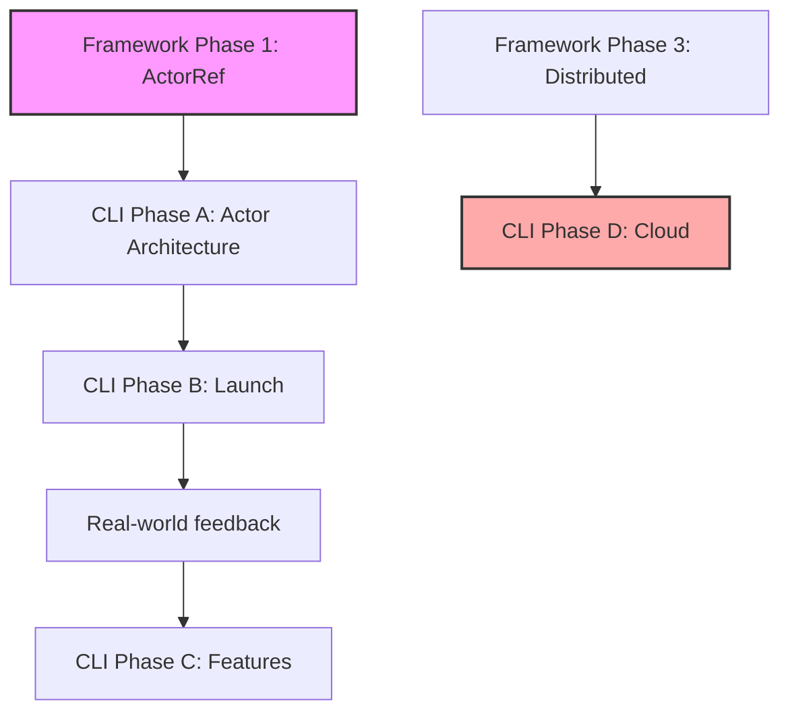

# 🗺️ Actor-Web Framework & Agent-Workflow-CLI Roadmap

> **Vision**: Deliver a universal actor-centric development ecosystem where state, side-effects, and all communication are managed **exclusively** through message-passing actors. Create a pure actor web runtime and CLI tooling that demonstrates these principles in practice.

## 🎭 Pure Actor Model Principles

### Core Tenets
1. **Message-Only Communication**: No direct state access between actors
2. **Location Transparency**: Actors can run anywhere (main thread, workers, remote)
3. **Supervision & Fault Tolerance**: Hierarchical error handling and recovery
4. **Event-Driven Architecture**: All interactions through typed events
5. **Zero Shared State**: Complete isolation between actor boundaries

### Benefits
- **Isolation**: Actors cannot corrupt each other's state
- **Scalability**: Seamless distribution across workers/networks
- **Fault Tolerance**: Supervisor strategies for resilience
- **Mental Model**: Clear, consistent programming model
- **Host-Agnostic**: Deploy anywhere - SPA, MPA, SSR, Edge, Desktop

---

## 📋 Executive Summary

| Track | Current Status | Next Phase | Progress |
|-------|---------------|------------|----------|
| **Actor-Web Framework** | Phase 1 - ActorRef API | Complete core implementation | 40% |
| **Agent-Workflow-CLI** | Phase A - Actor Architecture | Complete actor migration | 20% |

---

## 🎯 Track 1: Actor-Web Framework

### ✅ Phase 0: Foundation (COMPLETE)

| Component | Status | Description |
|-----------|--------|-------------|
| `createComponent` API | ✅ | Minimal API with machine + template |
| XState v5 Integration | ✅ | Full integration with type safety |
| Reactive Event Bus | ✅ | Event delegation and smart extraction |
| Animation Services | ✅ | XState-based animation system |
| Testing Infrastructure | ✅ | Vitest + actor test utilities |
| Enhanced Components | ✅ | Accessibility, ARIA, keyboard navigation |
| Documentation | ✅ | API.md, README.md, BEST_PRACTICES.md |

### 🚀 Phase 1: ActorRef API Implementation (IN PROGRESS)

**Goal:** Complete the pure actor reference abstraction that hides internal state

#### 1.1 Core ActorRef Interface ✅ COMPLETE

#### 1.2 Message Passing System
| Task | Status | Owner | Blocking | Done Criteria |
|------|--------|-------|----------|---------------|
| Event emission (`TEmitted` support) | ⬜ | TBD | None | All actors can emit typed events |
| Message interceptors | ⬜ | TBD | Event emission | Middleware chain tested |
| Correlation ID tracking | ✅ | Complete | - | - |
| Request/Response patterns | ✅ | Complete | - | - |

#### 1.3 Actor Lifecycle Management
| Task | Status | Owner | Blocking | Done Criteria |
|------|--------|-------|----------|---------------|
| Graceful shutdown | ⬜ | TBD | None | Zero resource leaks in tests |
| Cleanup hooks | ⬜ | TBD | Graceful shutdown | All subscriptions cleaned |
| Resource tracking | ⬜ | TBD | Cleanup hooks | Memory profiler shows flat line |

#### 1.4 Actor Supervision
| Task | Status | Owner | Blocking | Done Criteria |
|------|--------|-------|----------|---------------|
| Restart strategy | ⬜ | TBD | None | Unit tests pass for restart scenarios |
| Escalate strategy | ⬜ | TBD | None | Parent notified on child failure |
| Stop strategy | ⬜ | TBD | None | Clean termination verified |
| Supervision tree visualizer | ⬜ | TBD | All strategies | D3.js tree rendering |
| Dead letter queue | ⬜ | TBD | All strategies | Undelivered messages captured |

#### 1.5 Code Quality
| Task | Status | Owner | Done Criteria |
|------|--------|-------|---------------|
| Remove `[actor-web] TODO` comments | ⬜ | TBD | All 15 TODOs resolved |
| Eliminate `any` types | ⬜ | TBD | Zero `any` in production code |
| Comprehensive error messages | ⬜ | TBD | All errors have actionable text |

### 📅 Phase 2: Reactive State Management

**Goal:** Advanced reactive patterns for UI synchronization  
**Dependencies:** Phase 1 complete

#### Key Deliverables:
- Computed observables with memoization
- Observable operators (map, filter, debounce)
- Multi-actor state composition
- Component two-way binding helpers
- State persistence adapters (LocalStorage, IndexedDB)
- Auto-unsubscribe helpers for Web Components

### 📅 Phase 3: Distributed Actor System

**Goal:** Enable actor communication across boundaries  
**Dependencies:** Phase 2 complete

#### Key Deliverables:
- WebSocket/WebRTC transports
- Service Worker actors with BroadcastChannel
- WebWorker actors with structured clone
- Cross-frame communication
- Actor registry service
- Circuit breakers and retry strategies

### 📅 Phase 4: Host-Agnostic Runtime

**Goal:** Support all deployment modes through pure actor patterns  
**Dependencies:** Phase 3 complete

#### Key Deliverables:

##### Multi-Page Application Support
- Browser ↔ Service Worker transport adapter
- IndexedDB mailbox for cross-page persistence
- Actor system discovery/reinstantiation

##### Server-Side Rendering
- `renderToString(actorRef, templateFn)` for snapshots
- `hydrate(actorRef, snapshot)` for resumption
- Serialization adapters for actor context

##### Cross-Deployment Examples
- Islands/Micro-frontends via postMessage
- Electron/Tauri via IPC
- Edge Workers (Cloudflare, Deno) via RemoteActorRef

### 📅 Phase 5: Performance & Optimization

**Goal:** Production-ready performance with back-pressure handling  
**Dependencies:** Phase 4 stable

#### Key Deliverables:
- Event throughput benchmarks
- Configurable mailbox size + overflow strategy
- Message batching for high-frequency events
- Memory footprint optimization
- Actor pooling and lazy creation
- Compile-time optimizations

### 📅 Phase 6: Developer Tools

**Goal:** Best-in-class developer experience  
**Dependencies:** Phase 5 complete

#### Key Deliverables:
- Browser DevTools extension (actor tree, message timeline)
- Time-travel replay via message log
- VS Code snippets and generators
- Actor hierarchy visualizer
- Performance profiler
- State inspector

### 📅 Phase 7: Enhanced Architecture & Testing

**Goal:** Enterprise-grade actor system with comprehensive testing  
**Dependencies:** Phase 6 complete

#### 7.1 Unified Actor Registry & Addressing
- Central registry for actor discovery
- Hierarchical addresses: `actor://system/parent/child`
- Pattern-based discovery: `actor://auth/*`
- Location-transparent routing

#### 7.2 Actor Testing Framework
- `ActorTestHarness` for scenario testing
- Deterministic message replay
- Property-based testing for message flows
- Chaos testing with failure injection

#### 7.3 Security & Error Patterns
- Message validation/sanitization framework
- Trust boundary enforcement
- Encrypted actor communication
- Dead letter queue patterns

#### 7.4 Performance Monitoring
- Built-in metrics collection
- Message throughput tracking
- Mailbox depth monitoring
- Actor lifecycle timing

### 📅 Phase 8: General Availability

**Goal:** Production-ready framework with stability guarantees  
**Dependencies:** All previous phases complete

#### Release Gates:
- 🔒 **Zero** direct state access in framework code
- 🛡️ All critical actors protected by supervisors
- ⚙️ Performance benchmarks meet targets
- 🌍 Host-agnostic deployment verified
- 📖 Complete documentation and tutorials

---

## 🛠️ Track 2: Agent-Workflow-CLI

### ✅ Current Status: v0.1.0-alpha (Feature Complete)

| Feature | Status | Description |
|---------|--------|-------------|
| Git Worktree Management | ✅ | `pnpm aw:init` - Zero-conflict setup |
| Agent Detection | ✅ | Automatic agent type detection |
| Smart Validation | ✅ | Validate only changed files |
| Integration Workflow | ✅ | Ship and sync commands |
| Status Dashboard | ✅ | Rich CLI interface |
| Performance | ✅ | 10x faster validation |

### 🚀 Phase A: Actor-Based Architecture (IN PROGRESS)

**Goal:** Demonstrate framework's actor principles in real-world CLI tool

#### Implementation Sequence (⚠️ Order matters):

0. **GitActor** ✅ COMPLETE
   - XState v5 implementation with `fromPromise` actors
   - Zero `any` types, full type safety

1. **ConfigurationActor** ⬜
   - **Blocking:** None (must be first)
   - **Done Criteria:** Project detection works in all environments
   - States: `detecting` → `validating` → `ready`

2. **ValidationActor** ⬜
   - **Blocking:** ConfigurationActor
   - **Done Criteria:** Parallel TS + Biome validation with progress
   - States: `idle` → `filtering` → `validating` → `reporting`

3. **WorkflowActor** ⬜
   - **Blocking:** GitActor ✅ + ValidationActor
   - **Done Criteria:** All commands use centralized workflow
   - Orchestrates command sequences with rollback support

4. **UIActor** ⬜
   - **Blocking:** All other actors emitting standardized events
   - **Done Criteria:** Zero direct console.log in codebase
   - Centralized formatting and progress management

### 📦 Phase B: Production Launch

**Goal:** Release v1.0.0 on npm as showcase of actor patterns  
**Dependencies:** Phase A complete

#### Checklist:
- [ ] Production build configuration
- [ ] Cross-platform testing (Windows, Mac, Linux)
- [ ] Security audit
- [ ] Installation guide with actor architecture explanation
- [ ] Video tutorials showing actor coordination
- [ ] npm publish

### 🚀 Phase C: Enhanced Features

**Goal:** Advanced workflow capabilities using actor patterns  
**Dependencies:** Phase B launched

#### Deliverables:
- Plugin system (plugins as supervised actors)
- Custom validation rules via actor composition
- CI/CD integrations with actor-based pipelines
- Distributed team coordination actors

### 🌐 Phase D: Cloud Integration

**Goal:** Distributed actor coordination for teams  
**Dependencies:** Framework Phase 3 (Distributed Actors) - **BLOCKED**

#### Deliverables:
- Cloud actor coordination service
- Real-time team dashboards
- Cross-machine actor messaging
- Shared state actors

---

## 🌍 Deployment Mode Support Matrix

| Mode | Status | Phase | Actor Pattern Application |
|------|--------|-------|--------------------------|
| **Classic SPA** | ✅ Native | 1-4 | Single actor system in browser |
| **Multi-Page App** | 🔄 Planned | 4 | Shared actors via Service Worker |
| **SSR / Hydration** | 🔄 Planned | 4 | Server actors → client actors |
| **Islands / Micro-frontends** | 🔄 Planned | 4 | Cross-island actor messaging |
| **PWA / Offline** | 🔄 Planned | 4 | Persistent actor mailboxes |
| **Electron / Tauri** | 🔄 Planned | 4 | Main process supervisor actors |
| **Edge / Workers** | 🔄 Planned | 4 | Distributed actor mesh |

---

## 📊 Success Metrics

### Actor-Web Framework
| Metric | Current | Target | Measurement |
|--------|---------|--------|-------------|
| ActorRef completion | 40% | 100% | Checklist items above |
| TODO comments | 15 | 0 | `grep "[actor-web] TODO"` |
| Type coverage | ~95% | 100% | No `any` in src/ |
| Actor spawn time | Unknown | <200ms | Performance test suite |
| Bundle overhead | Unknown | <5KB | Webpack analyzer |
| Message throughput | Unknown | >10k/sec | Benchmark suite |

### Agent-Workflow-CLI
| Metric | Current | Target | Measurement |
|--------|---------|--------|-------------|
| Validation speed | ✅ 10x | Maintain | Benchmark suite |
| Setup time | Unknown | <30s | Fresh 2-core VM, cold npm cache |
| Weekly active users | 0 | 100+ | npm stats + telemetry (opt-in) |
| Satisfaction | Unknown | 90%+ | In-CLI NPS prompt (opt-in) |
| Actor coordination | 20% | 100% | All OOP replaced with actors |

---

## ⚠️ Risk Register

| Risk | Likelihood | Impact | Mitigation |
|------|------------|--------|------------|
| ActorRef complexity stalls | Medium | High | Time-box design; defer middleware to Phase 2 |
| Windows file-watch issues | High | Medium | Windows CI matrix; dedicated Windows maintainer |
| TypeScript 6.0 breaking changes | Low | High | Pin TS version; test against beta releases |
| Framework/CLI dependency cycles | Medium | Medium | Clear API contracts; version pinning |
| AI agent coordination conflicts | Low | Low | Clear ownership assignments in tasks |
| Actor pattern learning curve | Medium | Medium | Extensive docs, examples, tutorials |

---

## 🏛️ Governance

### Leadership
- **Product Owner:** 0xjcf
- **Steering Group:** Runtime Lead, DX Lead, Perf Lead, DevRel, Host Integration Lead

### Decision Process
- **RFC Process:** Propose → 7-day comment → Accepted/Needs-Work
- **Community Sync:** Discord every second Thursday (16:00 UTC)
- **Architecture Reviews:** Required for new actor patterns

### Contributing
1. Check roadmap labels: `good first issue`, `help wanted`, `RFC`
2. Submit PRs targeting next milestone branch
3. Add changes to CHANGELOG.md
4. Pass CI: `npm test`, `npm run lint`, `npm run benchmark`

---

## 🎯 Immediate Actions

### Actor-Web Framework
1. **Lock ActorRef scope** - Focus only on `TEmitted` + graceful shutdown
2. **Assign owners** - Each 1.x task needs a responsible party
3. **Daily progress tracking** - Burndown chart for Phase 1 completion
4. **Remove deprecated files** - Clean up `src/core/actor-ref.ts`

### Agent-Workflow-CLI
1. **Spike ConfigurationActor** - Prove pattern before other actors
2. **ValidationActor prototype** - Demo parallel validation by next milestone [[memory:2987389]] [[memory:2895458]]
3. **Document actor message schemas** - Before implementing WorkflowActor
4. **Beta release** - v0.2.0-beta once 2+ actors complete [[memory:2890251]]

---

## 🔗 Dependencies & Coordination

**Critical Dependencies:**
- CLI demonstrates framework actor patterns in practice
- CLI Phase D blocked until Framework Phase 3 ships
- Framework benefits from CLI's real-world usage patterns
- Both tracks validate pure actor model vision

---

## 🚀 Vision Success Criteria

When complete, Actor-Web will enable:

1. **Universal Deployment** - Same actor code runs everywhere
2. **Fault Tolerance** - Supervision trees handle all failures
3. **True Concurrency** - Actors distribute across cores/machines
4. **Clean Architecture** - Message-only communication throughout
5. **Developer Joy** - Intuitive mental model, great tooling

---

_Status: Living Document - Review at each phase completion_  
_Next Review: When Phase 1 reaches 60% or any blocking issue arises_
_Governance: See contributing guidelines and RFC process above_
