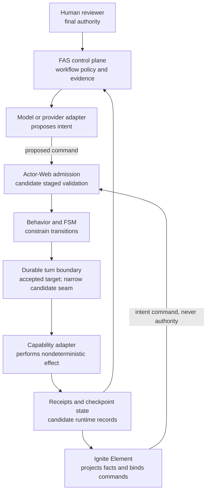

# Actor-Web Architecture Study Guide

## Status and purpose

This is a living, non-normative learning guide for understanding Actor-Web's
architecture from the bottom up. It connects foundational material to the
actual APIs and guarantees in this repository so that study produces usable
design judgment, not just vocabulary.

Completed weekly modules live in the
[Actor-Web learning product](./learning/README.md), which separates a readable
book from a hands-on workbook and interactive labs. Week 1 is complete across
all three surfaces; later weeks remain planned until their content is complete.

Snapshot used for this guide: `@actor-web/runtime` and `@actor-web/testing`
`0.2.0`, plus the recoverable CLI-host work merged by
[PR 56](https://github.com/0xjcf/actor-web/pull/56) as of July 31, 2026. Always
verify current source before treating a maturity statement here as a shipped
guarantee.

The intended outcome is that you can answer questions such as:

- Why is an actor preferable to an ordinary object or service here?
- What exactly happens between `send(...)` and a behavior handler?
- Which failure guarantees come from a mailbox, transport, supervisor,
  checkpoint, or application protocol?
- Why are schema admission, domain acceptance, and execution authorization
  different decisions?
- Why do we persist effect intent before calling an external system?
- Why can we prevent duplicate effects without claiming magical
  "exactly-once" execution?
- Why must FAS, Actor-Web, and Ignite Element keep separate authority?

## The short answer: is this Erlang or Elixir?

Actor-Web is **Erlang/OTP-inspired; it is not a BEAM reimplementation**.

The family resemblance is real:

| Erlang/OTP idea | Actor-Web counterpart | Shared reason |
| --- | --- | --- |
| Lightweight process with private state | Actor with isolated `context` | Remove shared mutable state from the concurrency model |
| Process mailbox | Bounded actor mailbox | Serialize message handling per actor |
| `Pid ! Message` / `GenServer.cast` | `ActorRef.send(message)` | Directed, asynchronous command without a reply contract |
| `GenServer.call` | `ActorRef.ask(message, timeout)` | Request/reply with an explicit timeout |
| `gen_server` behavior callbacks | `defineBehavior(...).withContext(...).onMessage(...)` | Separate reusable runtime machinery from application behavior |
| Supervisor strategies | Topology supervisor groups and actor restart policies | Make recovery policy explicit and keep failure handling out of the happy path |
| Registered names and distribution | Actor addresses, topology, directory, and transport | Address actors without coupling behavior to placement |
| OTP application structure | `defineActorWebTopology(...)` and runtime hosts | Declare actors, nodes, placement, and lifecycle as data |

The differences are equally important:

- Actor-Web runs on JavaScript runtimes. An actor is not a BEAM process with a
  private heap, preemptive reductions-based scheduling, per-process garbage
  collection, links, monitors, and decades of VM-level fault isolation.
- JavaScript still has one event loop per isolate or worker. A CPU-heavy or
  blocking handler can starve unrelated actors in that isolate. Actor
  isolation is an application/runtime discipline, not a new VM scheduler.
- Actor-Web user messages are currently at-most-once. Mailboxes, cross-node
  subscriptions, and transports can drop work at documented boundaries.
- Actor-Web supervision is intentionally smaller than full OTP: supervisor
  groups are one level deep, their children are co-located, and restarts begin
  from initial state unless behavior-specific recovery uses an external store.
- Actor-Web does not currently provide generic durable actors, OTP releases,
  hot code upgrades, or BEAM distribution semantics.
- The evidence-governed runtime adds concerns that do not come free from the
  actor model: authenticated principals, policy decisions, idempotency,
  checkpoints, effect intents, receipts, trace lineage, replay, and
  reconciliation.

The best comparison is therefore:

> Erlang/OTP supplies much of the concurrency and fault-containment grammar.
> Distributed systems, durable execution, security policy, CQRS, and
> ports-and-adapters supply the rest of this architecture.

## How to learn it efficiently

Do not try to finish a distributed-systems curriculum before touching the
code. Use a **spiral, failure-first learning loop**:

1. Learn one concept well enough to predict behavior.
2. Trace the concept through one public API and one implementation file.
3. Build or modify a tiny example.
4. Inject the failure the abstraction is supposed to handle.
5. Read the test or conformance fixture that proves the guarantee.
6. Explain what remains unguaranteed in your own words.

Spend about five to seven hours per week for ten weeks. A useful weekly split
is:

- 90 minutes of primary reading
- 90 minutes tracing Actor-Web source and tests
- two hours implementing a small exercise
- one hour breaking it and interpreting the result
- 30 minutes recording a one-page architecture note

The note matters. For every module, write:

```text
Concept:
Problem it solves:
Guarantee it provides:
Guarantee it does not provide:
Actor-Web API or file:
Failure I reproduced:
Design question I can now answer:
```

## The architecture in one picture

This is the **accepted target-state authority map**, not a claim that every
box is a current published guarantee. It combines the current actor/runtime
foundation with candidate admission, checkpoint, receipt, and recovery seams
and the still-target FAS conformance boundary. The maturity table below is the
authority for what is current, candidate, accepted target, or deferred.



The important direction is not the arrow layout; it is the authority boundary:

- Models propose.
- Behaviors and state machines constrain legal transitions.
- In the accepted target state, Actor-Web owns runtime validation,
  authorization, transition, persistence, execution, checkpointing,
  resumption, reconciliation, and authoritative runtime receipts. Current and
  candidate coverage is limited to the rows in the maturity table below.
- FAS owns workflow meaning, review policy, evidence normalization, and
  control-plane decisions.
- Ignite Element owns semantic projection and intent binding, not execution.
- Humans retain final review and merge authority.

## Vocabulary to settle first

These terms occupy different layers. Collapsing them leads directly to leaky
APIs.

| Term | Working meaning in this architecture | Typical Actor-Web surface |
| --- | --- | --- |
| Domain | The product's meaning, rules, and invariants | Application-owned message and context types |
| Behavior | The allowed reaction to a message in the current state | `defineBehavior`, `onMessage` |
| FSM or statechart | An explicit model of valid states and transitions | `withFSM`, `withMachine` |
| Actor | An identity, private state, mailbox, and behavior | `ActorRef`, actor instance, topology actor |
| Message | A directed request for an actor to consider doing something | `send`, `ask`, `MessagePlan` |
| Event or fact | Something the authoritative producer says happened | `emit`, projections, receipts |
| Policy | A decision about whether or under what conditions an action is allowed | `AgentExecutionAdmissionPolicy` or caller-owned adapter |
| Principal | The authenticated identity on whose authority a command runs | `AgentExecutionCommandPrincipal` |
| Capability | The name of an operation that could be performed | Tool or topology capability declaration |
| Port | A provider-neutral boundary the core can call | Policy, idempotency, checkpoint, transport, or provider interfaces |
| Adapter | A concrete implementation of a port | WebSocket transport, checkpoint store, LLM provider |
| Functional core | Deterministic logic that decides next state and effect intent | FSM transition and pure validation helpers |
| Imperative shell | Coordination that performs I/O and records outcomes | Runtime host, message processor, capability adapter |
| Effect intent | A durable statement of an external action that should be attempted | `effect_intent` receipt or checkpoint effect state |
| Receipt | A durable fact about admission, attempt, outcome, or reconciliation | `AgentExecutionReceipt` variants |
| Checkpoint | Versioned state from which a session may resume or be reconciled | `AgentSessionCheckpointEnvelope` |
| Projection | A consumer-oriented view derived from authoritative facts | Actor source and gateway snapshot/event stream |
| Reconciliation | Comparing desired or recorded state with observed reality and repairing safely | Reconciliation receipt and recovery path |
| Control plane | Decides what should run and under which workflow policy | FAS |
| Data plane | Executes admitted work and reports authoritative runtime facts | Actor-Web runtime and hosts |

One subtle distinction deserves repetition: a model/provider is normally an
adapter used by an actor, not automatically the actor itself. The actor retains
identity, behavior, lifecycle, authorization, and durable lineage even if the
provider changes.

## Current, target, and deferred maturity

Study architecture as a set of proven guarantees, not a single aspirational
diagram.

| Area | Maturity in this snapshot | What that means |
| --- | --- | --- |
| Isolated actor context, mailbox, `send`, `ask`, and emitted events | Current | Usable runtime behavior with documented at-most-once boundaries |
| Topology, placement, supervision, runtime transport, gateway, and sources | Current | Implemented, but with the documented supervision and delivery limitations |
| Provider-neutral execution trace, staged admission, receipts, and validation | Candidate (source) | Contract version 1 exists in runtime/testing source; publication maturity is separate |
| Agent-session checkpoint and rehydration seam | Candidate (source) | Narrow agent-session recovery exists; it is not generic durable actor state |
| Recoverable distributed CLI host | Candidate (merged source) | PR 56 connects hosting, readiness, checkpoint dependency, trace streaming, and recovery proofs; package publication is separate |
| FAS control-plane conformance over the runtime host | Accepted target | The next dependency-chain concern after PR 56; must be proved in FAS-owned mappings and policy |
| Published downstream contract | Deferred | Release/publication claims wait for runtime-host and FAS conformance |
| Generic transactional mailbox, actor state, inbox, outbox, and effect intent | Deferred | Do not infer this from the narrower checkpoint seam |
| Full OTP supervision trees and VM semantics | Deferred or non-goal | Actor-Web can borrow the principles without reproducing the BEAM |

Use the repository's
[ecosystem alignment note](./actor-web-ecosystem-alignment.md) and
[provider-neutral execution contract](./provider-neutral-agent-execution-contract.md)
to refresh these labels before making a decision.

## Ten-week learning path

### Week 1: JavaScript concurrency and the mailbox

The repository contains all three Week 1 surfaces. The canonical Pages links
below become a **current publication** only after the Docs workflow deploys
them from `main`; if any URL does not resolve, treat publication as candidate
and use the matching files under `docs/learning/` locally.

[Read Chapter 1](https://0xjcf.github.io/actor-web/learning/guide/01-javascript-concurrency-and-mailboxes.html),
[complete the workbook](https://0xjcf.github.io/actor-web/learning/workbook/01-javascript-concurrency-and-mailboxes.html),
and [open the interactive lab](https://0xjcf.github.io/actor-web/learning/labs/week-01-event-loop-and-mailbox.html).

**Question to answer:** If JavaScript is single-threaded, why do we still need
an actor concurrency model?

Learn:

- call stack, task queue, microtasks, timers, asynchronous I/O
- cooperative scheduling and why a long handler blocks progress
- queues, capacity, overflow, load shedding, and backpressure
- the difference between concurrent work and parallel CPU execution

Primary material:

- [Node.js event loop, timers, and `nextTick`](https://nodejs.org/en/learn/asynchronous-work/event-loop-timers-and-nexttick)
- [Node.js: do not block the event loop](https://nodejs.org/en/learn/asynchronous-work/dont-block-the-event-loop)

Read in this repository, in order:

1. [`mailbox.ts`](../packages/actor-core-runtime/src/messaging/mailbox.ts)
2. [`actor-instance.ts`](../packages/actor-core-runtime/src/actor-instance.ts)
3. [`actor-ref.ts`](../packages/actor-core-runtime/src/actor-ref.ts)

Exercise:

1. Implement a 20-line bounded FIFO queue outside Actor-Web.
2. Add `drop`, `fail`, and `park` overflow policies.
3. Run one deliberately blocking handler and observe what stops progressing.
4. Compare your result with `BoundedMailbox` statistics and tests.

Exit test: explain why "one message at a time" prevents concurrent mutation of
one actor's context but does not prevent event-loop starvation.

### Week 2: The actor model and OTP behaviors

**Question to answer:** What does an actor give us that a class with async
methods does not?

Learn:

- actor identity, private state, asynchronous message passing, and mailboxes
- tell versus request/reply
- behavior as a reusable runtime contract
- process names, addresses, links, monitors, and failure signals
- why location transparency helps and where it can hide cost or failure

Primary material:

- [Carl Hewitt, Actor Model of Computation](https://arxiv.org/abs/1008.1459)
- [Erlang processes](https://www.erlang.org/doc/system/ref_man_processes.html)
- [Erlang `gen_server` concepts](https://www.erlang.org/doc/system/gen_server_concepts.html)
- [Elixir processes](https://hexdocs.pm/elixir/processes.html)

Read in this repository:

1. [`otp-style-demo.ts`](../packages/actor-core-runtime/src/examples/otp-style-demo.ts)
2. [`fluent-behavior-builder.ts`](../packages/actor-core-runtime/src/fluent-behavior-builder.ts)
3. [`pure-behavior-handler.ts`](../packages/actor-core-runtime/src/pure-behavior-handler.ts)
4. [Actors and behaviors](./site/concepts/actors-and-behaviors.md)
5. [Messages](./site/concepts/messages.md)

Exercise: build the same counter three ways: a mutable class, an Erlang or
Elixir `GenServer`, and an Actor-Web behavior. Compare state ownership, command
ordering, failure propagation, testability, and remote placement.

The Actor-Web form should resemble this current API:

```ts
type CounterMessage =
  | { type: 'INCREMENT'; amount: number }
  | { type: 'READ' };

const counter = defineBehavior<CounterMessage>()
  .withContext({ count: 0 })
  .onMessage(({ message, context }) => {
    if (message.type === 'INCREMENT') {
      const count = context.count + message.amount;
      return {
        context: { count },
        emit: [{ type: 'COUNT_CHANGED', count }],
      };
    }
    return { reply: { count: context.count } };
  });
```

Exit test: explain why `send` is closer to `cast`, `ask` is closer to `call`,
and neither makes a network effect durable.

### Week 3: Supervision and failure domains

**Question to answer:** When is "let it crash" safer than catching an error?

Learn:

- faults versus expected domain errors
- restart, resume, stop, and escalate
- one-for-one, one-for-all, and rest-for-one strategies
- restart intensity, backoff, blast radius, and dependency ordering
- why state that caused a crash may be unsafe to resume blindly

Primary material:

- [Erlang supervision principles](https://www.erlang.org/doc/system/sup_princ.html)
- [Erlang/OTP design principles](https://www.erlang.org/doc/system/design_principles.html)

Read in this repository:

1. [Supervision and fault tolerance](./site/concepts/supervision.md)
2. [`actor-system-guardian.ts`](../packages/actor-core-runtime/src/actor-system-guardian.ts)
3. [`otp-types.ts`](../packages/actor-core-runtime/src/otp-types.ts)
4. [`otp-message-plan-processor.ts`](../packages/actor-core-runtime/src/otp-message-plan-processor.ts)

Exercise: create three actors where the second depends on the first. Crash each
actor under every group strategy. Record stop order, restart order, mailbox
loss, subscription behavior, and restored state.

Exit test: choose a strategy for a payment workflow and defend its blast radius.
Also state why supervision without persistence is recovery of computation, not
recovery of committed business work.

### Week 4: Behaviors, finite-state machines, and statecharts

**Question to answer:** Why should a probabilistic model propose actions instead
of selecting arbitrary state transitions?

Learn:

- states, events, transitions, guards, actions, and invariants
- finite-state machines versus statecharts with hierarchy and parallel states
- pure transition functions versus I/O effects
- impossible states and illegal transition rejection
- property-based and model-based testing

Primary material:

- [XState state machines](https://stately.ai/docs/machines)
- [XState actors](https://stately.ai/docs/actors)
- [XState states](https://stately.ai/docs/states)

Read in this repository:

1. [`unified-actor-builder.ts`](../packages/actor-core-runtime/src/unified-actor-builder.ts)
2. [`fluent-behavior-builder.ts`](../packages/actor-core-runtime/src/fluent-behavior-builder.ts)
3. [`otp-style-demo.ts`](../packages/actor-core-runtime/src/examples/otp-style-demo.ts)

Exercise: model an approval flow with `draft`, `awaiting-review`, `approved`,
`rejected`, and `executing`. Ask a model to propose the next command, but make
the machine reject `EXECUTE` from every state except `approved`.

Exit test: distinguish the domain rule "an approved revision may execute" from
the behavior transition and from the policy decision about who may approve it.

### Week 5: Distributed systems and delivery semantics

**Question to answer:** What can go wrong after a valid message leaves the
caller?

Learn:

- partial failure, network partitions, crash-stop and crash-recovery models
- loss, duplication, delay, and reordering
- at-most-once, at-least-once, and effectively-once processing
- timeouts as uncertainty, not proof that nothing happened
- correlation, causation, logical clocks, attempts, and sequence numbers
- backpressure, bounded queues, retry budgets, exponential backoff, and jitter

Primary material:

- [Leslie Lamport, Time, Clocks, and the Ordering of Events](https://lamport.azurewebsites.net/pubs/time-clocks.pdf)
- [AWS: timeouts, retries, backoff, and jitter](https://aws.amazon.com/builders-library/timeouts-retries-and-backoff-with-jitter/)
- [Jepsen consistency models](https://jepsen.io/consistency)
- [MIT 6.5840 Distributed Systems](https://pdos.csail.mit.edu/6.824/)

Read in this repository:

1. [Transport and multi-node delivery](./site/concepts/transport.md)
2. [Distributed runtime stack ADR](./0011-distributed-runtime-stack.md)
3. [`runtime-transport-contract.ts`](../packages/actor-core-runtime/src/runtime-transport-contract.ts)
4. [`runtime-transport-protocol.ts`](../packages/actor-core-runtime/src/runtime-transport-protocol.ts)
5. [`node-websocket-message-transport.ts`](../packages/actor-core-runtime/src/node-websocket-message-transport.ts)

Exercise: insert a proxy or test adapter that randomly drops, duplicates,
delays, and reorders messages. Make a command protocol safe under each fault
without changing user `send` into an undocumented stronger guarantee.

Exit test: given an `ask` timeout, list at least three possible realities on the
remote side and explain why retrying can duplicate an irreversible effect.

### Week 6: Durable execution, idempotency, and reconciliation

**Question to answer:** How do we resume after a crash without repeating an
irreversible effect?

Learn:

- durable admission versus committed handling versus external completion
- write-ahead intent, inbox/outbox patterns, effect journals, and receipts
- idempotency keys, deduplication scope, and result replay
- checkpoints, replay, deterministic state, and nondeterministic effects
- sagas and compensation
- reconciliation when the last external outcome is unknown

Primary material:

- [AWS: making retries safe with idempotent APIs](https://aws.amazon.com/builders-library/making-retries-safe-with-idempotent-APIs/)
- [Hector Garcia-Molina and Kenneth Salem, Sagas](https://sigmodrecord.org/1987/12/09/sagas/)
- [Pat Helland, Life Beyond Distributed Transactions](https://www.cidrdb.org/cidr2007/papers/cidr07p15.pdf)
- [Martin Fowler, Event Sourcing](https://martinfowler.com/eaaDev/EventSourcing.html)

Read in this repository:

1. [Provider-neutral execution contract](./provider-neutral-agent-execution-contract.md)
2. [`agent-execution-contract.ts`](../packages/actor-core-runtime/src/agent-execution-contract.ts)
3. [`agent-session-checkpoint-store.ts`](../packages/actor-core-runtime/src/agent-session-checkpoint-store.ts)
4. [`agent-session-checkpoint-conformance.ts`](../packages/actor-core-testing/src/agent-session-checkpoint-conformance.ts)
5. [`runtime-host-recovery-conformance.ts`](../packages/actor-core-testing/src/runtime-host-recovery-conformance.ts)

The accepted target protocol has this shape:

> Maturity boundary: current Actor-Web does not provide this as a generic
> transactional actor turn. The candidate agent-session checkpoint and receipt
> seams prove a narrower recovery path; generic atomic state-plus-effect-intent
> persistence remains deferred.

```text
1. Validate and authorize the command.
2. Decide the next deterministic state and effect intent.
3. Persist state plus intent at the required atomic boundary.
4. Attempt the external effect using a stable idempotency key.
5. Record the execution outcome as a success, failure, timeout, cancellation,
   or partial-failure receipt. `timeout` and `partial_failure` are non-terminal
   receipt statuses; they are not checkpoint rehydration outcomes.
6. On restart, inspect checkpoint, intent, attempt, and receipt lineage. If the
   external call may have occurred but no settled result was recorded,
   rehydration transitions to `deferred_for_reconciliation`.
7. Block automatic retry while reconciliation is required. Resume or attempt
   again only after a reconciliation receipt records the observed outcome and
   the current policy permits the next transition.
```

Exercise: simulate crashes at every boundary: before intent, after intent,
after the external call but before its receipt, and after the receipt but before
the next checkpoint. The crash after call/before receipt must not automatically
repeat the effect. It should become `deferred_for_reconciliation`.

Exit test: explain why "exactly once" is usually a protocol assembled from
stable identity, durable records, adapter deduplication, and reconciliation,
not a property a function call can promise by itself.

### Week 7: Authentication, authorization, and capabilities

**Question to answer:** Why is discovering a tool or passing schema validation
not permission to execute it?

Learn:

- authentication versus authorization
- subject or principal, resource, action, environment, and policy version
- policy decision point versus policy enforcement point
- capabilities as descriptive affordances versus authority-bearing tokens
- time-of-check/time-of-use gaps, revision checks, approval expiry, and
  fail-closed behavior
- credential minimization and audit-safe redaction

Primary material:

- [NIST SP 800-207: Zero Trust Architecture](https://csrc.nist.gov/pubs/sp/800/207/final)
- [Open Policy Agent deployment and decision APIs](https://www.openpolicyagent.org/docs/deploy)
- [Open Policy Agent decision logs](https://www.openpolicyagent.org/docs/management-decision-logs)

Read in this repository:

1. [`agent-execution-contract.ts`](../packages/actor-core-runtime/src/agent-execution-contract.ts)
2. [`runtime-auth.ts`](../packages/actor-core-runtime/src/runtime-auth.ts)
3. [`runtime-gateway.ts`](../packages/actor-core-runtime/src/runtime-gateway.ts)
4. [`runtime-host.ts`](../packages/agent-workflow-cli/src/host/runtime-host.ts)

Keep three decisions separate:

```text
schema-admitted
    The JSON shape and version are valid.

domain-accepted
    The command makes sense for this actor and current domain state.

execution-authorized
    This principal may execute this exact command, payload, approval,
    revision, idempotency key, and policy version now.
```

Exercise: create commands that are valid at exactly two of the three layers.
Prove that a discovered capability, valid schema, authenticated gateway, stale
approval, reused idempotency key, or changed revision cannot bypass the final
execution-time check.

Exit test: identify the policy decision point and enforcement point, then
explain why client-supplied principal data cannot be authoritative.

### Week 8: Facts, traces, CQRS, and projections

**Question to answer:** Why is a UI snapshot useful but not authoritative?

Learn:

- commands versus facts
- source of truth versus derived read model
- CQRS and event-sourced projections
- revision and sequence gaps, stale reads, replay, and resynchronization
- trace, span, correlation, causation, attempt, checkpoint, and receipt identity
- redaction that preserves joinability without leaking secrets or prompts

Primary material:

- [Martin Fowler, CQRS](https://martinfowler.com/bliki/CQRS.html)
- [W3C Trace Context](https://www.w3.org/TR/trace-context/)
- [JSON Schema learning resources](https://json-schema.org/learn)
- [Semantic Versioning 2.0.0](https://semver.org/)

Read in this repository:

1. [Sources and the gateway](./site/concepts/sources-and-gateway.md)
2. [`actor-web-source.ts`](../packages/actor-core-runtime/src/actor-web-source.ts)
3. [`runtime-gateway.ts`](../packages/actor-core-runtime/src/runtime-gateway.ts)
4. [`agent-execution-conformance.ts`](../packages/actor-core-testing/src/agent-execution-conformance.ts)

Exercise: project a trace into an operator table, then deliberately deliver
receipts out of order and create a sequence gap. The projection should report
staleness and resynchronize; it must not invent success or execute anything.

Exit test: state which identifiers join one command to its intent, principal,
attempts, checkpoint, and receipts without collapsing those identities into one
ambiguous ID.

### Week 9: Ports, adapters, and ecosystem authority

**Question to answer:** Why do FAS- or Ignite-specific concepts not belong in
Actor-Web runtime packages?

Learn:

- dependency inversion and hexagonal architecture
- provider-neutral ports and consumer-owned adapters
- functional core and imperative shell
- control plane versus data plane
- composition roots and independently useful packages

Primary material:

- [Alistair Cockburn, Hexagonal Architecture](https://alistair.cockburn.us/hexagonal-architecture)
- [Gary Bernhardt, Boundaries](https://www.destroyallsoftware.com/talks/boundaries)
- [Kubernetes controllers](https://kubernetes.io/docs/concepts/architecture/controller/)

Read in this repository:

1. [Actor-Web decoupling design](./actor-web-decoupling-design.md)
2. [Ecosystem alignment note](./actor-web-ecosystem-alignment.md)
3. [Distributed runtime stack ADR](./0011-distributed-runtime-stack.md)
4. [CLI runtime-host design](./actor-web-cli-runtime-host-design.md)

Exercise: draw the dependency graph for a feature that uses all three repos.
Put the Actor-Web-to-FAS translation in FAS, the Actor-Web-to-Ignite binding in
Ignite, and composition in the product host. Then test each repository without
the other two installed.

Exit test: for every new type, answer who owns its meaning, who validates it,
who executes it, who persists it, and who merely projects it.

### Week 10: Conformance and failure-oriented testing

**Question to answer:** What evidence is strong enough to call a runtime
guarantee real?

Learn:

- example tests versus contract and conformance tests
- golden JSON fixtures and supported-version matrices
- property-based, state-machine, and model-based tests
- deterministic clocks and identifiers
- fault injection, crash points, restart harnesses, and invariant checking
- compatibility, malformed input, unsupported versions, and fail-closed tests

Read in this repository:

1. [`agent-execution-conformance.ts`](../packages/actor-core-testing/src/agent-execution-conformance.ts)
2. [`agent-session-checkpoint-conformance.ts`](../packages/actor-core-testing/src/agent-session-checkpoint-conformance.ts)
3. [`runtime-host-recovery-conformance.ts`](../packages/actor-core-testing/src/runtime-host-recovery-conformance.ts)
4. [`runtime-host.ts`](../packages/agent-workflow-cli/src/host/runtime-host.ts)
5. The focused tests adjacent to each source file above

Exercise: make a downstream-only test harness that consumes the public fixture
surface. Verify:

- supported contract and schema versions
- unsupported and malformed input behavior
- terminal-lineage rejection
- timeout followed by retry and success
- crash after effect attempt but before receipt
- restart and rehydration outcomes
- no automatic duplicate irreversible effect
- explicit reconciliation receipt before safe continuation
- redaction with stable join keys

Exit test: distinguish a green unit test from a versioned, downstream-consumable
conformance proof.

## Lower-level API reading order

When an API feels too abstract, walk down one vertical slice instead of reading
the repository horizontally.

### Slice A: from a local command to state

```text
ActorRef.send or ActorRef.ask
  -> actor instance
  -> bounded mailbox
  -> behavior handler
  -> next context, reply, emitted event, or MessagePlan
  -> snapshot/event subscription
```

Read:

1. [`actor-ref.ts`](../packages/actor-core-runtime/src/actor-ref.ts)
2. [`actor-instance.ts`](../packages/actor-core-runtime/src/actor-instance.ts)
3. [`mailbox.ts`](../packages/actor-core-runtime/src/messaging/mailbox.ts)
4. [`fluent-behavior-builder.ts`](../packages/actor-core-runtime/src/fluent-behavior-builder.ts)
5. [`otp-message-plan-processor.ts`](../packages/actor-core-runtime/src/otp-message-plan-processor.ts)

### Slice B: from an address to another node

```text
ActorRef address
  -> actor system directory or router
  -> runtime transport frame
  -> bounded peer queue
  -> peer transport
  -> remote directory
  -> remote mailbox
```

Read:

1. [`actor-system-impl.ts`](../packages/actor-core-runtime/src/actor-system-impl.ts)
2. [`runtime-transport-contract.ts`](../packages/actor-core-runtime/src/runtime-transport-contract.ts)
3. [`runtime-transport-protocol.ts`](../packages/actor-core-runtime/src/runtime-transport-protocol.ts)
4. [`node-websocket-message-transport.ts`](../packages/actor-core-runtime/src/node-websocket-message-transport.ts)
5. [`serve-actor-web-node.ts`](../packages/actor-core-runtime/src/serve-actor-web-node.ts)

### Slice C: from a consumer command to authorization

```text
Ignite or CLI intent
  -> source or gateway command frame
  -> authenticated host context
  -> credential-free principal
  -> schema and metadata validation
  -> application-owned policy adapter
  -> idempotency claim
  -> durable decision sink
  -> actor dispatch or rejection receipt
```

Read:

1. [`actor-web-source.ts`](../packages/actor-core-runtime/src/actor-web-source.ts)
2. [`runtime-gateway.ts`](../packages/actor-core-runtime/src/runtime-gateway.ts)
3. [`runtime-auth.ts`](../packages/actor-core-runtime/src/runtime-auth.ts)
4. [`agent-execution-contract.ts`](../packages/actor-core-runtime/src/agent-execution-contract.ts)
5. [`runtime-host.ts`](../packages/agent-workflow-cli/src/host/runtime-host.ts)

### Slice D: from an agent turn to safe recovery

```text
admitted command
  -> agent behavior
  -> deterministic checkpoint state
  -> effect intent and attempt identity
  -> provider or tool adapter
  -> receipt
  -> next checkpoint
  -> restart read
  -> resume, reconcile, or require manual recovery
```

Read:

1. [`index.ts` in `@actor-web/agent`](../packages/actor-agent/src/index.ts)
2. [`agent-session-checkpoint-store.ts`](../packages/actor-core-runtime/src/agent-session-checkpoint-store.ts)
3. [`node-agent-session-checkpoint-store.ts`](../packages/actor-core-runtime/src/node-agent-session-checkpoint-store.ts)
4. [`agent-session-checkpoint-conformance.ts`](../packages/actor-core-testing/src/agent-session-checkpoint-conformance.ts)
5. [`runtime-host-recovery-conformance.ts`](../packages/actor-core-testing/src/runtime-host-recovery-conformance.ts)

## Why these architecture decisions exist

Use this table as a decision-review checklist rather than doctrine.

| Decision | Problem it addresses | Cost or limitation we accept |
| --- | --- | --- |
| Actors own mutable state | Shared-state races and unclear concurrency ownership | Message protocols, mailbox pressure, and eventual coordination are more explicit work |
| Behaviors and FSMs constrain models | Probabilistic output cannot define application truth safely | Domain transitions must be modeled and maintained deliberately |
| `send`, `ask`, and `emit` stay distinct | Commands, request/reply, and facts have different coupling and failure semantics | More vocabulary than a single generic event bus |
| At-most-once is documented honestly | A transport cannot promise durable business completion by enqueueing once | Reliable workflows need application protocols and storage |
| Accepted target: state and irreversible effect intent meet at a durable boundary | A crash must not lose why an external call should happen | Requires storage design, versioning, and recovery policy |
| External outcomes become receipts | Provider calls are nondeterministic and may be uncertain | More records and lineage to manage |
| Retries use stable idempotency identity | Timeouts and transient failures require repetition without duplicate harm | Every adapter needs a clear deduplication scope and retention policy |
| Uncertain effects reconcile instead of replaying blindly | A timeout or crash after a call does not prove the call failed | Some work pauses for observation or human review |
| Admission has three stages | Valid JSON, valid domain action, and authorized execution are different claims | More explicit rejection states and tests |
| Execution rechecks current authority | Discovery, cached approval, and projections can become stale | A last-moment policy dependency can reject previously visible actions |
| Runtime contracts are JSON-safe and versioned | Downstream repos and providers need a stable, language-neutral seam | Rich runtime objects must be projected into stricter data shapes |
| Ports are provider-neutral; adapters live downstream | Core packages must stay independently useful and avoid dependency cycles | Consumers own translation code and reconfirm compatibility |
| FAS is control plane; Actor-Web is data plane | Workflow governance and runtime execution evolve at different rates | Cross-plane contracts and reconciliation are required |
| Ignite projects facts rather than owning execution | UI state is derived, possibly stale, and not a security boundary | Commands must travel back through authoritative admission |
| Humans keep final review and merge | Automated evidence can be incomplete or wrong | Full autonomy stops at an explicit governance boundary |

## Capstone: build a recoverable, evidence-governed worker

The capstone should be small enough to understand completely and harsh enough
to expose every layer.

Build two runtime nodes:

- a coordinator actor accepts `SUBMIT_JOB`, `APPROVE_JOB`, and `EXECUTE_JOB`
- a worker actor performs one simulated irreversible external effect
- an injected provider adapter returns success, timeout, authorization failure,
  partial failure, cancellation, or an indeterminate connection loss
- a read-only operator projection shows the job and receipt lineage

Milestones:

1. Model the job lifecycle as a state machine.
2. Put coordinator and worker behind typed `ActorRef` protocols.
3. Add a bounded mailbox and record its overflow behavior.
4. Place the worker on a second node and prove message-loss behavior.
5. Require an authenticated, credential-free principal.
6. Separate schema admission, domain acceptance, and execution authorization.
7. Persist job state plus effect intent before the provider call.
8. Use stable intent, command, effect, attempt, correlation, checkpoint, and
   receipt identities.
9. Crash at every persistence/effect boundary.
10. On an unknown effect result, require reconciliation instead of automatic
    repetition.
11. Prove no duplicate irreversible effect with a deduplicating fake adapter.
12. Consume the JSON-safe conformance fixture from a separate test package.
13. Project the facts into a UI without granting the UI execution authority.
14. Write a two-page ADR explaining every guarantee and non-guarantee.

The capstone is complete only when another person can answer these questions
from its tests and receipts:

- What was proposed?
- Who authorized it, under which policy and revision?
- Which domain transition was accepted?
- What intent was durably recorded?
- Was the external effect attempted, and under which idempotency key?
- What outcome is known, unknown, or partial?
- From which checkpoint can execution safely continue?
- What needs reconciliation or human review?
- Which record is authoritative and which is only a projection?

## A repeatable design-review rubric

Before accepting a lower-level API, ask:

1. **Meaning:** Which domain owns this concept?
2. **Authority:** Who may decide, execute, and publish the result?
3. **Identity:** Which IDs remain distinct, and how are records joined?
4. **Ordering:** What ordering is promised per actor, sender, node, or trace?
5. **Failure:** What happens on loss, duplication, delay, crash, timeout, and
   partial failure?
6. **Durability:** What is committed before an irreversible effect begins?
7. **Recovery:** Does restart resume, retry, reconcile, or require a human?
8. **Security:** Which principal and current policy are rechecked at execution?
9. **Projection:** Which consumers may observe or bind commands without gaining
   authority?
10. **Compatibility:** How are version, malformed input, redaction, and
    unsupported behavior defined?
11. **Evidence:** Which focused test, full gate, conformance fixture, and review
    receipt prove the claim?
12. **Boundary:** Can Actor-Web, FAS, and Ignite remain independently useful?

If an API proposal cannot answer these questions, it is not yet low-level
enough to be authoritative. It is still an architectural sketch.

## Suggested books and longer courses

Use these after the matching week, not as prerequisites:

- Joe Armstrong, *Programming Erlang*, for the Erlang process and OTP mindset
- Bruce Tate et al., *Designing Elixir Systems with OTP*, for practical
  supervision and application structure
- Martin Kleppmann, *Designing Data-Intensive Applications*, especially the
  chapters on encoding, replication, transactions, and distributed-system
  trouble
- Chris Richardson, *Microservices Patterns*, selectively for sagas,
  transactional outbox, idempotent consumers, and API composition
- Eric Evans, *Domain-Driven Design*, selectively for domain language,
  invariants, aggregates, and bounded contexts
- [MIT 6.5840 Distributed Systems](https://pdos.csail.mit.edu/6.824/) for a
  rigorous implementation course
- [Designing Data-Intensive Applications resources](https://dataintensive.net/)
  for papers and talks surrounding the book

Do not copy a pattern because a book names it. For each pattern, state the
failure it handles, the store or authority it assumes, and the new failure mode
it introduces.

## Recommended immediate sequence

Start with this four-session mini-course before the full ten weeks:

1. Read the Actor-Web overview, messages, and supervision docs; trace one local
   `send` through `ActorRef`, mailbox, actor instance, and handler.
2. Work through the Elixir process guide and Erlang `gen_server` concepts;
   create the same counter in Elixir and Actor-Web.
3. Trace the execution admission contract from principal to policy,
   idempotency claim, decision sink, and dispatch. Construct one rejection at
   each admission stage.
4. Trace the checkpoint conformance scenarios and explain the
   call-completed/receipt-missing crash without using the phrase "exactly once."

After those sessions, revisit PR 56. You should be able to explain why the CLI
host is not merely a command-line wrapper: it is the composition and recovery
boundary that wires topology, transport, directory readiness, authentication,
admission, checkpoint dependency, trace streaming, and operator-visible
degradation into one recoverable host.
