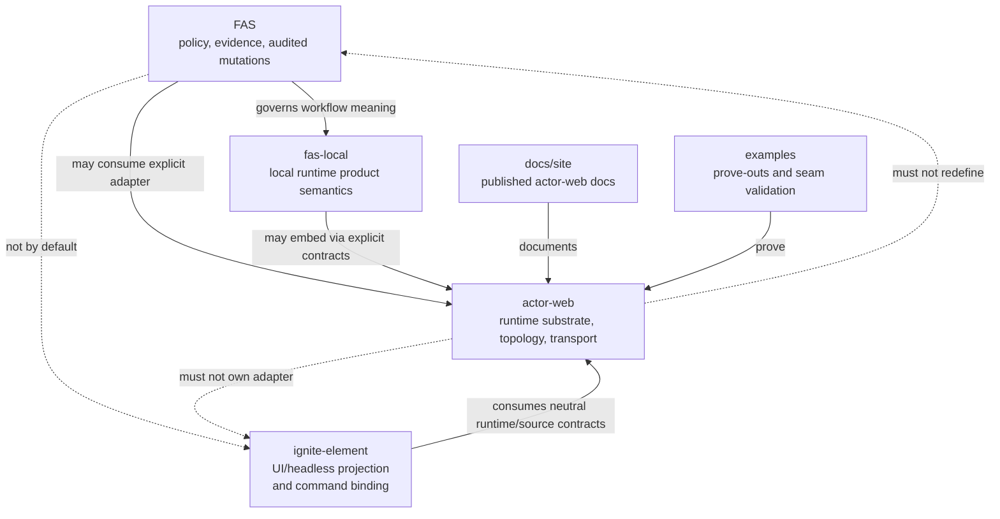
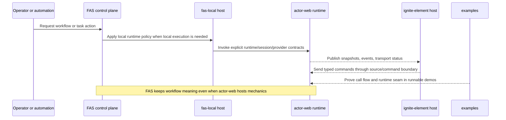
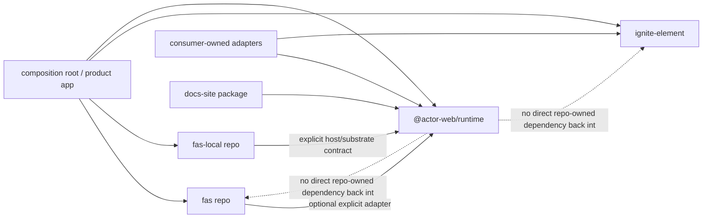
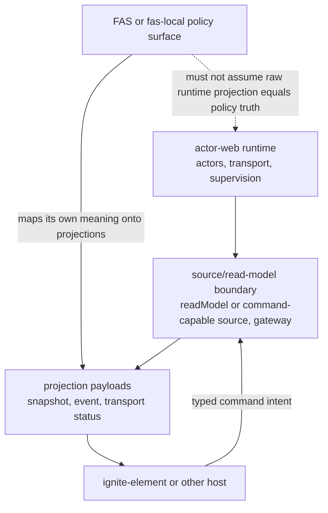

# Actor-Web Ecosystem Alignment Note

## Status

Internal actor-web alignment note. This document is repo-local guidance for
`actor-web` maintainers. It does not ratify governance for `FAS`, `fas-local`,
`ignite-element`, or `docs/site`, and it does not replace accepted ADRs in
those repos.

## Purpose

This note records the current actor-web view of the ecosystem boundary between
`FAS`, `fas-local`, `actor-web`, `ignite-element`, published docs, and examples.
It is intentionally narrower than a cross-repo ADR:

- use current repo evidence for current-state claims
- use sibling ADRs only when their status is explicit
- treat spikes and design notes as historical evidence, not adopted policy

## Governance Stack

Use these sources in order when deciding whether a statement is current fact,
target state, or provenance only.

| Rank | Source | Use |
| --- | --- | --- |
| 1 | Current actor-web source and package exports, especially [../packages/actor-core-runtime/src/node.ts](../packages/actor-core-runtime/src/node.ts), [../packages/actor-core-runtime/src/actor-web-client.ts](../packages/actor-core-runtime/src/actor-web-client.ts), and [../package.json](../package.json) | Current actor-web contract and shipped surface |
| 2 | Accepted or explicitly proposed ADRs with visible status, especially [../../fas/docs/adr/0006 - shared-architecture-roadmap.md](../../fas/docs/adr/0006%20-%20shared-architecture-roadmap.md) and [./0009-fas-local-runtime-host-substrate-alignment.md](./0009-fas-local-runtime-host-substrate-alignment.md) | Cross-repo target direction and boundary language |
| 3 | Current actor-web design notes such as [./actor-web-decoupling-design.md](./actor-web-decoupling-design.md) | Present design intent when source alone is not enough |
| 4 | Historical spikes such as [./spikes/actor-web-adr-003-fas-integration-review.md](./spikes/actor-web-adr-003-fas-integration-review.md) and [./actor-web-adr-003-alignment-spike.md](./actor-web-adr-003-alignment-spike.md) | Provenance, prior reasoning, and drift detection only |

## Law Of Least Inference

Operational gate:

1. Call something a current fact only when the current actor-web tree or an
   explicitly statused ADR still supports it.
2. If a historical spike cites files or contracts that no longer exist, keep
   the spike as provenance and downgrade the claim to historical evidence.
3. If actor-web and a sibling repo both describe a boundary, prefer the source
   that owns that boundary:
   `FAS` for workflow policy, `fas-local` for local runtime product meaning,
   `actor-web` for runtime substrate, `ignite-element` for UI/headless
   projection and adapter consumption.
4. If the evidence only supports direction, label it `target state`, not
   `current state`.

Applied example:
the historical integration spike references
`integration/fas-shared-contracts.ts` and `integration/ignite-element-bridge.ts`
in [./spikes/actor-web-adr-003-fas-integration-review.md](./spikes/actor-web-adr-003-fas-integration-review.md),
but the current repo instead records their removal in
[./actor-web-decoupling-design.md](./actor-web-decoupling-design.md). The
historical spike remains useful provenance, but it is not current contract
truth.

## Current Vs Target Maturity Matrix

Maturity labels:

- `Current`: evidenced in the present tree or statused ADR.
- `Partial`: direction is live, but the boundary is still being proved or owned
  elsewhere.
- `Target`: north-star only, not safe to treat as adopted.

| Area | Current maturity | Current evidence | Target state |
| --- | --- | --- | --- |
| Shared architecture vocabulary across repos | `Partial` | [../../fas/docs/adr/0006 - shared-architecture-roadmap.md](../../fas/docs/adr/0006%20-%20shared-architecture-roadmap.md) is `Proposed`, not accepted stack-wide | Paired accepted ADRs and explicit contracts in each owning repo |
| actor-web runtime substrate | `Current` | Runtime entrypoints and exports in [../packages/actor-core-runtime/src/actor-web-client.ts](../packages/actor-core-runtime/src/actor-web-client.ts), [../packages/actor-core-runtime/src/topology-entry.ts](../packages/actor-core-runtime/src/topology-entry.ts), and [../packages/actor-core-runtime/src/node.ts](../packages/actor-core-runtime/src/node.ts) | Stable substrate consumed by sibling repos through explicit adapters only |
| FAS workflow policy ownership | `Current` | Preserved by [../../fas/docs/adr/0006 - shared-architecture-roadmap.md](../../fas/docs/adr/0006%20-%20shared-architecture-roadmap.md) and reinforced by actor-web boundary notes such as [./0009-fas-local-runtime-host-substrate-alignment.md](./0009-fas-local-runtime-host-substrate-alignment.md) | FAS continues to own policy even if runtime mechanics move out |
| fas-local public runtime semantics | `Current` | [./0009-fas-local-runtime-host-substrate-alignment.md](./0009-fas-local-runtime-host-substrate-alignment.md) keeps `Runtime`, `Session`, `Provider`, and CLI meaning in `fas-local` | actor-web may host internals, but not own public semantics |
| actor-web to FAS contract shape | `Partial` | Current tree exposes neutral runtime and node-session/node-provider contracts in [../packages/actor-core-runtime/src/node-session-actor-contract.ts](../packages/actor-core-runtime/src/node-session-actor-contract.ts) and [../packages/actor-core-runtime/src/node-provider-lifecycle-contract.ts](../packages/actor-core-runtime/src/node-provider-lifecycle-contract.ts); decoupling note removes FAS-owned bridge from actor-web | FAS-owned adapter maps neutral actor-web projections into FAS vocabulary |
| actor-web to ignite-element seam | `Partial` | Current examples in [./examples/ignite-element-host.md](./examples/ignite-element-host.md) show runtime/UI seam; current Ignite accepts a single `source` handle, either read-only or command-capable, while the decoupling note says actor-web should not own the Ignite adapter | ignite-element owns the adapter/headless runtime integration and consumes neutral actor-web source contracts through one Ignite `source` surface |
| docs/site as published source of truth | `Current` for actor-web docs, `Not governance` for cross-repo ownership | Site content exists under [./site](./site), but task scope and repo boundaries keep it distinct from this note | Published docs may describe the actor-web API, but not ratify sibling repo governance |
| examples as ecosystem proof | `Current` as prove-out only | Examples and scripts are first-class in [../package.json](../package.json) and docs such as [./examples/ignite-element-host.md](./examples/ignite-element-host.md) | Examples continue to prove seams without becoming governance documents |

## Scoped Responsibilities

| Surface | Owns now | Must not silently own |
| --- | --- | --- |
| `FAS` | Workflow policy, task/queue meaning, review and verification evidence, memory discipline, audited mutations, control-plane vocabulary | actor-web runtime internals, ignite-element UI composition, fas-local public runtime semantics |
| `fas-local` | Local runtime product meaning, provider/session lifecycle semantics, operator-facing CLI/API contracts | actor-web topology ownership, FAS workflow policy, docs-site publication |
| `actor-web` | Runtime substrate, topology, sources, gateway, transport, supervision, node-session and node-provider substrate contracts | FAS policy meaning, ignite-element adapter ownership, cross-repo governance by implication |
| `ignite-element` | UI and headless projection, command binding, host-side view composition, Ignite adapter ownership | actor-web runtime semantics, FAS workflow meaning |
| `docs/site` | Published actor-web documentation and API guidance | internal cross-repo governance decisions unless explicitly ratified elsewhere |
| `examples` | Prove-outs, runnable seams, topology demos, validation of transport/source boundaries | long-term governance, production contract ownership, sibling repo semantics |

## Ownership Diagram

## Call-Flow Diagram

## Package And Dependency Diagram

## Projection And Read-Model Diagram

## Evidence Cross-Links

- Shared roadmap north star:
  [../../fas/docs/adr/0006 - shared-architecture-roadmap.md](../../fas/docs/adr/0006%20-%20shared-architecture-roadmap.md)
- Repo-local boundary ADR for `fas-local` substrate alignment:
  [./0009-fas-local-runtime-host-substrate-alignment.md](./0009-fas-local-runtime-host-substrate-alignment.md)
- Historical spike prompt:
  [./actor-web-adr-003-alignment-spike.md](./actor-web-adr-003-alignment-spike.md)
- Historical review result:
  [./spikes/actor-web-adr-003-fas-integration-review.md](./spikes/actor-web-adr-003-fas-integration-review.md)
- Current decoupling direction:
  [./actor-web-decoupling-design.md](./actor-web-decoupling-design.md)
- Current runtime entrypoints:
  [../packages/actor-core-runtime/src/actor-web-client.ts](../packages/actor-core-runtime/src/actor-web-client.ts),
  [../packages/actor-core-runtime/src/topology-entry.ts](../packages/actor-core-runtime/src/topology-entry.ts),
  [../packages/actor-core-runtime/src/node.ts](../packages/actor-core-runtime/src/node.ts)
- Current substrate contracts:
  [../packages/actor-core-runtime/src/node-session-actor-contract.ts](../packages/actor-core-runtime/src/node-session-actor-contract.ts),
  [../packages/actor-core-runtime/src/node-provider-lifecycle-contract.ts](../packages/actor-core-runtime/src/node-provider-lifecycle-contract.ts)
- Current ignite prove-out:
  [./examples/ignite-element-host.md](./examples/ignite-element-host.md)
- Current Ignite actor-web contract evidence:
  [../../ignite-element/docs/site/src/content/docs/guides/actor-web.mdx](../../ignite-element/docs/site/src/content/docs/guides/actor-web.mdx),
  [../../ignite-element/packages/ignite-element/src/igniteCore/actor-web.ts](../../ignite-element/packages/ignite-element/src/igniteCore/actor-web.ts),
  [../../ignite-element/packages/ignite-element/src/tests/types/igniteCore.types.test.ts](../../ignite-element/packages/ignite-element/src/tests/types/igniteCore.types.test.ts)

## Historical Evidence And Provenance

Historical evidence still matters here, but only with labels:

- [./actor-web-adr-003-alignment-spike.md](./actor-web-adr-003-alignment-spike.md)
  is intake material. It frames the questions, not the accepted answer.
- [./spikes/actor-web-adr-003-fas-integration-review.md](./spikes/actor-web-adr-003-fas-integration-review.md)
  captured a useful earlier review, but parts of it now describe removed files.
- [./actor-web-decoupling-design.md](./actor-web-decoupling-design.md) records
  the later repo-local direction: actor-web should expose neutral contracts and
  let FAS and ignite-element own their adapters.

Practical reading rule:
if a provenance document and the current tree disagree, use the current tree for
current-state claims and keep the older document as rationale history only.

## Alignment Decision For This Repo

For actor-web maintainers, the safe working assumption is:

- actor-web is a runtime substrate candidate and present runtime library
- actor-web is not the owner of FAS workflow meaning
- actor-web is not the owner of fas-local public runtime semantics
- actor-web should keep consumer-specific adapters out of its core package when
  a neutral runtime/source contract is sufficient
- actor-web docs should describe command-capable sources as values passed to
  Ignite through `source`, not as a separate `igniteCore` config key
- docs/site and examples should explain or prove these seams, not elevate them
  into cross-repo acceptance by implication

## Residual Risks

- A future doc may accidentally cite historical bridge files as if they still
  exist.
- A runnable example may be mistaken for a ratified cross-repo contract.
- A published docs page may look more authoritative than the owning repo's ADR
  even when it is only describing actor-web behavior.
- Ignite examples can drift if actor-web docs keep pre-beta.8 per-config
  `commandSource` snippets after Ignite moved to one `source` surface.
- Cross-repo alignment can still drift unless each repo records the same split
  in its own accepted artifact.
