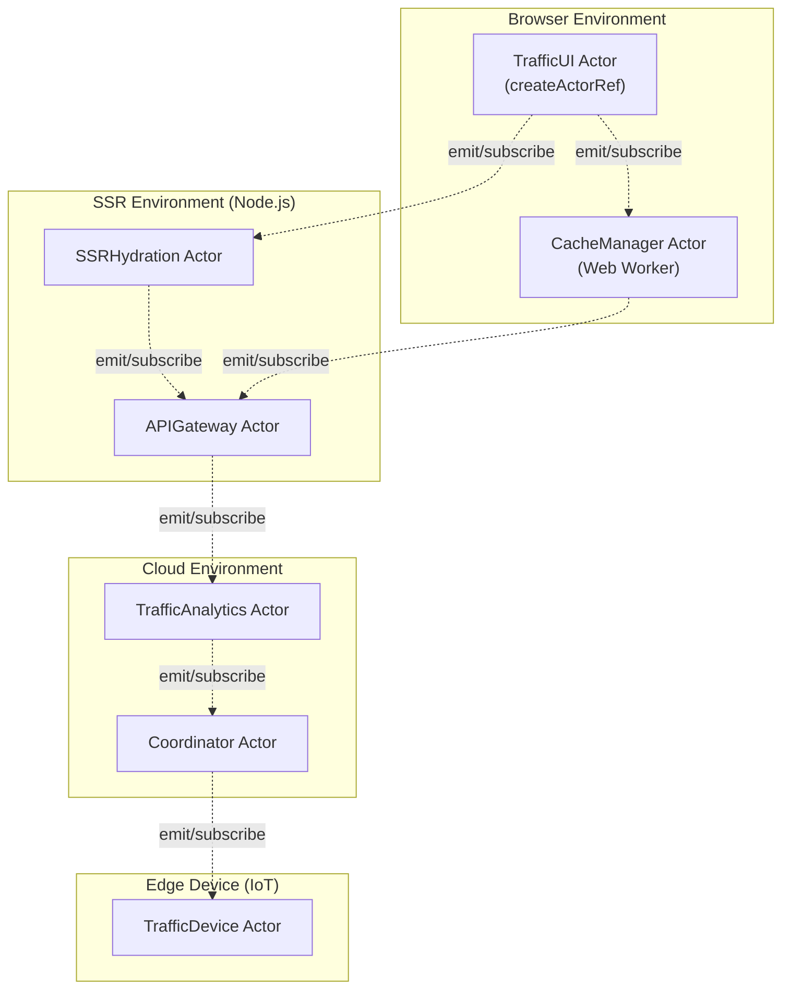

# Multi-Environment Traffic System (Pure Actor Model)

This example demonstrates how to use the Actor-Web Framework's pure actor model to build a distributed traffic management system that runs seamlessly across browser, web workers, SSR, and cloud environments. All actors use XState v5 behaviors and communicate exclusively via type-safe, asynchronous messages.

---

## 1. Multi-Environment Architecture



---

## 2. Foundation & Boilerplate

### Core Message Types (Shared Across All Environments)

```typescript
// src/traffic/message-types.ts
import { EventObject } from 'xstate';

export interface TrafficEventMetadata {
  timestamp: number;
  environment: 'browser' | 'worker' | 'ssr' | 'cloud' | 'edge';
  actorId: string;
}

export interface BaseTrafficEvent extends EventObject {
  type: string;
  metadata: TrafficEventMetadata;
}

export interface TrafficStatusEvent extends BaseTrafficEvent {
  type: 'TRAFFIC_STATUS_UPDATE';
  payload: {
    lightId: string;
    state: 'RED' | 'YELLOW' | 'GREEN';
    intersectionId: string;
  };
}

export interface OptimizationRequestEvent extends BaseTrafficEvent {
  type: 'OPTIMIZATION_REQUEST';
  payload: {
    intersectionId: string;
    congestionLevel: number;
    historicalData: Array<{ timestamp: number; vehicles: number }>;
  };
}

export interface TimingUpdateEvent extends BaseTrafficEvent {
  type: 'TIMING_UPDATE';
  payload: {
    lightId: string;
    newTiming: number;
    effectiveTime: number;
  };
}

export interface UIStateEvent extends BaseTrafficEvent {
  type: 'UI_STATE_CHANGE';
  payload: {
    view: 'dashboard' | 'intersection' | 'analytics';
    data: Record<string, unknown>;
  };
}

export type TrafficEvent = 
  | TrafficStatusEvent 
  | OptimizationRequestEvent 
  | TimingUpdateEvent 
  | UIStateEvent;
```

### Environment Bootstrap Configuration

```typescript
// src/traffic/environment-config.ts
import { ActorRefOptions } from '../core/actors/actor-ref';

export interface EnvironmentConfig {
  actorSystemId: string;
  supervision: 'restart-on-failure' | 'stop-on-failure';
  messageTransport: 'local' | 'websocket' | 'http' | 'message-port';
  persistenceProvider?: 'indexeddb' | 'redis' | 'memory';
}

export const ENVIRONMENT_CONFIGS: Record<string, EnvironmentConfig> = {
  browser: {
    actorSystemId: 'traffic-browser',
    supervision: 'restart-on-failure',
    messageTransport: 'websocket',
    persistenceProvider: 'indexeddb'
  },
  worker: {
    actorSystemId: 'traffic-worker',
    supervision: 'restart-on-failure',
    messageTransport: 'message-port',
    persistenceProvider: 'indexeddb'
  },
  ssr: {
    actorSystemId: 'traffic-ssr',
    supervision: 'restart-on-failure',
    messageTransport: 'http',
    persistenceProvider: 'memory'
  },
  cloud: {
    actorSystemId: 'traffic-cloud',
    supervision: 'restart-on-failure',
    messageTransport: 'http',
    persistenceProvider: 'redis'
  }
};
```

---

## 3. Pure Actor Implementations (XState v5)

### Browser UI Actor

```typescript
// src/traffic/actors/traffic-ui-actor.ts
import { setup, assign } from 'xstate';
import { createActorRef } from '../../core/create-actor-ref';
import type { TrafficEvent, TrafficStatusEvent, UIStateEvent } from '../message-types';

interface TrafficUIContext {
  intersections: Record<string, {
    id: string;
    lights: Array<{ id: string; state: 'RED' | 'YELLOW' | 'GREEN' }>;
    congestionLevel: number;
  }>;
  currentView: 'dashboard' | 'intersection' | 'analytics';
  selectedIntersection?: string;
}

export const trafficUIMachine = setup({
  types: {
    context: {} as TrafficUIContext,
    events: {} as TrafficEvent
  },
  actions: {
    updateTrafficStatus: assign({
      intersections: ({ context, event }) => {
        if (event.type !== 'TRAFFIC_STATUS_UPDATE') return context.intersections;
        
        const { lightId, state, intersectionId } = event.payload;
        const intersection = context.intersections[intersectionId] || {
          id: intersectionId,
          lights: [],
          congestionLevel: 0
        };
        
        const updatedLights = intersection.lights.map(light =>
          light.id === lightId ? { ...light, state } : light
        );
        
        return {
          ...context.intersections,
          [intersectionId]: {
            ...intersection,
            lights: updatedLights.length ? updatedLights : 
              [...intersection.lights, { id: lightId, state }]
          }
        };
      }
    }),
    
    changeView: assign({
      currentView: ({ event }) => {
        if (event.type !== 'UI_STATE_CHANGE') return 'dashboard';
        return event.payload.view;
      }
    }),
    
    emitOptimizationRequest: ({ context }) => {
      // Emit to other actors via the actor ref
      trafficUIActor.emit({
        type: 'OPTIMIZATION_REQUEST',
        payload: {
          intersectionId: context.selectedIntersection!,
          congestionLevel: context.intersections[context.selectedIntersection!]?.congestionLevel || 0,
          historicalData: []
        },
        metadata: {
          timestamp: Date.now(),
          environment: 'browser',
          actorId: 'traffic-ui'
        }
      });
    }
  },
  
  guards: {
    hasSelectedIntersection: ({ context }) => !!context.selectedIntersection
  }
}).createMachine({
  id: 'trafficUI',
  initial: 'dashboard',
  context: {
    intersections: {},
    currentView: 'dashboard'
  },
  
  states: {
    dashboard: {
      on: {
        TRAFFIC_STATUS_UPDATE: {
          actions: 'updateTrafficStatus'
        },
        UI_STATE_CHANGE: {
          target: 'intersection',
          guard: ({ event }) => event.payload.view === 'intersection',
          actions: 'changeView'
        }
      }
    },
    
    intersection: {
      on: {
        TRAFFIC_STATUS_UPDATE: {
          actions: 'updateTrafficStatus'
        },
        OPTIMIZATION_REQUEST: {
          guard: 'hasSelectedIntersection',
          actions: 'emitOptimizationRequest'
        },
        UI_STATE_CHANGE: {
          target: 'dashboard',
          guard: ({ event }) => event.payload.view === 'dashboard',
          actions: 'changeView'
        }
      }
    }
  }
});

// Create the actor using your framework's createActorRef
export const trafficUIActor = createActorRef(trafficUIMachine, {
  id: 'traffic-ui',
  supervision: 'restart-on-failure',
  autoStart: true
});

// Subscribe to events from other actors
trafficUIActor.subscribe((event: TrafficEvent) => {
  console.log('TrafficUI received event:', event.type);
});
```

### Web Worker Cache Actor

```typescript
// src/traffic/actors/cache-manager-actor.ts
import { setup, assign } from 'xstate';
import { createActorRef } from '../../core/create-actor-ref';
import type { TrafficEvent, TrafficStatusEvent } from '../message-types';

interface CacheContext {
  trafficData: Record<string, TrafficStatusEvent[]>;
  lastSync: number;
  syncInterval: number;
}

export const cacheManagerMachine = setup({
  types: {
    context: {} as CacheContext,
    events: {} as TrafficEvent
  },
  actions: {
    cacheTrafficData: assign({
      trafficData: ({ context, event }) => {
        if (event.type !== 'TRAFFIC_STATUS_UPDATE') return context.trafficData;
        
        const { intersectionId } = event.payload;
        const existing = context.trafficData[intersectionId] || [];
        
        return {
          ...context.trafficData,
          [intersectionId]: [...existing.slice(-99), event] // Keep last 100 entries
        };
      }
    }),
    
    updateSyncTime: assign({
      lastSync: () => Date.now()
    }),
    
    syncWithServer: async ({ context }) => {
      // Emit aggregated data to API actor
      cacheManagerActor.emit({
        type: 'CACHE_SYNC',
        payload: {
          data: context.trafficData,
          lastSync: context.lastSync
        },
        metadata: {
          timestamp: Date.now(),
          environment: 'worker',
          actorId: 'cache-manager'
        }
      });
    }
  }
}).createMachine({
  id: 'cacheManager',
  initial: 'idle',
  context: {
    trafficData: {},
    lastSync: 0,
    syncInterval: 30000 // 30 seconds
  },
  
  states: {
    idle: {
      on: {
        TRAFFIC_STATUS_UPDATE: {
          actions: 'cacheTrafficData'
        },
        SYNC_REQUEST: {
          target: 'syncing'
        }
      },
      
      after: {
        30000: 'syncing' // Auto-sync every 30 seconds
      }
    },
    
    syncing: {
      invoke: {
        src: 'syncWithServer',
        onDone: {
          target: 'idle',
          actions: 'updateSyncTime'
        },
        onError: 'idle'
      }
    }
  }
});

export const cacheManagerActor = createActorRef(cacheManagerMachine, {
  id: 'cache-manager',
  supervision: 'restart-on-failure',
  autoStart: true
});
```

### SSR Hydration Actor

```typescript
// src/traffic/actors/ssr-hydration-actor.ts (Node.js)
import { setup, assign } from 'xstate';
import { createActorRef } from '../../core/create-actor-ref';
import type { TrafficEvent } from '../message-types';

interface SSRContext {
  initialState: Record<string, unknown>;
  hydrationComplete: boolean;
  requestId: string;
}

export const ssrHydrationMachine = setup({
  types: {
    context: {} as SSRContext,
    events: {} as TrafficEvent,
    input: {} as { requestId: string; url: string; userAgent: string }
  },
  actors: {
    loadTrafficData: fromPromise(async ({ input }: { input: { route: string } }) => {
      // Simulate database/API calls for SSR data
      const response = await fetch(`http://api.traffic.internal/data${input.route}`);
      return response.json();
    }),
    
    preloadIntersectionData: fromPromise(async ({ input }: { input: { intersectionId: string } }) => {
      // Load specific intersection data for SSR
      return {
        intersection: {
          id: input.intersectionId,
          lights: [
            { id: `${input.intersectionId}-light-1`, state: 'RED' as const },
            { id: `${input.intersectionId}-light-2`, state: 'GREEN' as const }
          ],
          lastUpdate: Date.now()
        }
      };
    })
  },
  actions: {
    initializeFromInput: assign({
      requestId: ({ event }) => event.input?.requestId || '',
      initialState: ({ event }) => ({
        url: event.input?.url || '',
        userAgent: event.input?.userAgent || '',
        loadedAt: Date.now()
      })
    }),
    
    setLoadedData: assign({
      initialState: ({ context, event }) => ({
        ...context.initialState,
        trafficData: event.output
      })
    }),
    
    setIntersectionData: assign({
      initialState: ({ context, event }) => ({
        ...context.initialState,
        intersectionData: event.output
      })
    }),
    
    markHydrationComplete: assign({
      hydrationComplete: true
    }),
    
    emitStateReady: ({ context, self }) => {
      self.emit({
        type: 'SSR_STATE_READY',
        payload: context.initialState,
        metadata: {
          timestamp: Date.now(),
          environment: 'ssr',
          actorId: self.id
        }
      });
    }
  },
  guards: {
    hasValidRoute: ({ event }) => {
      return event.type === 'PREPARE_INITIAL_STATE' && 
             !!event.payload?.route;
    },
    
    isIntersectionRoute: ({ event }) => {
      return event.type === 'LOAD_INTERSECTION_DATA' &&
             !!event.payload?.intersectionId;
    }
  }
}).createMachine({
  id: 'ssrHydration',
  initial: 'initializing',
  context: ({ input }) => ({
    initialState: {
      url: input?.url || '',
      userAgent: input?.userAgent || '',
      loadedAt: Date.now()
    },
    hydrationComplete: false,
    requestId: input?.requestId || ''
  }),
  
  states: {
    initializing: {
      entry: 'initializeFromInput',
      on: {
        PREPARE_INITIAL_STATE: {
          target: 'loadingData',
          guard: 'hasValidRoute'
        }
      }
    },
    
    loadingData: {
      invoke: {
        src: 'loadTrafficData',
        input: ({ event }) => ({
          route: event.payload.route
        }),
        onDone: {
          target: 'ready',
          actions: ['setLoadedData', 'emitStateReady']
        },
        onError: {
          target: 'error',
          actions: assign({
            initialState: ({ context }) => ({
              ...context.initialState,
              error: 'Failed to load initial data'
            })
          })
        }
      }
    },
    
    ready: {
      on: {
        LOAD_INTERSECTION_DATA: {
          target: 'loadingIntersection',
          guard: 'isIntersectionRoute'
        },
        
        HYDRATION_COMPLETE: {
          target: 'complete',
          actions: 'markHydrationComplete'
        }
      }
    },
    
    loadingIntersection: {
      invoke: {
        src: 'preloadIntersectionData',
        input: ({ event }) => ({
          intersectionId: event.payload.intersectionId
        }),
        onDone: {
          target: 'ready',
          actions: 'setIntersectionData'
        },
        onError: 'ready' // Graceful fallback
      }
    },
    
    error: {
      on: {
        RETRY: 'initializing'
      }
    },
    
    complete: {
      type: 'final'
    }
  }
});

export const ssrHydrationActor = createActorRef(ssrHydrationMachine, {
  id: 'ssr-hydration',
  supervision: 'restart-on-failure',
  autoStart: false // Start per request
});
```

### Cloud Analytics Actor

```typescript
// src/traffic/actors/traffic-analytics-actor.ts (Cloud/Node.js)
import { setup, assign } from 'xstate';
import { createActorRef } from '../../core/create-actor-ref';
import type { TrafficEvent, OptimizationRequestEvent } from '../message-types';

interface AnalyticsContext {
  optimizationQueue: OptimizationRequestEvent[];
  processedOptimizations: number;
  analyticsResults: Record<string, {
    recommendedTiming: number;
    confidence: number;
    reasoning: string;
  }>;
}

export const trafficAnalyticsMachine = setup({
  types: {
    context: {} as AnalyticsContext,
    events: {} as TrafficEvent
  },
  actions: {
    queueOptimization: assign({
      optimizationQueue: ({ context, event }) => {
        if (event.type !== 'OPTIMIZATION_REQUEST') return context.optimizationQueue;
        return [...context.optimizationQueue, event];
      }
    }),
    
    processOptimization: assign(({ context }) => {
      const [current, ...remaining] = context.optimizationQueue;
      if (!current) return context;
      
      // Simulate ML processing
      const result = {
        recommendedTiming: Math.floor(Math.random() * 60) + 30,
        confidence: 0.85,
        reasoning: 'Based on historical traffic patterns and current congestion'
      };
      
      return {
        ...context,
        optimizationQueue: remaining,
        processedOptimizations: context.processedOptimizations + 1,
        analyticsResults: {
          ...context.analyticsResults,
          [current.payload.intersectionId]: result
        }
      };
    }),
    
    emitOptimizationResult: ({ context }) => {
      const lastProcessed = Object.keys(context.analyticsResults).pop();
      if (!lastProcessed) return;
      
      const result = context.analyticsResults[lastProcessed];
      
      trafficAnalyticsActor.emit({
        type: 'TIMING_UPDATE',
        payload: {
          lightId: `${lastProcessed}-light-1`,
          newTiming: result.recommendedTiming,
          effectiveTime: Date.now() + 5000
        },
        metadata: {
          timestamp: Date.now(),
          environment: 'cloud',
          actorId: 'traffic-analytics'
        }
      });
    }
  }
}).createMachine({
  id: 'trafficAnalytics',
  initial: 'idle',
  context: {
    optimizationQueue: [],
    processedOptimizations: 0,
    analyticsResults: {}
  },
  
  states: {
    idle: {
      on: {
        OPTIMIZATION_REQUEST: {
          target: 'processing',
          actions: 'queueOptimization'
        }
      }
    },
    
    processing: {
      invoke: {
        src: 'processOptimization',
        onDone: {
          target: 'idle',
          actions: ['processOptimization', 'emitOptimizationResult']
        }
      }
    }
  }
});

export const trafficAnalyticsActor = createActorRef(trafficAnalyticsMachine, {
  id: 'traffic-analytics',
  supervision: 'restart-on-failure',
  autoStart: true
});
```

---

## 4. Production Deployment Setup

### Environment-Specific Initialization

```typescript
// src/traffic/bootstrap/browser-init.ts
import { trafficUIActor } from '../actors/traffic-ui-actor';
import { ENVIRONMENT_CONFIGS } from '../environment-config';

export async function initializeBrowserEnvironment() {
  const config = ENVIRONMENT_CONFIGS.browser;
  
  // Initialize WebSocket connection for cross-environment communication
  const ws = new WebSocket('ws://localhost:8080/traffic-actors');
  
  // Set up web worker for cache management
  const worker = new Worker('/js/cache-worker.js');
  
  // Create message bridge between main thread and worker
  trafficUIActor.subscribe((event) => {
    worker.postMessage(event);
  });
  
  worker.onmessage = (e) => {
    trafficUIActor.send(e.data);
  };
  
  // Start the UI actor
  trafficUIActor.start();
  
  return { trafficUIActor, worker, ws };
}
```

```typescript
// src/traffic/bootstrap/ssr-init.ts (Express.js middleware)
import { createActorRef } from '../../core/create-actor-ref';
import { ssrHydrationMachine } from '../actors/ssr-hydration-actor';
import type { TrafficEvent } from '../message-types';

export function createSSRMiddleware() {
  return async (req, res, next) => {
    // Create per-request SSR actor instance using your framework
    const ssrActor = createActorRef(ssrHydrationMachine, {
      id: `ssr-hydration-${req.id}`,
      supervision: 'stop-on-failure', // Don't restart on SSR failures
      autoStart: true,
      input: { 
        requestId: req.id,
        url: req.url,
        userAgent: req.get('User-Agent') || ''
      }
    });
    
    // Set up event subscription for real-time updates
    const unsubscribe = ssrActor.subscribe((event: TrafficEvent) => {
      if (event.type === 'SSR_STATE_READY') {
        // Actor has prepared the initial state
        res.locals.actorInitialState = event.payload;
      }
    });
    
    // Request initial state using ask pattern
    try {
      const initialState = await ssrActor.ask({
        type: 'PREPARE_INITIAL_STATE',
        payload: {
          route: req.path,
          query: req.query
        },
        timeout: 5000
      });
      
      res.locals.actorInitialState = initialState;
      res.locals.ssrActor = ssrActor; // Make available to templates
      
    } catch (error) {
      console.error('SSR Actor initialization failed:', error);
      res.locals.actorInitialState = { error: 'SSR_FAILED' };
    }
    
    // Clean up actor after response
    res.on('finish', async () => {
      unsubscribe();
      await ssrActor.stop();
    });
    
    next();
  };
}

// Example Express.js setup
export function setupSSRServer() {
  const app = express();
  
  // Add SSR middleware
  app.use(createSSRMiddleware());
  
  // Route handler with actor integration
  app.get('/traffic/:intersectionId', async (req, res) => {
    const { ssrActor, actorInitialState } = res.locals;
    
    // Actor can handle route-specific data loading
    const intersectionData = await ssrActor.ask({
      type: 'LOAD_INTERSECTION_DATA',
      payload: { intersectionId: req.params.intersectionId },
      timeout: 3000
    });
    
    // Render with actor state
    res.render('traffic-dashboard', {
      initialState: actorInitialState,
      intersectionData,
      actorScript: `
        // Hydrate client-side actor with SSR state
        window.__ACTOR_INITIAL_STATE__ = ${JSON.stringify(actorInitialState)};
      `
    });
  });
  
  return app;
}

// Client-side hydration example
export function hydrateClientFromSSR() {
  // Get SSR state injected by server
  const ssrState = window.__ACTOR_INITIAL_STATE__;
  
  if (!ssrState) {
    throw new Error('No SSR state found for hydration');
  }
  
  // Create client-side actor with SSR state
  const clientTrafficActor = createActorRef(trafficUIMachine, {
    id: 'traffic-ui-hydrated',
    supervision: 'restart-on-failure',
    autoStart: true,
    input: ssrState // Hydrate with server state
  });
  
  // Emit hydration complete to other actors
  clientTrafficActor.emit({
    type: 'HYDRATION_COMPLETE',
    payload: { ssrState },
    metadata: {
      timestamp: Date.now(),
      environment: 'browser',
      actorId: 'traffic-ui-hydrated'
    }
  });
  
  return clientTrafficActor;
}
```

```typescript
// src/traffic/bootstrap/cloud-init.ts (Kubernetes/Docker)
import { trafficAnalyticsActor } from '../actors/traffic-analytics-actor';
import { createServer } from 'http';

export async function initializeCloudEnvironment() {
  // Set up HTTP server for inter-service communication
  const server = createServer((req, res) => {
    if (req.method === 'POST' && req.url === '/traffic/optimize') {
      let body = '';
      req.on('data', chunk => body += chunk);
      req.on('end', () => {
        const event = JSON.parse(body);
        trafficAnalyticsActor.send(event);
        res.writeHead(200, { 'Content-Type': 'application/json' });
        res.end(JSON.stringify({ status: 'received' }));
      });
    }
  });
  
  // Set up actor event emission to other services
  trafficAnalyticsActor.subscribe((event) => {
    // Forward to message queue or other services
    publishToMessageQueue(event);
  });
  
  server.listen(8080, () => {
    console.log('Traffic Analytics Actor Service running on port 8080');
  });
  
  trafficAnalyticsActor.start();
  
  return { server, trafficAnalyticsActor };
}

async function publishToMessageQueue(event) {
  // Redis, RabbitMQ, or Kafka integration
  console.log('Publishing event to queue:', event.type);
}
```

---

## 5. Actor Communication Patterns

### Request/Response Pattern

```typescript
// Any actor can request information from another
const optimizationResult = await trafficUIActor.ask({
  type: 'OPTIMIZATION_REQUEST',
  payload: {
    intersectionId: 'intersection-1',
    congestionLevel: 3,
    historicalData: []
  },
  timeout: 10000
});
```

### Event Emission Pattern

```typescript
// Producer actor emits events
trafficAnalyticsActor.emit({
  type: 'TIMING_UPDATE',
  payload: { lightId: 'light-1', newTiming: 45, effectiveTime: Date.now() + 5000 },
  metadata: { timestamp: Date.now(), environment: 'cloud', actorId: 'analytics' }
});

// Consumer actors subscribe to events
trafficUIActor.subscribe((event) => {
  if (event.type === 'TIMING_UPDATE') {
    // Update UI with new timing
  }
});
```

### Supervision and Fault Tolerance

```typescript
// Actors automatically restart on failure
const resilientActor = createActorRef(trafficUIMachine, {
  id: 'traffic-ui',
  supervision: 'restart-on-failure', // or 'stop-on-failure'
  autoStart: true,
  maxRestarts: 3,
  restartDelay: 1000
});

// Monitor actor health
resilientActor.observe(snapshot => snapshot.status).subscribe(status => {
  console.log('Actor status changed:', status);
});
```

---

## 6. Key Benefits of This Architecture

1. **Environment Agnostic**: Same actor code runs in browser, worker, SSR, and cloud
2. **Type Safety**: Full TypeScript support with XState v5 integration
3. **Fault Tolerance**: Built-in supervision strategies and automatic restart
4. **Message Isolation**: Pure message passing eliminates shared state bugs
5. **Scalable**: Actors can be distributed across any number of environments
6. **Testable**: Each actor is independently testable with clear message contracts

---

**Framework Documentation:**
- [ActorRef API Reference](../src/core/actors/actor-ref.ts)
- [Supervision Strategies](../src/core/actors/supervisor.ts)
- [Message Types](../src/core/messaging/message-types.ts)
- [Environment Bootstrap](../src/core/environment/)