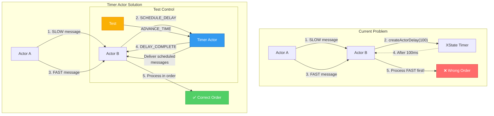

# Async Testing Research and Implementation Plan

## Executive Summary

After removing `enableTestMode()` to fix memory leak issues caused by synchronous message processing, we face widespread test failures related to async delays and message ordering. This document presents research findings and a phased implementation plan to fix these issues while maintaining pure actor model principles.

## Research Findings

### 1. Actor Framework Testing Patterns

#### **Akka (JVM)**
- Uses `TestKit` with custom test scheduler (`TestScheduler`)
- Provides `timeFactor` to speed up delays in tests
- Key pattern: **Virtual time advancement** - tests control when time moves forward
```scala
testScheduler.advance(100.millis)
```

#### **Erlang/OTP**
- Uses `meck` for mocking timers
- Pattern: **Message-based scheduling** - delays are implemented as messages
- `receive after` pattern can be controlled in tests
```erlang
receive
  {timeout, Ref, Msg} -> handle_timeout(Msg)
after 0 -> no_timeout
end
```

#### **Orleans (.NET)**
- Uses `TestCluster` with deterministic scheduler
- Key insight: **Grain (actor) timers are part of the runtime**, not external
- Tests can control timer firing explicitly

### 2. XState Testing Best Practices

XState provides several testing utilities:
- `@xstate/test` for model-based testing
- **Clock control** via `clock` option in machine configuration
- **Simulated time** using `SimulatedClock`
```typescript
const testClock = new SimulatedClock();
const service = interpret(machine, { clock: testClock });
testClock.increment(100); // Advance time by 100ms
```

### 3. Analysis of Current Issues

#### **Problem Categories**

1. **Message Ordering with Delays**
   - Tests expect FIFO ordering even with delays
   - `createActorDelay()` suspends actor processing
   - `system.flush()` can't wait for XState timers

2. **Actor Resolution**
   - `NullActorRef` pattern for lazy resolution
   - System event actor returns `SendInstruction` with paths
   - Plan interpreter can't resolve paths to actors

3. **Timer Integration**
   - XState timers (via `after`) are external to actor system
   - No way to query pending timers
   - `flush()` only processes mailbox messages

4. **Test Determinism**
   - Real timers make tests flaky
   - Can't control time advancement
   - Race conditions between timer expiry and message processing

## Proposed Solution Architecture

### Core Principles
1. **Pure Actor Model**: All delays must be message-based
2. **Deterministic Testing**: Tests must control time advancement
3. **No Special Modes**: Same code paths for tests and production
4. **Location Transparency**: Delays work the same locally and distributed

### Implementation Strategy

#### **Phase 1: Timer Actor Pattern** ✅ (Recommended Starting Point)

Implement a dedicated timer actor that manages all delays as messages:

```typescript
// Timer actor handles delay requests
interface ScheduleMessage extends ActorMessage {
  type: 'SCHEDULE';
  targetActor: string;
  message: ActorMessage;
  delay: number;
}

// Timer actor tracks scheduled messages
interface TimerState {
  scheduledMessages: Map<string, ScheduledMessage>;
  currentTime: number;
}

// In tests, we can control time
await timerActor.send({ type: 'ADVANCE_TIME', by: 100 });
await system.flush(); // Delivers all messages scheduled for <= currentTime
```

**Benefits:**
- Pure actor model (delays are messages)
- Testable (control time advancement)
- Works with existing `flush()` mechanism
- Can be made location-transparent

#### **Phase 2: Actor Path Resolution**

Fix the `NullActorRef` resolution issue:

```typescript
// Add actor resolution to plan interpreter
async function resolveActorRef(ref: ActorRef | string): Promise<ActorRef> {
  if (typeof ref === 'string') {
    return system.lookup(ref) || throw new Error(`Actor not found: ${ref}`);
  }
  return ref;
}

// Or implement lazy resolution in SendInstruction processing
const actualRef = await system.resolveActor(instruction.to);
await actualRef.send(instruction.tell);
```

#### **Phase 3: Migrate Delays to Timer Actor**

Replace all delay patterns:

```typescript
// Before (XState delay)
await createActorDelay(100);

// After (Timer actor)
await timerActor.ask({
  type: 'DELAY',
  duration: 100,
  callbackMessage: { type: 'DELAY_COMPLETE' }
});
```

#### **Phase 4: Test Utilities**

Create test helpers for common patterns:

```typescript
class TestActorSystem extends ActorSystemImpl {
  private timerActor?: ActorRef;
  
  async advanceTime(ms: number): Promise<void> {
    await this.timerActor?.send({ type: 'ADVANCE_TIME', by: ms });
    await this.flush();
  }
  
  async flushWithTime(maxTime: number = 5000): Promise<void> {
    // Advance time in steps, flushing between each
    const steps = 10;
    const stepSize = maxTime / steps;
    
    for (let i = 0; i < steps; i++) {
      await this.advanceTime(stepSize);
      await this.flush();
      
      if (!this.hasScheduledMessages()) {
        break;
      }
    }
  }
}
```

## Implementation Plan

### Phase 1: Timer Actor (Week 1)
1. **Day 1-2**: Implement basic timer actor
   - Message scheduling
   - Time tracking
   - Message delivery
   
2. **Day 3-4**: Test utilities
   - Time advancement commands
   - Query scheduled messages
   - Integration with flush()
   
3. **Day 5**: Update failing tests
   - Replace createActorDelay with timer actor
   - Add time advancement to tests

### Phase 2: Actor Resolution (Week 2)
1. **Day 1-2**: Implement actor lookup in system
   - Path-based lookup
   - Cache for performance
   
2. **Day 3-4**: Update plan interpreter
   - Resolve NullActorRef before sending
   - Handle lookup failures gracefully
   
3. **Day 5**: Fix system event actor tests

### Phase 3: Framework Integration (Week 3)
1. **Day 1-2**: Create standard delay patterns
   - Self-scheduling messages
   - Delayed responses
   - Periodic tasks
   
2. **Day 3-4**: Documentation and examples
   - Migration guide
   - Best practices
   - Common patterns
   
3. **Day 5**: Performance optimization
   - Timer wheel implementation
   - Batch message delivery

## Migration Strategy

### Step 1: Fix Critical Tests (Immediate)
```typescript
// Temporary: Add small delays to wait for async operations
await new Promise(resolve => setTimeout(resolve, 100));
await system.flush();
```

### Step 2: Implement Timer Actor (Week 1)
- Start with simple implementation
- Use in new tests first
- Gradually migrate existing tests

### Step 3: Remove XState Delays (Week 2-3)
- Replace createActorDelay usage
- Update actor behaviors to use timer actor
- Ensure backward compatibility

## Success Criteria

1. **All tests passing** without enableTestMode()
2. **Deterministic test execution** - no flaky tests
3. **Performance maintained** - no regression in test speed
4. **Pure actor model** - all delays are messages
5. **Developer experience** - easy to write delay-based tests

## Risks and Mitigations

| Risk | Impact | Mitigation |
|------|--------|------------|
| Timer actor becomes bottleneck | High | Implement distributed timers |
| Complex timer logic | Medium | Start simple, iterate |
| Breaking API changes | High | Provide compatibility layer |
| Test complexity increases | Medium | Good test utilities |

## Recommendations

1. **Start with Phase 1** - Timer actor gives immediate value
2. **Keep XState for now** - Don't remove working code until replacement is proven
3. **Test incrementally** - Fix one test file at a time
4. **Document patterns** - Create cookbook for common scenarios
5. **Consider vitest-timer** - Investigate Vitest's timer mocking as fallback

## Next Steps

1. **Review and approve** this plan
2. **Create timer actor** specification
3. **Implement MVP** timer actor
4. **Fix highest-priority** test failures
5. **Iterate based on** learnings

## Appendix: Quick Wins

While implementing the full solution, these quick fixes can unblock development:

1. **For message ordering tests**: Add explicit waits
```typescript
await actor.send({ type: 'SLOW' });
await new Promise(r => setTimeout(r, 150)); // Wait for delay
await actor.send({ type: 'FAST' });
```

2. **For system event tests**: Use actual actor refs instead of paths
```typescript
// Instead of subscriber.path
const actualRef = await system.lookup(subscriber.path);
notifications.push(createSendInstruction(actualRef, message));
```

3. **For flush with delays**: Implement retries
```typescript
async function flushWithRetries(system: ActorSystem, retries = 3) {
  for (let i = 0; i < retries; i++) {
    await system.flush();
    await new Promise(r => setTimeout(r, 50));
  }
}
```

