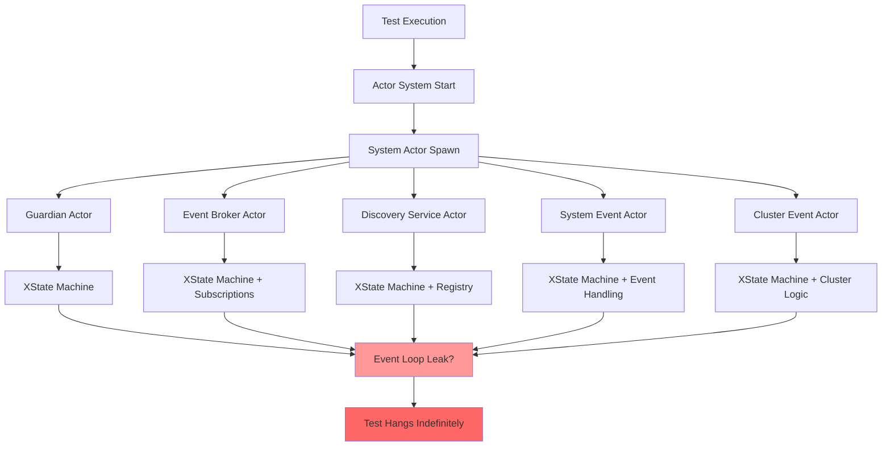
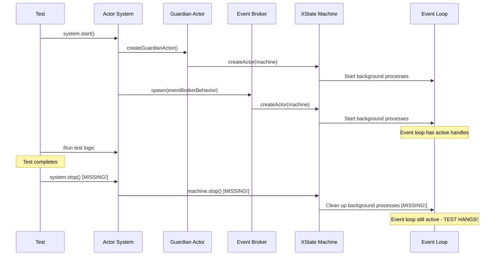
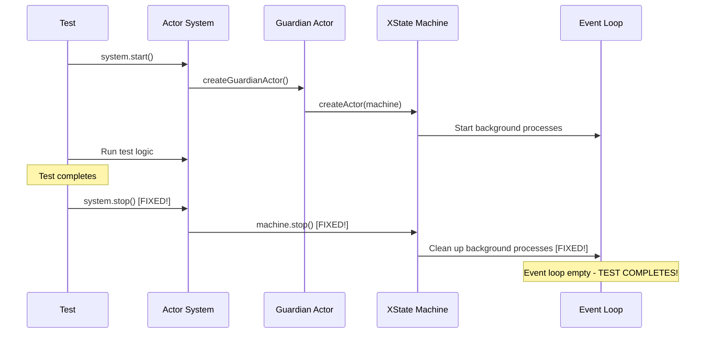

# Design Document: Hanging Tests Fix

## Architecture Overview

The hanging tests issue stems from **background processes keeping the Node.js event loop alive** during actor system initialization. Our systematic investigation reveals multiple potential culprits that must be addressed comprehensively.



### Root Cause Analysis

**Primary Hypothesis**: System actors spawn **XState machines** during initialization that create persistent background processes, preventing the Node.js event loop from being empty.

**Evidence**:
1. ✅ **PureXStateTimeoutManager fixed** - But hanging persists
2. ✅ **askActor using PureXState** - But hanging persists  
3. ❌ **5+ System actors spawned** - Each creates XState machines
4. ❌ **System actor lifecycle unclear** - May not be shutting down properly
5. ❌ **XState actor cleanup incomplete** - Other XState actors may lack proper cleanup

## Component Design

### 1. System Actor Lifecycle Audit

#### Current System Actor Architecture
```typescript
// During system.start() - 5 system actors are spawned:
class ActorSystemImpl {
  private guardianActorAddress?: ActorAddress;           // 1. Guardian 
  private eventBrokerActorAddress?: ActorAddress;        // 2. Event Broker
  private discoveryServiceActorAddress?: ActorAddress;   // 3. Discovery Service  
  private systemEventActorAddress?: ActorAddress;       // 4. System Event
  private clusterEventActorAddress?: ActorAddress;      // 5. Cluster Event
  
  async start() {
    // Each spawns XState machines that may keep event loop alive
    const guardianActor = await createGuardianActor(this);
    const eventBrokerActor = await this.spawn(eventBrokerBehavior);
    const discoveryServiceActor = await this.spawn(discoveryServiceBehavior);  
    const systemEventActor = await this.spawn(systemEventBehavior);
    const clusterEventActor = await this.spawn(clusterEventBehavior);
  }
}
```

**Design Issue**: Each system actor likely creates **XState machines** that are:
1. **Started but not stopped** when system shuts down
2. **Creating background timers** through XState's internal scheduling
3. **Subscribing to events** that aren't unsubscribed
4. **Keeping references alive** that prevent garbage collection

### 2. XState Actor Cleanup Strategy

#### Enhanced System Shutdown Design
```typescript
class ActorSystemImpl {
  private systemActors: Map<string, { actor: ActorRef; machine: AnyActor }> = new Map();
  
  async start() {
    // Track all system actors for proper cleanup
    const guardianActor = await createGuardianActor(this);
    this.systemActors.set('guardian', { 
      actor: guardianActor, 
      machine: guardianActor.machine 
    });
    
    // Same for all other system actors...
  }
  
  async stop() {
    // ✅ DESIGN FIX: Explicitly stop all XState machines
    for (const [name, { actor, machine }] of this.systemActors) {
      try {
        // Stop the XState machine to clean up background processes
        machine.stop();
        
        // Stop the actor (if different from machine)
        await this.stopActor(actor);
        
        log.debug(`System actor stopped: ${name}`);
      } catch (error) {
        log.error(`Error stopping system actor ${name}:`, error);
      }
    }
    
    this.systemActors.clear();
    
    // ✅ DESIGN FIX: Ensure timeout manager cleanup
    this.systemTimeoutManager.destroy();
  }
}
```

### 3. System Actor Behavior Review

#### Guardian Actor Investigation
```typescript
// packages/actor-core-runtime/src/actor-system-guardian.ts
export async function createGuardianActor(system: ActorSystem): Promise<ActorRef> {
  // ❌ POTENTIAL ISSUE: May create XState machine that doesn't clean up
  const guardianMachine = setup({...}).createMachine({
    // Complex state machine with timers, subscriptions?
  });
  
  const guardianActor = createActor(guardianMachine);
  guardianActor.start();  // ❌ Started but may not be stopped in tests
  
  return createActorRef(system, address, guardianActor);
}
```

**Design Solution**: Audit each system actor's XState machine to ensure:
1. **Explicit stop() calls** during system shutdown
2. **No persistent timers** that keep event loop alive
3. **Clean subscription management** with proper unsubscribe
4. **Finite state machines** that reach final states

### 4. Test Environment Isolation

#### Test-Specific Actor System Design
```typescript
// Design pattern for test isolation
class TestActorSystem extends ActorSystemImpl {
  private testCleanupHandlers: (() => Promise<void>)[] = [];
  
  async startForTest(config: ActorSystemConfig = {}) {
    // ✅ Test-specific configuration
    const testConfig = {
      ...config,
      // Shorter timeouts for tests
      shutdownTimeout: 1000,
      // Disable non-essential system actors for minimal tests
      disableClusterActor: true,
      disableDiscoveryService: true,
    };
    
    await this.start(testConfig);
    
    // ✅ Auto-cleanup after test timeout
    const autoCleanup = setTimeout(() => {
      this.forceShutdown();
    }, 5000);
    
    this.testCleanupHandlers.push(async () => {
      clearTimeout(autoCleanup);
    });
  }
  
  async stopForTest() {
    // Execute test-specific cleanup
    await Promise.all(this.testCleanupHandlers.map(handler => handler()));
    this.testCleanupHandlers = [];
    
    // Standard shutdown
    await this.stop();
  }
  
  private async forceShutdown() {
    log.warn('Force shutdown triggered - test may have hung');
    
    // ✅ Nuclear option: Stop all XState actors immediately
    for (const [_name, { machine }] of this.systemActors) {
      try {
        machine.stop();
      } catch (error) {
        // Ignore errors during force shutdown
      }
    }
    
    // Clear all timeout managers
    this.systemTimeoutManager.destroy();
    
    process.exit(1); // Last resort for hanging tests
  }
}
```

## Data Flow

### System Startup and Shutdown Flow



### Fixed Flow Design



## API Contracts

### Enhanced ActorSystem Interface
```typescript
interface ActorSystem {
  start(config?: ActorSystemConfig): Promise<void>;
  stop(): Promise<void>;
  
  // ✅ NEW: Test-specific methods
  startForTest(config?: TestActorSystemConfig): Promise<void>;
  stopForTest(): Promise<void>;
  forceShutdown(): void; // Emergency cleanup
}

interface TestActorSystemConfig extends ActorSystemConfig {
  // Test-specific options
  disableNonEssentialActors?: boolean;
  autoShutdownTimeout?: number;
  forceCleanup?: boolean;
}
```

### System Actor Lifecycle Contract
```typescript
interface SystemActor {
  start(): Promise<void>;
  stop(): Promise<void>;
  isRunning(): boolean;
  
  // ✅ NEW: Cleanup contract
  cleanup(): Promise<void>;
  forceStop(): void;
}

// Each system actor must implement proper cleanup
interface SystemActorBehavior {
  onStart?: () => Promise<void>;
  onStop?: () => Promise<void>;
  onMessage: PureMessageHandler;
  
  // ✅ NEW: Resource management
  cleanup?: () => Promise<void>;
}
```

## Technology Choices

### Investigation Tools
| Tool | Usage | Justification |
|------|-------|---------------|
| **Node.js `process._getActiveHandles()`** | Identify active event loop handles | Shows what's keeping event loop alive |
| **Node.js `process._getActiveRequests()`** | Identify active async operations | Reveals pending operations |
| **Vitest `--reporter=verbose`** | Detailed test execution logging | Better visibility into hang location |
| **Manual XState actor tracking** | Log all createActor/stop calls | Identify actors not being stopped |

### Implementation Patterns
| Pattern | Usage | Justification |
|---------|-------|---------------|
| **Explicit Resource Management** | Track and clean up all XState actors | Prevents event loop leaks |
| **Test Isolation** | Separate test and production actor system | Safer test environment |
| **Timeout Safeguards** | Auto-shutdown for hanging tests | Prevents infinite hangs |
| **Graceful Degradation** | Force shutdown as last resort | Ensures tests can complete |

## Risk Assessment

### High Risk: System Actor XState Machines
- **Risk**: Each system actor creates XState machines that aren't stopped
- **Impact**: Multiple background processes keep event loop alive
- **Mitigation**: Systematic audit and explicit stop() calls for all system actor machines
- **Detection**: Add logging for all XState actor lifecycle events

### Medium Risk: PureXStateTimeoutManager Edge Cases
- **Risk**: Still missing cleanup in some timeout manager code paths
- **Impact**: Timeout actors continue running
- **Mitigation**: Comprehensive review of all setTimeout/clearTimeout usage
- **Detection**: Log all timeout actor creation/destruction

### Medium Risk: Event Subscriptions and Listeners
- **Risk**: System actors create event subscriptions that aren't cleaned up
- **Impact**: Event listeners keep references alive
- **Mitigation**: Audit all addEventListener/subscribe calls for matching cleanup
- **Detection**: Track subscription/unsubscription calls

### Low Risk: Test Framework Integration
- **Risk**: Vitest or test setup causing hangs
- **Impact**: Framework-level issue outside our control
- **Mitigation**: Create minimal Node.js reproduction script
- **Detection**: Test actor system without Vitest

## Success Metrics

### Functional Metrics
- [ ] `debug-minimal.test.ts` completes in <5 seconds
- [ ] Actor system starts and stops cleanly
- [ ] All XState actors explicitly stopped during shutdown
- [ ] Node.js event loop empty after test completion
- [ ] No active handles or requests after shutdown

### Performance Metrics  
- [ ] Test startup time <2 seconds
- [ ] System shutdown time <1 second
- [ ] Memory usage returns to baseline after tests
- [ ] CPU usage drops to idle after test completion

### Quality Metrics
- [ ] Zero infinite hangs across all test scenarios
- [ ] Deterministic test completion times
- [ ] Clean process exit (exit code 0)
- [ ] No resource leak warnings or errors

---

**Design Approval Required**: This design document must be reviewed for technical feasibility and comprehensive coverage of hanging test scenarios before proceeding to task list creation. 