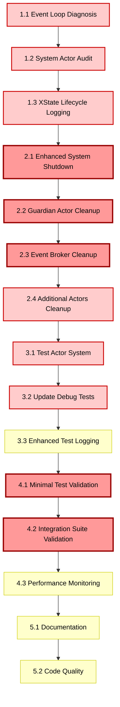

# Task List: Hanging Tests Fix

## Implementation Phases

### Phase 1: Investigation & Root Cause Analysis (Day 1)

#### Task 1.1: Event Loop Diagnosis ⚠️ **HIGH PRIORITY**
**Dependency**: None (start task)  
**Estimate**: 2 hours  
**Files**: New investigation script, existing test files

- [ ] Create `debug-event-loop.js` script to identify active handles
- [ ] Use `process._getActiveHandles()` and `process._getActiveRequests()` 
- [ ] Run script with actor system startup to capture active processes
- [ ] Document all active handles that prevent event loop from being empty
- [ ] Identify which system actors are creating persistent background processes

**Definition of Done**:
- [ ] Clear evidence of which system actors create persistent handles
- [ ] Documentation of active handles before/after system start
- [ ] Baseline understanding of event loop leaks

#### Task 1.2: System Actor XState Machine Audit ⚠️ **HIGH PRIORITY**
**Dependency**: Task 1.1  
**Estimate**: 3 hours  
**Files**: Guardian, Event Broker, Discovery Service, System Event, Cluster Event actors

- [ ] Audit `createGuardianActor()` for XState machine lifecycle
- [ ] Audit Event Broker Actor for XState machine and subscription cleanup
- [ ] Audit Discovery Service Actor for XState machine and registry cleanup
- [ ] Audit System Event Actor for XState machine and event handling cleanup
- [ ] Audit Cluster Event Actor for XState machine and cluster logic cleanup
- [ ] Document all XState machines created by system actors
- [ ] Identify missing `.stop()` calls during system shutdown

**Definition of Done**:
- [ ] Complete inventory of all system actor XState machines
- [ ] Documentation of current cleanup (or lack thereof) in each actor
- [ ] Clear list of missing `.stop()` calls that need to be added

#### Task 1.3: Add XState Actor Lifecycle Logging ⚠️ **HIGH PRIORITY**
**Dependency**: Task 1.2  
**Estimate**: 2 hours  
**Files**: All system actor files, actor system implementation

- [ ] Add debug logging for all `createActor()` calls in system actors
- [ ] Add debug logging for all `.start()` calls on XState machines
- [ ] Add debug logging for all `.stop()` calls (currently missing)
- [ ] Create logging wrapper for XState actor lifecycle
- [ ] Enable debug logging in test environment

**Definition of Done**:
- [ ] All XState actor creation/destruction is logged
- [ ] Can identify which actors are started but not stopped
- [ ] Clear visibility into XState actor lifecycle during tests

### Phase 2: System Actor Cleanup Implementation (Day 1)

#### Task 2.1: Enhanced ActorSystemImpl Shutdown ⚠️ **CRITICAL**
**Dependency**: Task 1.3  
**Estimate**: 4 hours  
**Files**: `/packages/actor-core-runtime/src/actor-system-impl.ts`

- [ ] Add `systemActors` Map to track all system actors and their XState machines
- [ ] Update `start()` method to register system actors in tracking Map
- [ ] Update `stop()` method to explicitly stop all XState machines
- [ ] Add error handling for system actor cleanup failures
- [ ] Ensure `systemTimeoutManager.destroy()` is called during shutdown
- [ ] Add logging for each system actor stop operation

**Definition of Done**:
- [ ] All system actors tracked with their XState machines
- [ ] `system.stop()` explicitly stops all XState machines
- [ ] Error handling prevents cleanup failures from blocking shutdown
- [ ] Comprehensive logging shows each system actor being stopped

#### Task 2.2: Guardian Actor Cleanup Fix ⚠️ **CRITICAL**  
**Dependency**: Task 2.1  
**Estimate**: 2 hours  
**Files**: `/packages/actor-core-runtime/src/actor-system-guardian.ts`

- [ ] Review Guardian Actor XState machine implementation
- [ ] Ensure Guardian Actor machine can be stopped externally
- [ ] Add cleanup method to Guardian Actor if needed
- [ ] Test Guardian Actor start/stop cycle in isolation
- [ ] Verify Guardian Actor machine reaches final state on stop

**Definition of Done**:
- [ ] Guardian Actor XState machine can be stopped cleanly
- [ ] No active handles remain after Guardian Actor stop
- [ ] Guardian Actor properly integrated with system shutdown

#### Task 2.3: Event Broker Actor Cleanup Fix ⚠️ **CRITICAL**
**Dependency**: Task 2.2  
**Estimate**: 2 hours  
**Files**: `/packages/actor-core-runtime/src/actors/event-broker-actor.ts`

- [ ] Review Event Broker XState machine and subscription handling
- [ ] Ensure all event subscriptions are unsubscribed on stop
- [ ] Add cleanup for topic-based subscription Maps
- [ ] Test Event Broker start/stop cycle in isolation
- [ ] Verify no event listeners remain after stop

**Definition of Done**:
- [ ] Event Broker XState machine stops cleanly
- [ ] All pub/sub subscriptions cleaned up on stop
- [ ] No memory leaks in topic subscription Maps

#### Task 2.4: Additional System Actors Cleanup ⚠️ **HIGH PRIORITY**
**Dependency**: Task 2.3  
**Estimate**: 3 hours  
**Files**: Discovery Service, System Event, Cluster Event actor files

- [ ] Fix Discovery Service Actor XState machine cleanup
- [ ] Fix System Event Actor XState machine cleanup  
- [ ] Fix Cluster Event Actor XState machine cleanup
- [ ] Test each actor's start/stop cycle in isolation
- [ ] Verify no active handles remain after each actor stops

**Definition of Done**:
- [ ] All 5 system actors have proper XState machine cleanup
- [ ] Individual actor tests pass with clean start/stop cycles
- [ ] No active handles remain after any system actor stops

### Phase 3: Test Environment Enhancements (Day 2)

#### Task 3.1: Test-Specific Actor System ⚠️ **HIGH PRIORITY**
**Dependency**: Task 2.4  
**Estimate**: 3 hours  
**Files**: New test utility, existing test files

- [ ] Create `TestActorSystem` class extending `ActorSystemImpl`
- [ ] Add `startForTest()` method with test-specific configuration
- [ ] Add `stopForTest()` method with enhanced cleanup
- [ ] Add `forceShutdown()` method as last resort for hanging tests
- [ ] Add auto-shutdown timeout to prevent infinite hangs

**Definition of Done**:
- [ ] `TestActorSystem` provides safe test environment
- [ ] Auto-shutdown prevents tests from hanging indefinitely
- [ ] Enhanced cleanup catches edge cases missed by standard shutdown

#### Task 3.2: Update Debug Tests to Use TestActorSystem ⚠️ **HIGH PRIORITY**
**Dependency**: Task 3.1  
**Estimate**: 2 hours  
**Files**: `/packages/actor-core-runtime/src/integration/debug-minimal.test.ts`

- [ ] Update debug tests to use `TestActorSystem` instead of `ActorSystemImpl`
- [ ] Add proper cleanup in test afterEach/afterAll hooks
- [ ] Add timeout safeguards to prevent infinite hangs
- [ ] Enable debug logging for test execution
- [ ] Test both successful and error scenarios

**Definition of Done**:
- [ ] Debug tests use safe `TestActorSystem` environment
- [ ] Tests complete successfully within timeout limits
- [ ] Proper cleanup prevents resource leaks between tests

#### Task 3.3: Enhanced Test Logging and Debugging ⚠️ **MEDIUM PRIORITY**
**Dependency**: Task 3.2  
**Estimate**: 2 hours  
**Files**: Test files, logging utilities

- [ ] Add event loop handle logging to tests
- [ ] Create test utility to check for active handles after test completion
- [ ] Add memory usage monitoring to detect leaks
- [ ] Create test report showing resource cleanup status
- [ ] Add debugging information for hanging test scenarios

**Definition of Done**:
- [ ] Tests provide comprehensive debugging information
- [ ] Easy to identify resource leaks or cleanup failures
- [ ] Test reports show clean resource management

### Phase 4: Verification & Validation (Day 2)

#### Task 4.1: Minimal Test Validation ⚠️ **CRITICAL VALIDATION**
**Dependency**: Task 3.3  
**Estimate**: 2 hours  
**Files**: Debug test files

- [ ] Run `debug-minimal.test.ts` with all fixes applied
- [ ] Verify test completes in <5 seconds without hanging
- [ ] Check Node.js event loop is empty after test completion
- [ ] Verify no active handles or requests remain
- [ ] Test multiple runs to ensure consistency

**Definition of Done**:
- [ ] `debug-minimal.test.ts` passes reliably without hangs
- [ ] Test execution time consistently under 5 seconds
- [ ] Clean event loop after test completion
- [ ] Multiple consecutive runs work without issues

#### Task 4.2: Integration Test Suite Validation ⚠️ **CRITICAL VALIDATION**
**Dependency**: Task 4.1  
**Estimate**: 4 hours  
**Files**: All integration test files

- [ ] Run full integration test suite with fixes applied
- [ ] Update any integration tests to use `TestActorSystem`
- [ ] Fix any remaining hanging tests identified
- [ ] Verify all tests complete within reasonable time limits
- [ ] Check for resource leaks across full test suite

**Definition of Done**:
- [ ] All integration tests pass without hanging
- [ ] Full test suite completes in <2 minutes
- [ ] No resource leaks detected across test runs
- [ ] Consistent test results on multiple runs

#### Task 4.3: Performance and Resource Monitoring ⚠️ **MEDIUM PRIORITY**
**Dependency**: Task 4.2  
**Estimate**: 2 hours  
**Files**: Test monitoring utilities

- [ ] Add performance monitoring to test suite
- [ ] Monitor memory usage before/after tests
- [ ] Track CPU usage during test execution
- [ ] Create baseline metrics for resource usage
- [ ] Add alerts for resource usage anomalies

**Definition of Done**:
- [ ] Comprehensive resource monitoring during tests
- [ ] Baseline metrics established for normal operation
- [ ] Early warning system for resource leaks

### Phase 5: Documentation & Cleanup (Day 3)

#### Task 5.1: Fix Documentation and Examples ⚠️ **MEDIUM PRIORITY**
**Dependency**: Task 4.3  
**Estimate**: 2 hours  
**Files**: Documentation, example files

- [ ] Update actor system documentation to include proper shutdown
- [ ] Add examples showing correct test setup with cleanup
- [ ] Document `TestActorSystem` usage patterns
- [ ] Update troubleshooting guide with hanging test solutions
- [ ] Add best practices for actor system resource management

**Definition of Done**:
- [ ] Clear documentation on proper actor system lifecycle
- [ ] Examples demonstrate correct cleanup patterns
- [ ] Troubleshooting guide helps with future hanging issues

#### Task 5.2: Code Quality and Standards Compliance ⚠️ **MEDIUM PRIORITY**
**Dependency**: Task 5.1  
**Estimate**: 2 hours  
**Files**: All modified files

- [ ] Run TypeScript compiler to fix any type errors
- [ ] Run linter to fix warnings introduced during fixes
- [ ] Ensure no `any` types were introduced
- [ ] Verify all code follows @FRAMEWORK-STANDARD guidelines
- [ ] Add proper error handling throughout cleanup code

**Definition of Done**:
- [ ] Zero TypeScript errors across all packages
- [ ] Zero linting warnings in modified files
- [ ] All code follows framework standards
- [ ] Robust error handling in cleanup paths

## Dependencies Matrix

## Time Estimates

### Day 1: Investigation & Core Fixes (11 hours)
- Task 1.1: Event Loop Diagnosis (2 hours)
- Task 1.2: System Actor XState Machine Audit (3 hours)
- Task 1.3: Add XState Actor Lifecycle Logging (2 hours)
- Task 2.1: Enhanced ActorSystemImpl Shutdown (4 hours)

### Day 2: System Actor Cleanup & Test Environment (13 hours)
- Task 2.2: Guardian Actor Cleanup Fix (2 hours)
- Task 2.3: Event Broker Actor Cleanup Fix (2 hours)
- Task 2.4: Additional System Actors Cleanup (3 hours)
- Task 3.1: Test-Specific Actor System (3 hours)
- Task 3.2: Update Debug Tests to Use TestActorSystem (2 hours)
- Task 3.3: Enhanced Test Logging and Debugging (2 hours)

### Day 3: Validation & Documentation (10 hours)
- Task 4.1: Minimal Test Validation (2 hours)
- Task 4.2: Integration Test Suite Validation (4 hours)
- Task 4.3: Performance and Resource Monitoring (2 hours)
- Task 5.1: Fix Documentation and Examples (2 hours)
- Task 5.2: Code Quality and Standards Compliance (2 hours)

**Total**: 3 days (34 hours - comprehensive fix including investigation, implementation, and validation)

## Risk Mitigation

### High-Risk Tasks
- **Task 2.1 (Enhanced System Shutdown)**: Core system changes affecting all actors
  - **Mitigation**: Incremental implementation with extensive logging
  - **Fallback**: Rollback mechanism to current implementation

- **Task 4.2 (Integration Suite Validation)**: Full test suite may reveal additional hangs
  - **Mitigation**: Address each hanging test individually with same methodology
  - **Success Criteria**: Zero hanging tests across entire suite

### Medium-Risk Tasks  
- **Task 2.2-2.4 (System Actor Cleanup)**: Each system actor may have unique cleanup requirements
  - **Mitigation**: Test each actor in isolation before integration
  - **Validation**: Individual actor start/stop tests must pass

- **Task 3.1 (Test Actor System)**: New test infrastructure must be reliable
  - **Mitigation**: Start with minimal implementation, expand incrementally
  - **Fallback**: Enhanced cleanup in existing ActorSystemImpl if TestActorSystem fails

## Critical Path Analysis

**Critical Path**: Tasks 1.1 → 1.2 → 1.3 → 2.1 → 4.1
- This path represents core investigation and fix implementation
- Any delays in critical path affect overall timeline
- Focus resources on critical path tasks first

**Parallel Work Opportunities**:
- Tasks 2.2, 2.3, 2.4 can be done in parallel after 2.1
- Documentation (5.1) can be started during validation phases
- Performance monitoring (4.3) can parallel integration validation (4.2)

## Definition of Done (Overall)

### Functional Requirements
- [ ] `debug-minimal.test.ts` completes in <5 seconds without hanging
- [ ] All integration tests pass without infinite hangs
- [ ] Actor system starts and stops cleanly in test environment
- [ ] No active handles remain after test completion
- [ ] Node.js event loop is empty after all tests

### Quality Requirements
- [ ] Zero TypeScript errors across all packages
- [ ] Zero linting warnings in modified code
- [ ] All XState actors properly cleaned up during shutdown
- [ ] Comprehensive logging shows clean resource management
- [ ] Memory usage returns to baseline after tests

### Performance Requirements
- [ ] Test startup time <2 seconds
- [ ] System shutdown time <1 second
- [ ] Full integration test suite completes in <2 minutes
- [ ] CPU usage returns to idle after test completion
- [ ] No memory leaks detected across test runs

---

## Current Status: Ready to Begin

### 🎯 **IMMEDIATE NEXT ACTION**
**Task 1.1: Event Loop Diagnosis** - Create investigation script to identify exactly which system actors are keeping the event loop alive.

**Command to start**: `node debug-event-loop.js` (to be created)

This systematic approach will identify the root cause and fix all hanging test issues comprehensively.

---

**Task List Approval Required**: This task breakdown must be reviewed for implementation feasibility and comprehensive coverage before beginning work. 