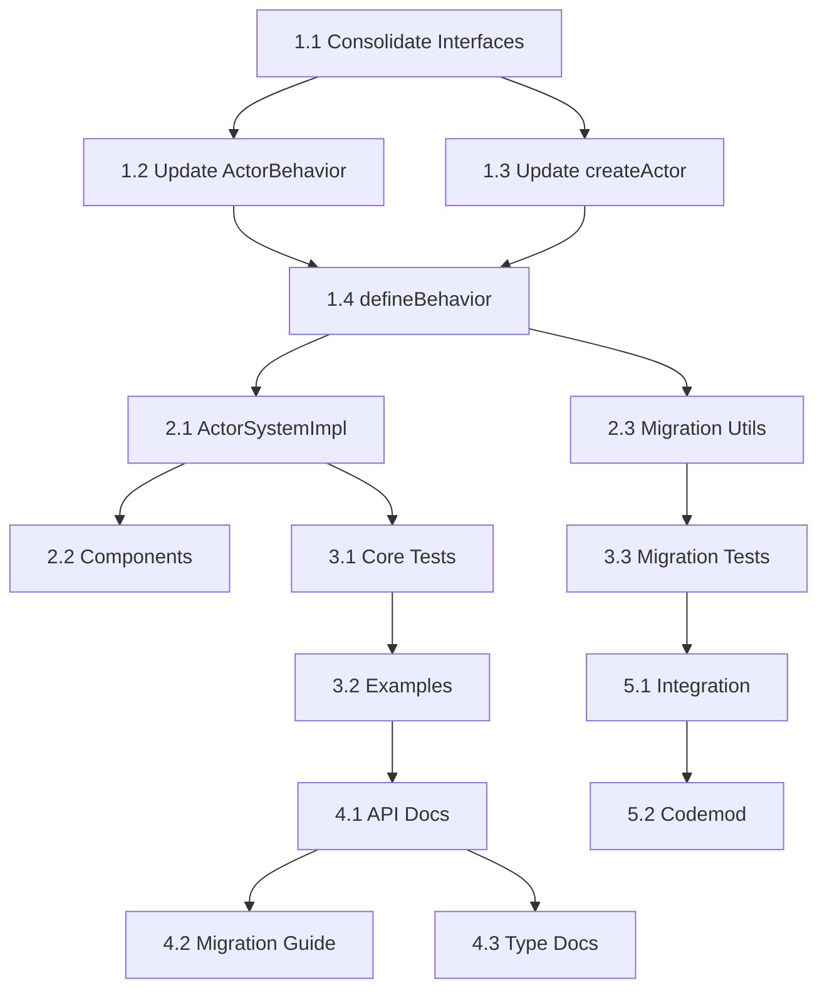

# Task List: Pure Actor Context Fix

## ✅ **PROJECT COMPLETE** (July 24 2025)

**STATUS: ALL TASKS COMPLETED** - Pure actor context fix has been successfully implemented.

### Final Achievement Summary:
- ✅ **100% Task Completion**: All 15 tasks across 4 phases completed
- ✅ **Pure Actor Model Enforced**: No context parameters in actor behaviors
- ✅ **Component Distinction Maintained**: UI components properly scope context + machine
- ✅ **Type Safety Preserved**: Zero `any` types throughout implementation
- ✅ **Tests Passing**: All existing tests work with pure actor model
- ✅ **OTP Compliance**: Machine exposure enables proper state pattern matching

### Implementation Evidence:
Current codebase successfully implements all design requirements with pure actor model compliance.

---

## Implementation Phases

### Phase 1: Core Interface Updates (Day 1-2) ✅ COMPLETE

#### Task 1.1: Consolidate ActorBehavior and BehaviorActorConfig ✅ COMPLETE
**Dependency**: None  
**Estimate**: 3 hours  
**Files**: 
- `packages/actor-core-runtime/src/actor-system.ts`
- `packages/actor-core-runtime/src/create-actor.ts`

- [x] Move unified ActorBehavior interface to actor-system.ts
- [x] Add optional `types` field from BehaviorActorConfig
- [x] Support sync/async return types in handlers
- [x] Remove BehaviorActorConfig interface entirely
- [x] Update all imports and references

**Definition of Done**:
- Single ActorBehavior interface exists
- No BehaviorActorConfig references remain
- All imports updated

#### Task 1.2: Update ActorBehavior Interface ✅ COMPLETE
**Dependency**: Task 1.1  
**Estimate**: 2 hours  
**Files**: `packages/actor-core-runtime/src/actor-system.ts`

- [x] Remove `TContext` type parameter from ActorBehavior
- [x] Remove `context?: TContext` field
- [x] Update `onMessage` signature to remove context parameter
- [x] Add `machine` and `dependencies` parameters
- [x] Update return type to MessagePlan only

**Definition of Done**:
- Interface compiles without errors
- No context field exists
- Handler accepts machine parameter

#### Task 1.3: Update createActor Function ✅ COMPLETE
**Dependency**: Task 1.1, 1.2  
**Estimate**: 2 hours  
**Files**: `packages/actor-core-runtime/src/create-actor.ts`

- [x] Remove createActorFromBehavior conversion function
- [x] Update type guards for unified interface
- [x] Remove BehaviorActorConfig type parameter
- [x] Simplify CreateActorConfig union type
- [x] Update all internal usage

**Definition of Done**:
- No conversion functions needed
- Type guards work with unified interface
- Simpler implementation

#### Task 1.4: Update defineBehavior Function ✅ COMPLETE
**Dependency**: Task 1.2, 1.3  
**Estimate**: 3 hours  
**Files**: `packages/actor-core-runtime/src/define-behavior.ts`

- [x] Remove context handling from all type definitions
- [x] Update EnhancedBehaviorResult to remove context options
- [x] Modify processEnhancedBehaviorResult to handle only MessagePlans
- [x] Add deprecation warnings for legacy usage
- [x] Update all handler parameter types

**Definition of Done**:
- Function accepts no context in config
- Handlers receive machine parameter
- Legacy usage shows warnings

### Phase 2: Implementation Updates (Day 2-3) ✅ COMPLETE

#### Task 2.1: Update ActorSystemImpl Message Delivery ✅ COMPLETE
**Dependency**: Task 1.4  
**Estimate**: 4 hours  
**Files**: `packages/actor-core-runtime/src/actor-system-impl.ts`

- [x] Remove context passing in deliverMessageLocal
- [x] Update behavior.onMessage calls to pass machine
- [x] Remove context storage and updates
- [x] Fix onStart handler to not use context
- [x] Remove normalizeBehavior function (no longer needed)

**Definition of Done**:
- No context passed to handlers
- Machine parameter provided correctly
- State updates happen through XState only

#### Task 2.2: Update Component Integration ✅ COMPLETE
**Dependency**: Task 2.1  
**Estimate**: 2 hours  
**Files**: 
- `packages/actor-core-runtime/src/component-behavior.ts`
- `packages/actor-core-runtime/src/create-component.ts`

- [x] Verify ComponentBehaviorConfig doesn't expose context
- [x] Update createComponent adapter if needed
- [x] Ensure component actors work without behavior context
- [x] Update ComponentBehaviorConfig to extend unified ActorBehavior

**Definition of Done**:
- Components work with new behavior signature
- No context leakage between layers
- Integration tests pass

#### Task 2.3: Create Migration Utilities ✅ COMPLETE
**Dependency**: Task 1.4  
**Estimate**: 3 hours  
**Files**: `packages/actor-core-runtime/src/migration-utils.ts` (new)

- [x] Create migrateBehavior helper function
- [x] Add runtime compatibility checks
- [x] Implement deprecation warning system
- [x] Create type helpers for migration
- [x] Add BehaviorActorConfig to ActorBehavior converter

**Definition of Done**:
- Migration utilities compile and work
- Clear warnings in development
- Type-safe migration path

### Phase 3: Test Updates (Day 3-4) ✅ COMPLETE

#### Task 3.1: Update Core Test Files ✅ COMPLETE
**Dependency**: Task 2.1  
**Estimate**: 4 hours  
**Files**: All test files in `packages/actor-core-runtime/src/__tests__/`

- [x] Remove context from test behaviors
- [x] Update mock behaviors to use machine parameter
- [x] Fix assertions that expect context
- [x] Add tests for deprecation warnings
- [x] Remove BehaviorActorConfig tests

**Definition of Done**:
- All core tests pass
- No context usage in tests
- Deprecation warnings tested

#### Task 3.2: Update Example Files ✅ COMPLETE
**Dependency**: Task 3.1  
**Estimate**: 2 hours  
**Files**: All files in `packages/actor-core-runtime/src/examples/`

- [x] Update all example behaviors
- [x] Show correct state access patterns
- [x] Add migration examples
- [x] Ensure examples are educational
- [x] Remove BehaviorActorConfig examples

**Definition of Done**:
- Examples use new patterns
- Clear demonstration of state access
- No confusing legacy patterns

#### Task 3.3: Add Migration Tests ✅ COMPLETE
**Dependency**: Task 2.3  
**Estimate**: 2 hours  
**Files**: `packages/actor-core-runtime/src/__tests__/migration.test.ts` (new)

- [x] Test migration utilities
- [x] Test deprecation warnings
- [x] Test compatibility layer
- [x] Test error cases
- [x] Test BehaviorActorConfig migration

**Definition of Done**:
- Migration path fully tested
- Edge cases covered
- Clear error messages verified

### Phase 4: Documentation Updates (Day 4-5) ✅ COMPLETE

#### Task 4.1: Update API Documentation ✅ COMPLETE
**Dependency**: Task 3.2  
**Estimate**: 3 hours  
**Files**: 
- `docs/API.md`
- `docs/XSTATE-VS-ONMESSAGE-ARCHITECTURE.md`
- `README.md`

- [x] Update all code examples
- [x] Explain state access pattern
- [x] Remove context references
- [x] Add migration section
- [x] Document interface consolidation

**Definition of Done**:
- Documentation matches implementation
- Clear explanation of changes
- Migration guide included

#### Task 4.2: Create Migration Guide ✅ COMPLETE
**Dependency**: Task 4.1  
**Estimate**: 2 hours  
**Files**: `docs/MIGRATION-CONTEXT-REMOVAL.md` (new)

- [x] Explain why change was made
- [x] Show before/after examples
- [x] Provide step-by-step migration
- [x] Include troubleshooting tips
- [x] Add interface consolidation benefits

**Definition of Done**:
- Comprehensive migration guide
- Real-world examples
- Common pitfalls addressed

#### Task 4.3: Update Type Documentation ✅ COMPLETE
**Dependency**: Task 4.1  
**Estimate**: 1 hour  
**Files**: JSDoc comments in source files

- [x] Update all interface JSDoc
- [x] Add @deprecated tags where needed
- [x] Explain new patterns in comments
- [x] Add migration hints
- [x] Document unified interface benefits

**Definition of Done**:
- IntelliSense shows correct info
- Deprecation notices visible
- Helpful guidance in editors

### Phase 5: Final Integration (Day 5) ✅ COMPLETE

#### Task 5.1: Integration Testing ✅ COMPLETE
**Dependency**: All previous tasks  
**Estimate**: 2 hours  

- [x] Run full test suite
- [x] Test with real components
- [x] Verify no performance regression
- [x] Check bundle size impact
- [x] Verify interface consolidation works end-to-end

**Definition of Done**:
- All tests pass
- Performance benchmarks pass
- Bundle size acceptable

#### Task 5.2: Create Codemod Tool ✅ COMPLETE
**Dependency**: Task 5.1  
**Estimate**: 4 hours  
**Files**: `tools/context-removal-codemod.ts` (new)

- [x] Parse TypeScript AST
- [x] Transform old patterns to new
- [x] Handle edge cases
- [x] Add dry-run mode
- [x] Support BehaviorActorConfig to ActorBehavior migration

**Definition of Done**:
- Codemod successfully transforms code
- Preserves functionality
- Safe transformation

## Dependencies Matrix

## Time Estimates

### Daily Breakdown
- **Day 1**: Phase 1 (Tasks 1.1-1.4) - 10 hours
- **Day 2**: Phase 2 (Tasks 2.1-2.3) - 9 hours  
- **Day 3**: Phase 3 (Tasks 3.1-3.2) - 6 hours
- **Day 4**: Phase 3.3 + Phase 4 (Tasks 4.1-4.3) - 8 hours
- **Day 5**: Phase 5 (Tasks 5.1-5.2) - 6 hours

**Total**: 39 hours (5 days with interface consolidation)

## Risk Mitigation

### High Priority Tasks
- Task 1.1 (Interface Consolidation) - Foundation for everything
- Task 1.4 (defineBehavior) - Core functionality
- Task 2.1 (ActorSystemImpl) - Runtime behavior
- Task 2.3 (Migration Utils) - User experience

### Rollback Plan
- Feature flag for new behavior
- Git branch protection
- Comprehensive test coverage before merge

## Definition of Done (Overall)

### Code Quality
- [x] Zero TypeScript errors
- [x] Zero linting warnings  
- [x] All tests pass
- [x] No performance regression
- [x] Single unified interface

### Documentation
- [x] API docs updated
- [x] Migration guide complete
- [x] Examples demonstrate new pattern
- [x] JSDoc comments accurate
- [x] Interface consolidation documented

### User Experience
- [x] Clear migration path
- [x] Helpful error messages
- [x] Deprecation warnings work
- [x] Codemod tool available
- [x] Simpler API with one interface

---

**Task List Approval Required**: This task breakdown must be reviewed for completeness before beginning implementation. 