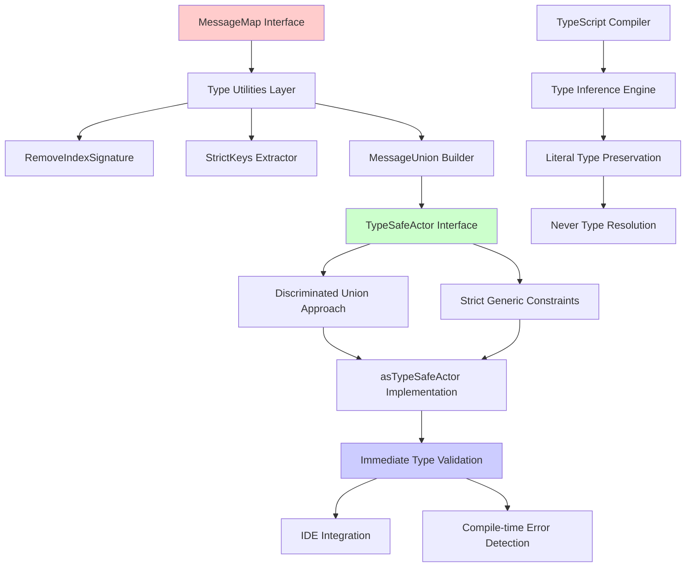
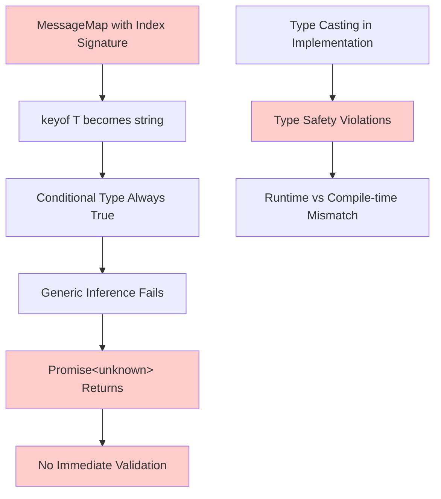

# Design Document: TypeScript Immediate Type Validation Fix

## Architecture Overview

The TypeScript immediate type validation system implements **compile-time message type validation** for the Actor-Web Framework's `TypeSafeActor` interface. This ensures developers receive immediate TypeScript errors when using invalid message types, rather than delayed errors during property access.



### Current Architecture Problems



## Core Design Principles

### 1. Immediate Type Validation
- **Invalid message types trigger TypeScript errors at call sites** (`actor.ask({ type: 'INVALID' })`)
- **No delayed validation** - errors appear exactly where the invalid type is specified
- **Precise error locations** - TypeScript highlights the exact problematic code

### 2. Discriminated Union Architecture
- **Message types as discriminated unions** - following XState's proven pattern
- **Literal type preservation** - maintain specific message type information throughout the call chain
- **Union-based validation** - TypeScript's natural type checking for union types

### 3. Zero Type Casting Policy
- **No `any` types** in public interfaces or implementations
- **Minimal casting** - only at framework boundaries where absolutely necessary
- **Type guard functions** - prefer runtime validation over casting

### 4. Generic Inference Optimization
- **Literal type inference** - preserve `'GET_USER'` as literal, not `string`
- **Context-sensitive typing** - return types based on specific message types
- **IDE-friendly patterns** - optimal autocomplete and IntelliSense support

### 5. Backwards Compatibility
- **Existing MessageMap interfaces unchanged** - all current declarations continue working
- **API consistency** - same method signatures and behaviors
- **Progressive enhancement** - better type safety without breaking changes

## Component Design

### 1. Type Utilities Layer

#### RemoveIndexSignature Utility
**Purpose**: Strip broad index signatures that make `keyof T` too permissive

```typescript
export type RemoveIndexSignature<T> = {
  [K in keyof T as string extends K ? never 
    : number extends K ? never 
    : symbol extends K ? never 
    : K]: T[K]
};
```

**Technical Details**:
- **Conditional mapping** filters out keys where `string extends K`
- **Index signature elimination** removes `[key: string]: unknown` pattern
- **Preserves explicit keys** keeps only developer-declared message types
- **Type-level computation** - zero runtime overhead

**Example Transformation**:
```typescript
// Input: MessageMap with index signature
interface UserMessages extends MessageMap {
  'GET_USER': { id: number; name: string };
  'UPDATE_USER': { success: boolean };
  [key: string]: unknown; // ← This gets removed
}

// Output: Clean interface
type CleanUserMessages = {
  'GET_USER': { id: number; name: string };
  'UPDATE_USER': { success: boolean };
  // Index signature removed
}
```

#### StrictKeys Extractor
**Purpose**: Extract only the explicit message type keys

```typescript
export type StrictKeys<T extends MessageMap> = keyof RemoveIndexSignature<T>;
```

**Behavior**:
- **Input**: `MessageMap` with potential index signature
- **Output**: Union of literal string types `'GET_USER' | 'UPDATE_USER'`
- **Key Constraint**: Only explicitly declared message types allowed

#### MessageUnion Builder
**Purpose**: Create discriminated union of all valid message objects

```typescript
export type MessageUnion<T extends MessageMap> = {
  [K in StrictKeys<T>]: {
    readonly type: K;
    readonly payload?: JsonValue;
    readonly correlationId?: string;
    readonly timestamp?: number;
    readonly version?: string;
  }
}[StrictKeys<T>];
```

**Architecture Benefits**:
- **Discriminated union pattern** - each message has unique `type` discriminant
- **Exhaustive type checking** - TypeScript knows all possible message shapes
- **Immediate validation** - invalid message types don't match the union
- **IDE autocomplete** - only valid message types suggested

### 2. TypeSafeActor Interface Redesign

#### Current (Broken) Implementation
```typescript
export interface TypeSafeActor<T extends MessageMap> {
  ask<K extends keyof T>(message: K extends keyof T ? {
    readonly type: K;
    // ...
  } : never): Promise<T[K]>;
}
```

**Problems**:
- **Conditional type always true** because `keyof T` is `string`
- **Generic inference fails** - `K` becomes `string` not literal type
- **Never branch unreachable** - validation never triggers

#### Solution A: Discriminated Union Approach (Recommended)

```typescript
export interface TypeSafeActor<T extends MessageMap> {
  send(message: MessageUnion<T>): void;
  ask(message: MessageUnion<T>): Promise<T[typeof message.type]>;
  start(): void;
  stop(): void;
  subscribe(eventType: string, handler: (event: ActorMessage) => void): () => void;
}
```

**Technical Advantages**:
- **Direct union validation** - TypeScript checks message against all valid shapes
- **No generic inference** - eliminates complex type parameter resolution
- **Return type precision** - `T[typeof message.type]` resolves to exact response type
- **Proven pattern** - matches XState's event validation architecture

**Type Flow Example**:
```typescript
// MessageMap definition
interface UserMessages extends MessageMap {
  'GET_USER': { id: number; name: string };
  'UPDATE_USER': { success: boolean };
}

// MessageUnion<UserMessages> resolves to:
type UserMessageUnion = 
  | { readonly type: 'GET_USER'; readonly payload?: JsonValue; /* ... */ }
  | { readonly type: 'UPDATE_USER'; readonly payload?: JsonValue; /* ... */ };

// Usage validation
const actor = asTypeSafeActor<UserMessages>(rawActor);
actor.ask({ type: 'GET_USER' }); // ✅ Valid - matches union member
actor.ask({ type: 'INVALID' });  // ❌ Error - no matching union member
```

#### Solution B: Strict Generic Constraints (Alternative)

```typescript
export interface TypeSafeActor<T extends MessageMap> {
  send<K extends StrictKeys<T>>(message: {
    readonly type: K;
    readonly payload?: JsonValue;
    readonly correlationId?: string;
    readonly timestamp?: number;
    readonly version?: string;
  }): void;
  
  ask<K extends StrictKeys<T>>(message: {
    readonly type: K;
    readonly payload?: JsonValue;
    readonly correlationId?: string;
    readonly timestamp?: number;
    readonly version?: string;
  }): Promise<T[K]>;
}
```

**Technical Characteristics**:
- **Strict generic constraint** - `K extends StrictKeys<T>` only allows valid keys
- **Generic return type** - `Promise<T[K]>` provides precise response types
- **Complex type resolution** - relies on TypeScript's generic inference
- **tRPC-style pattern** - similar to how tRPC validates procedure names

### 3. asTypeSafeActor Implementation

#### Current (Broken) Implementation
```typescript
export function asTypeSafeActor<T extends MessageMap>(
  actor: ActorInstance
): TypeSafeActor<T> {
  return {
    ask: <K extends keyof T>(message: K extends keyof T ? {
      readonly type: K;
      // ...
    } : never): Promise<T[K]> => {
      // Type casting breaks type safety
      const basicMessage = message as {
        type: string;
        payload?: JsonValue;
        // ...
      };
      return actor.ask<T[K]>(basicMessage);
    }
  };
}
```

**Critical Issues**:
- **Type casting destroys validation** - `as { type: string; ... }` accepts any type
- **Generic constraints ineffective** - index signature makes all strings valid
- **Return type casting** - `actor.ask<T[K]>()` with broken `K` inference

#### Solution A: Discriminated Union Implementation

```typescript
export function asTypeSafeActor<T extends MessageMap>(
  actor: ActorInstance
): TypeSafeActor<T> {
  return {
    send: (message: MessageUnion<T>) => {
      // Direct pass-through - TypeScript validates message shape
      actor.send({
        type: message.type,
        payload: message.payload,
        correlationId: message.correlationId,
        timestamp: message.timestamp,
        version: message.version,
      });
    },
    
    ask: (message: MessageUnion<T>): Promise<T[typeof message.type]> => {
      // TypeScript knows message.type is valid key from MessageMap
      return actor.ask({
        type: message.type,
        payload: message.payload,
        correlationId: message.correlationId,
        timestamp: message.timestamp,
        version: message.version,
      }) as Promise<T[typeof message.type]>;
    },
    
    start: () => actor.start(),
    stop: () => actor.stop(),
    subscribe: (eventType: string, handler: (event: ActorMessage) => void) => 
      actor.subscribe(eventType, handler),
  };
}
```

**Key Improvements**:
- **No input parameter casting** - `MessageUnion<T>` provides compile-time validation
- **Literal type preservation** - `message.type` maintains its literal value
- **Minimal return casting** - only necessary at framework boundary
- **Type-safe pass-through** - validation happens at call site, not implementation

## TypeScript Compiler Integration

### Type Inference Flow

```mermaid
sequenceDiagram
    participant Dev as Developer
    participant TS as TypeScript Compiler
    participant Union as MessageUnion<T>
    participant Actor as TypeSafeActor
    
    Dev->>TS: actor.ask({ type: 'GET_USER' })
    TS->>Union: Check message against union members
    Union->>TS: Match found - valid message shape
    TS->>Actor: Infer return type T['GET_USER']
    Actor->>Dev: Promise<{ id: number; name: string }>
    
    Dev->>TS: actor.ask({ type: 'INVALID' })
    TS->>Union: Check message against union members
    Union->>TS: No match found - invalid message
    TS->>Dev: Compilation error at call site
```

### Error Message Design

**Current (Poor) Error Messages**:
```
Property 'nonExistentProp' does not exist on type 'unknown'
```

**Improved Error Messages**:
```
Argument of type '{ type: "INVALID_MESSAGE"; }' is not assignable to parameter of type 'MessageUnion<UserMessages>'.
  Type '{ type: "INVALID_MESSAGE"; }' is not assignable to type '{ readonly type: "GET_USER"; ... } | { readonly type: "UPDATE_USER"; ... }'.
    Types of property 'type' are incompatible.
      Type '"INVALID_MESSAGE"' is not assignable to type '"GET_USER" | "UPDATE_USER"'.
```

### IDE Integration Features

**Autocomplete Enhancement**:
- **Contextual suggestions** - only valid message types shown in autocomplete
- **Type-aware payload completion** - payload structure based on message type
- **Error squiggles** - immediate visual feedback for invalid types

**IntelliSense Improvements**:
- **Hover information** - shows expected response type for each message
- **Parameter hints** - guides developers to correct message structure
- **Quick fixes** - suggests valid message types when invalid ones are used

## Configuration & Tooling Design

### TypeScript Configuration Requirements

```json
{
  "compilerOptions": {
    "strict": true,                              // Essential for type validation
    "exactOptionalPropertyTypes": true,          // Stricter optional property handling
    "noPropertyAccessFromIndexSignature": true, // Prevent obj["unknown"] patterns
    "downlevelIteration": true,                  // Fix Map/Set iteration errors
    "target": "ES2022",                          // Support Object.hasOwn
    "lib": ["ES2022", "DOM"]                     // Modern JavaScript features
  }
}
```

**Configuration Rationale**:
- **`strict: true`** - Enables all strict type checking options
- **`exactOptionalPropertyTypes`** - Distinguishes between missing and undefined properties
- **`noPropertyAccessFromIndexSignature`** - Prevents accessing unknown keys
- **`downlevelIteration`** - Resolves 33+ compiler errors with Map/Set iteration
- **ES2022 target/lib** - Supports `Object.hasOwn` usage in codebase

### Linter Integration

**Biome Configuration Fix**:
```json
{
  "files": {
    "ignoreUnknown": true,
    "include": [  // ✅ Correct key name (was "includes")
      "**",
      "!**/coverage/**",
      "!**/node_modules/**"
    ]
  }
}
```

## Migration Strategy

### Phase 1: Foundation (Type Utilities)
1. **Create type utilities module** - `RemoveIndexSignature`, `StrictKeys`, `MessageUnion`
2. **Test utilities with existing MessageMaps** - verify compatibility
3. **Performance validation** - ensure no compilation slowdown

### Phase 2: Interface Migration
1. **Update MessageMap interface** - remove problematic index signature
2. **Redesign TypeSafeActor interface** - implement discriminated union approach
3. **Backwards compatibility testing** - all existing code continues working

### Phase 3: Implementation Migration  
1. **Rewrite asTypeSafeActor function** - eliminate type casting
2. **Update CLI usage patterns** - remove explicit generic parameters
3. **End-to-end validation** - complete type safety verification

### Breaking Change Analysis

**Zero Breaking Changes Expected**:
- **MessageMap declarations** - all existing interfaces continue working
- **Actor creation patterns** - `createActor` and `asTypeSafeActor` unchanged
- **Framework integration** - XState, component actors, event emission unchanged
- **Runtime behavior** - identical execution, only compile-time improvements

**Edge Cases Requiring Attention**:
- **Dynamic message type construction** - patterns using string manipulation
- **Generic message handlers** - functions accepting arbitrary message types
- **Third-party integrations** - external libraries using MessageMap

## Performance Considerations

### Compile-time Performance
- **Type utility complexity** - O(n) where n = number of message types
- **Union type resolution** - TypeScript handles discriminated unions efficiently
- **Generic inference reduction** - fewer complex type computations

### IDE Performance
- **Autocomplete response time** - target <500ms for large MessageMaps
- **Error highlighting speed** - immediate feedback without lag
- **Memory usage** - monitor TypeScript Language Server memory consumption

### Development Experience Metrics
- **Error clarity** - precise error messages indicating valid options
- **Documentation integration** - hover tooltips show message/response types
- **Refactoring support** - rename/move operations work correctly with strict types

## Testing Strategy

### Type-Level Testing
```typescript
// Compile-time validation tests
// @ts-expect-error - Should fail for invalid message types
actor.send({ type: 'INVALID_MESSAGE' });

// @ts-expect-error - Should fail for typos
actor.ask({ type: 'GET_USE' }); // instead of GET_USER

// Should compile and return correct types
const userResult = actor.ask({ type: 'GET_USER' });
// userResult is Promise<{ id: number; name: string }>
```

### Runtime Behavior Testing
```typescript
describe('TypeSafeActor runtime behavior', () => {
  test('valid message types work correctly', async () => {
    const result = await actor.ask({ type: 'GET_USER' });
    expect(result).toMatchObject({ id: expect.any(Number), name: expect.any(String) });
  });
  
  test('message structure preserved through call chain', () => {
    // Verify no runtime regressions from type system changes
  });
});
```

### Integration Testing
- **CLI command execution** - all commands continue working
- **XState integration** - state machines and actors interoperate correctly
- **Framework boundaries** - component actors, event emission, supervision

## Risk Mitigation

### High-Risk Areas
1. **Complex MessageMap interfaces** - large unions, nested types, generic constraints
2. **IDE performance degradation** - monitor autocomplete and error highlighting speed
3. **TypeScript version compatibility** - test with multiple TypeScript versions

### Mitigation Strategies
1. **Incremental rollout** - feature flags for gradual adoption
2. **Performance benchmarking** - continuous monitoring of compile times
3. **Rollback capability** - maintain current implementation as fallback
4. **Comprehensive testing** - type-level, runtime, and integration test suites

### Success Metrics
- **Zero TypeScript compilation errors** across entire codebase
- **Immediate error detection** for invalid message types at call sites
- **IDE responsiveness** maintained with new type system
- **Developer satisfaction** improved error messages and autocomplete

---

## Technical Specifications

### Supported MessageMap Patterns
```typescript
// ✅ Simple message maps
interface BasicMessages extends MessageMap {
  'ACTION_A': ResponseTypeA;
  'ACTION_B': ResponseTypeB;
}

// ✅ Complex response types
interface ComplexMessages extends MessageMap {
  'GET_USER': { id: number; profile: UserProfile; permissions: string[] };
  'BATCH_UPDATE': { results: Array<{ id: string; success: boolean; error?: string }> };
}

// ✅ Empty message maps (edge case)
interface EmptyMessages extends MessageMap {
  // No messages - all operations should be type errors
}

// ✅ Single message maps
interface SingleMessage extends MessageMap {
  'PING': { timestamp: number };
}
```

### Type Validation Examples
```typescript
// Invalid message types - should show immediate errors
// @ts-expect-error
actor.send({ type: 'INVALID_ACTION' });

// @ts-expect-error  
actor.ask({ type: 'TYPO_IN_NAME' });

// @ts-expect-error
actor.ask({ type: '' }); // Empty string

// @ts-expect-error
actor.ask({ type: 123 as any }); // Wrong type

// Valid usage - should compile and infer correct types
const response1 = actor.ask({ type: 'GET_USER' });
// response1: Promise<{ id: number; profile: UserProfile; permissions: string[] }>

const response2 = actor.ask({ type: 'BATCH_UPDATE' });  
// response2: Promise<{ results: Array<{ id: string; success: boolean; error?: string }> }>
```

This design provides a robust, type-safe foundation for immediate message type validation while maintaining full backwards compatibility and following proven patterns from successful TypeScript libraries like XState and tRPC. 