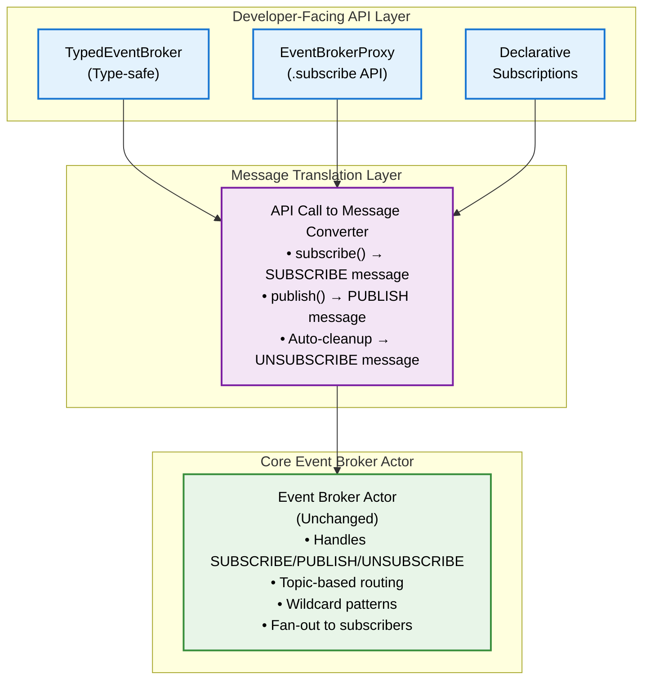

# Design Document: Event Broker DX Improvement

## Architecture Overview

The improved Event Broker design introduces a **three-layer architecture** that maintains pure actor model semantics while providing progressively simpler APIs:



This design achieves the 50%+ code reduction goal while maintaining backward compatibility and pure actor principles.

## Component Design

### 1. Type-Safe Event Registry

Define a central registry of all events in the system using TypeScript's mapped types:

```typescript
// Event type definitions with topic hierarchy
interface EventRegistry {
  // User domain events
  'user.created': { userId: string; email: string; timestamp: number };
  'user.updated': { userId: string; changes: Partial<UserProfile> };
  'user.deleted': { userId: string; reason: string };
  
  // Order domain events  
  'order.created': { orderId: string; userId: string; items: OrderItem[] };
  'order.shipped': { orderId: string; trackingNumber: string };
  'order.cancelled': { orderId: string; reason: string };
  
  // Counter example events
  'counter.changed': { componentId: string; newValue: number; source: string };
  'counter.reset': { componentId: string; resetBy: string };
}

// Extract event types for discriminated unions
type EventType = keyof EventRegistry;
type EventPayload<T extends EventType> = EventRegistry[T];
```

### 2. TypedEventBroker Interface

A type-safe wrapper that provides compile-time validation:

```typescript
interface TypedEventBroker {
  // Type-safe subscribe with inferred payload types
  subscribe<T extends EventType>(
    topic: T,
    handler: (payload: EventPayload<T>) => void
  ): Promise<Unsubscribe>;
  
  // Type-safe publish
  publish<T extends EventType>(
    topic: T,
    payload: EventPayload<T>
  ): Promise<void>;
  
  // Pattern-based subscriptions (less type-safe but flexible)
  subscribePattern(
    pattern: string, // e.g., "user.*"
    handler: (topic: string, payload: unknown) => void
  ): Promise<Unsubscribe>;
}

type Unsubscribe = () => Promise<void>;
```

### 3. EventBrokerProxy Implementation

The proxy translates the simple API to Event Broker messages:

```typescript
class EventBrokerProxyImpl implements TypedEventBroker {
  private subscriptions = new Map<string, Set<Function>>();
  private correlationHandlers = new Map<string, Function>();
  
  constructor(
    private brokerActor: ActorPID,
    private actorId: string
  ) {}
  
  async subscribe<T extends EventType>(
    topic: T,
    handler: (payload: EventPayload<T>) => void
  ): Promise<Unsubscribe> {
    const subscriptionId = generateId();
    
    // Register handler locally
    if (!this.subscriptions.has(topic)) {
      this.subscriptions.set(topic, new Set());
    }
    this.subscriptions.get(topic)!.add(handler);
    
    // Send SUBSCRIBE message to broker
    await this.brokerActor.send({
      type: 'SUBSCRIBE',
      payload: {
        topic,
        subscriber: this.actorId,
        subscriptionId
      }
    });
    
    // Return unsubscribe function
    return async () => {
      this.subscriptions.get(topic)?.delete(handler);
      await this.brokerActor.send({
        type: 'UNSUBSCRIBE',
        payload: { subscriptionId }
      });
    };
  }
  
  // Intercept TOPIC_EVENT messages and route to handlers
  handleTopicEvent(message: TopicEventMessage): void {
    const { topic, event } = message.payload;
    const handlers = this.subscriptions.get(topic);
    
    if (handlers) {
      handlers.forEach(handler => {
        try {
          handler(event.payload);
        } catch (error) {
          console.error(`Handler error for ${topic}:`, error);
        }
      });
    }
  }
}
```

### 4. Declarative Subscriptions

Allow components to declare their subscriptions at definition time:

```typescript
interface ComponentBehaviorWithSubscriptions<T extends EventType = EventType> {
  // Existing behavior properties...
  
  // New: declarative subscriptions
  subscriptions?: {
    [K in T]?: (payload: EventPayload<K>, machine: Actor) => void | DomainEvent;
  };
}

// Example usage
const counterBehavior = defineComponentBehavior({
  dependencies: {
    eventBroker: 'actor://system/event-broker'
  },
  
  subscriptions: {
    'counter.changed': (payload, machine) => {
      machine.send({ type: 'UPDATE_COUNT', newCount: payload.newValue });
    },
    'counter.reset': (payload, machine) => {
      machine.send({ type: 'RESET' });
    }
  },
  
  onMessage: async ({ message }) => {
    // Business logic without subscription boilerplate
  }
});
```

### 5. Integration with Component Mount Lifecycle

The framework automatically handles subscriptions during component lifecycle:

```typescript
// In component mount handler
async function handleComponentMount(behavior: ComponentBehaviorWithSubscriptions) {
  if (behavior.subscriptions && behavior.dependencies?.eventBroker) {
    const eventBroker = createEventBrokerProxy(
      behavior.dependencies.eventBroker,
      behavior.actorId
    );
    
    // Auto-subscribe to declared events
    for (const [topic, handler] of Object.entries(behavior.subscriptions)) {
      await eventBroker.subscribe(topic as EventType, handler);
    }
    
    // Store proxy for message interception
    behavior.context._eventBrokerProxy = eventBroker;
  }
}
```

#### XState v5 Lifecycle Integration Options

For actors using XState v5 directly, subscriptions can be managed via:

```typescript
import { setup, assign, fromCallback } from 'xstate';

// Option 1: Entry/Exit Actions with setup()
const actorMachine = setup({
  types: {
    context: {} as {
      eventBroker?: TypedEventBroker;
      unsubscribeHandlers?: Array<() => Promise<void>>;
    }
  },
  actions: {
    subscribeToEvents: assign(({ context }) => {
      const unsubscribe = context.eventBroker?.subscribe('user.updated', handleUserUpdate);
      return {
        unsubscribeHandlers: [...(context.unsubscribeHandlers || []), unsubscribe]
      };
    }),
    unsubscribeFromEvents: ({ context }) => {
      context.unsubscribeHandlers?.forEach(unsub => unsub());
    }
  }
}).createMachine({
  initial: 'inactive',
  states: {
    active: {
      entry: 'subscribeToEvents',
      exit: 'unsubscribeFromEvents',
      // ... state logic
    }
  }
});

// Option 2: Invoke Pattern (replaces activities in v5)
const actorMachine = setup({
  types: {
    context: {} as { eventBroker?: TypedEventBroker }
  },
  actors: {
    eventSubscriptionService: fromCallback(({ input, sendBack }) => {
      const { eventBroker, topics } = input;
      const unsubscribers: Array<() => Promise<void>> = [];
      
      // Subscribe to multiple topics
      topics.forEach(async (topic) => {
        const unsubscribe = await eventBroker.subscribe(topic, (payload) => {
          sendBack({ type: 'EVENT_RECEIVED', topic, payload });
        });
        unsubscribers.push(unsubscribe);
      });
      
      // Cleanup function
      return () => {
        unsubscribers.forEach(unsub => unsub());
      };
    })
  }
}).createMachine({
  initial: 'inactive',
  states: {
    monitoring: {
      invoke: {
        src: 'eventSubscriptionService',
        input: ({ context }) => ({
          eventBroker: context.eventBroker,
          topics: ['order.*', 'user.updated']
        })
      },
      on: {
        EVENT_RECEIVED: {
          actions: ({ event }) => {
            console.log(`Received ${event.topic}:`, event.payload);
          }
        }
      }
    }
  }
});
```

## Data Flow

### Publishing Events

```
Component → eventBroker.publish('user.created', payload)
         ↓
EventBrokerProxy → Creates PUBLISH message
         ↓  
Event Broker Actor → Finds subscribers for 'user.created'
         ↓
TOPIC_EVENT messages → Sent to all subscribers
         ↓
Subscriber's Proxy → Intercepts TOPIC_EVENT
         ↓
Handler Function → Called with typed payload
```

### Subscription Flow

```
Component declares subscription in behavior
         ↓
Framework auto-subscribes on mount
         ↓
EventBrokerProxy sends SUBSCRIBE message
         ↓
Event Broker Actor registers subscription
         ↓
Future events routed to component
         ↓
Framework auto-unsubscribes on unmount
```

## API Contracts

### Event Broker Messages (Unchanged)

```typescript
// Existing message types remain for backward compatibility
interface SubscribeMessage extends ActorMessage {
  type: 'SUBSCRIBE';
  payload: {
    topic: string;
    pattern?: string;
    subscriber: string;
    subscriptionId?: string;
  };
}

interface PublishMessage extends ActorMessage {
  type: 'PUBLISH';
  payload: {
    topic: string;
    event: ActorMessage;
    publisherId?: string;
  };
}

interface TopicEventMessage extends ActorMessage {
  type: 'TOPIC_EVENT';
  payload: {
    topic: string;
    event: ActorMessage;
    publisherId?: string;
  };
}
```

### New TypeScript Interfaces

```typescript
// Main API surface
interface EventBrokerDependency {
  eventBroker: TypedEventBroker;
}

// Subscription handle  
interface SubscriptionHandle {
  unsubscribe(): Promise<void>;
  topic: string;
  isActive: boolean;
}

// Pattern matching utilities
type TopicPattern<T extends string> = T extends `${infer Prefix}.*` 
  ? `${Prefix}.${string}` 
  : T;

// Type guard for event validation
function isValidEvent<T extends EventType>(
  topic: T,
  payload: unknown
): payload is EventPayload<T>;
```

## Technology Choices

### TypeScript Language Features
- **Template Literal Types**: For type-safe topic hierarchies
- **Mapped Types**: For the EventRegistry pattern
- **Discriminated Unions**: For event type safety
- **Conditional Types**: For pattern matching support

### Implementation Patterns
- **Proxy Pattern**: Hide message complexity behind simple API
- **Registry Pattern**: Central event type definitions
- **Facade Pattern**: Progressive complexity layers
- **Interception Pattern**: Route TOPIC_EVENT to handlers

### No New Dependencies
- Pure TypeScript implementation
- Uses existing Actor-Web primitives
- Compatible with current XState integration
- No runtime libraries needed

## Risk Assessment

### Technical Risks

1. **Message Interception Complexity**
   - Risk: Intercepting TOPIC_EVENT messages might interfere with user handlers
   - Mitigation: Use message handler chain pattern, user handlers run after proxy

2. **Type Definition Maintenance**
   - Risk: EventRegistry could become large and unwieldy
   - Mitigation: Support modular registry composition and namespace patterns

3. **Memory Leaks from Handlers**
   - Risk: Forgotten unsubscribe calls could leak memory
   - Mitigation: Auto-cleanup on actor termination, weak references where appropriate

### Migration Risks

1. **Breaking Changes**
   - Risk: Existing Event Broker usage might break
   - Mitigation: All changes are additive, old patterns continue to work

2. **Learning Curve**
   - Risk: Developers confused by multiple APIs
   - Mitigation: Clear documentation, migration guide, deprecation warnings

## Quality Assurance Strategy

### Type Safety
- EventRegistry enforces compile-time validation
- No `any` types in public APIs
- Type guards for runtime validation of external events
- Strict TypeScript configuration for all new code

### Testing Strategy
- Unit tests for EventBrokerProxy message translation
- Integration tests for full subscribe/publish flow
- Type-level tests using TypeScript's type checker
- Performance benchmarks comparing old vs new API
- Cross-browser testing for distributed scenarios

### Regression Prevention
- Existing Event Broker tests continue to pass
- New API tests added alongside old ones
- Migration tests verify both APIs work together
- Pre-commit hooks enforce type safety
- CI/CD runs full test suite on every change

### Developer Experience Validation
- Code reduction metrics (target: 50%+)
- Time-to-first-event measurements
- Error message clarity testing
- IntelliSense/autocomplete verification 