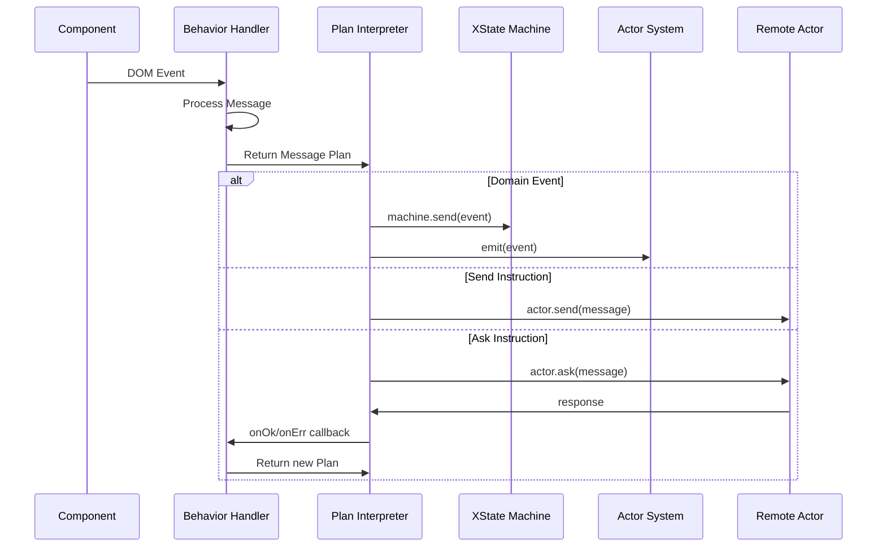
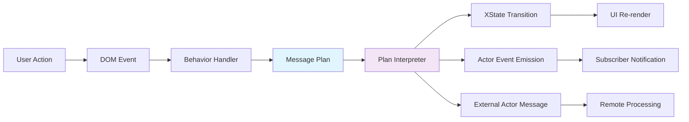

# Design Document: OTP-Style Actor Implementation

## Architecture Overview

The design implements Erlang/OTP-style actor patterns in JavaScript/TypeScript through three core architectural layers:

```mermaid
graph TB
    A[OTP-Style API Layer] --> B[Message Plan DSL]
    B --> C[Runtime Execution Layer]
    C --> D[XState Bridge]
    C --> E[Actor System Core]
    
    A --> F[defineBehavior()]
    A --> G[createActor()]
    A --> H[Ask Pattern]
    
    B --> I[Fan-Out Events]
    B --> J[Tell Instructions]
    B --> K[Ask Instructions]
    
    C --> L[Plan Interpreter]
    C --> M[Correlation Manager]
    C --> N[Transport Router]
```

### Key Design Principles

1. **OTP Fidelity**: Map Erlang patterns directly to JavaScript idioms
2. **Type Safety**: Comprehensive TypeScript support with zero `any` types
3. **Backward Compatibility**: All existing APIs continue to work
4. **Performance**: Minimal runtime overhead through efficient message routing
5. **Location Transparency**: Same API works locally, in Workers, across network

## Component Design

### 1. OTP-Style API Layer

#### `defineBehavior()` Function
```typescript
export function defineBehavior<TMessage, TContext, TDomainEvent>(config: {
  onMessage: (params: {
    message: TMessage;
    machine: Actor<AnyStateMachine>;
    dependencies: ActorDependencies;
  }) => MessagePlan<TDomainEvent> | Promise<MessagePlan<TDomainEvent>>;
}): ActorBehavior<TMessage, TContext, TDomainEvent>;
```

**Design Rationale**: 
- Single function creates behaviors for both actors and components
- Unified signature reduces cognitive overhead
- Returns structured message plans instead of imperative calls

#### `createActor()` Function  
```typescript
export function createActor<TMessage, TContext>(config: {
  machine: StateMachine<TContext>;
  behavior: ActorBehavior<TMessage, TContext>;
}): ActorFactory<TMessage>;

interface ActorFactory<TMessage> {
  start(): ActorRef<TMessage>;
}

interface ActorRef<TMessage> {
  send(message: TMessage): Promise<void>;
  ask<TResponse>(message: TMessage & { replyTo?: ActorRef }, timeout?: number): Promise<TResponse>;
  stop(): Promise<void>;
}
```

**Design Rationale**:
- Two-step creation (create + start) matches Erlang spawn patterns
- ActorRef provides clean abstraction over implementation details  
- Ask pattern built-in with automatic correlation management

### 2. Message Plan DSL

#### Core Message Plan Types
```typescript
type MessagePlan<TDomainEvent = DomainEvent> =
  | TDomainEvent                                    // Fan-out broadcast
  | SendInstruction                                 // Point-to-point tell
  | AskInstruction                                  // Request/response
  | (TDomainEvent | SendInstruction | AskInstruction)[];  // Multiple operations

interface SendInstruction {
  to: ActorRef<any>;
  msg: ActorMessage;
  mode?: 'fireAndForget' | 'retry(3)' | 'guaranteed';
}

interface AskInstruction<TResponse = unknown> {
  to: ActorRef<any>;
  ask: ActorMessage;
  onOk: TDomainEvent | ((response: TResponse) => TDomainEvent);
  onErr?: TDomainEvent | ((error: Error) => TDomainEvent);
  timeout?: number;
}
```

**Design Rationale**:
- Declarative approach enables atomicity and durability
- Union types provide compile-time validation
- Instructions include delivery policies for reliability

#### Domain Event System
```typescript
interface DomainEvent {
  type: string;
  [key: string]: JsonValue | undefined;
}

type ValidDomainEvent<T> = T extends DomainEvent 
  ? T extends { type: infer U }
    ? U extends string
      ? Omit<T, 'type'> extends Record<string, JsonValue | undefined>
        ? T
        : never
      : never
    : never
  : never;

export function isDomainEvent<T>(value: unknown): value is ValidDomainEvent<T>;
```

**Design Rationale**:
- Domain events are serializable by design (JSON constraint)
- Type guards prevent runtime serialization errors
- Events automatically fan-out to both XState machine and actor system

### 3. Runtime Execution Layer

#### Message Plan Interpreter
```typescript
export async function processMessagePlan<TDomainEvent>(
  plan: MessagePlan<TDomainEvent> | void,
  context: RuntimeContext
): Promise<void> {
  if (!plan) return;
  
  const plans = Array.isArray(plan) ? plan : [plan];
  
  for (const instruction of plans) {
    if (isDomainEvent(instruction)) {
      // Fan-out: Send to XState machine AND emit to actor system
      context.machine.send(instruction);
      context.emit(instruction);
    } else if (isSendInstruction(instruction)) {
      await processSendInstruction(instruction, context);
    } else if (isAskInstruction(instruction)) {
      await processAskInstruction(instruction, context);
    }
  }
}
```

**Design Rationale**:
- Single interpreter handles all message types uniformly
- Fan-out logic embedded for domain events
- Async processing allows for network operations

#### Ask Pattern Implementation
```typescript
interface CorrelationManager {
  generateId(): string;
  registerRequest<T>(correlationId: string, timeout: number): Promise<T>;
  handleResponse(correlationId: string, response: ActorMessage): void;
  handleTimeout(correlationId: string): void;
}

export class DefaultCorrelationManager implements CorrelationManager {
  private pendingRequests = new Map<string, {
    resolve: (value: any) => void;
    reject: (error: Error) => void;
    timeoutHandle: number;
  }>();

  generateId(): string {
    return `${Date.now()}-${Math.random().toString(36).substr(2, 9)}`;
  }

  async registerRequest<T>(correlationId: string, timeout: number): Promise<T> {
    return new Promise((resolve, reject) => {
      const timeoutHandle = window.setTimeout(() => {
        this.pendingRequests.delete(correlationId);
        reject(new Error(`Request ${correlationId} timed out after ${timeout}ms`));
      }, timeout);

      this.pendingRequests.set(correlationId, { resolve, reject, timeoutHandle });
    });
  }
  
  // ... implementation details
}
```

**Design Rationale**:
- Automatic correlation ID generation prevents conflicts  
- Timeout handling built-in to prevent resource leaks
- Promise-based API fits JavaScript async patterns

## Data Flow

### Message Flow Architecture



### State Management Flow



## API Contracts

### Actor Creation Contract
```typescript
// Input: Configuration object
interface ActorConfig<TMessage, TContext> {
  machine: StateMachine<TContext>;
  behavior: ActorBehavior<TMessage, TContext>;
}

// Output: Actor factory
interface ActorFactory<TMessage> {
  start(): ActorRef<TMessage>;
}

// Usage contract
const counter = createActor({
  machine: counterMachine,
  behavior: counterBehavior
}).start();
```

### Message Handling Contract
```typescript
// Behavior handler signature
type MessageHandler<TMessage, TContext, TDomainEvent> = (params: {
  message: TMessage;
  machine: Actor<StateMachine<TContext>>;
  dependencies: ActorDependencies;
}) => MessagePlan<TDomainEvent> | Promise<MessagePlan<TDomainEvent>>;

// Message plan result types
type MessagePlan<TDomainEvent> = 
  | TDomainEvent                        // Simple fan-out
  | SendInstruction                     // Tell pattern
  | AskInstruction<any>                 // Ask pattern
  | (TDomainEvent | SendInstruction | AskInstruction<any>)[];  // Batch
  | void;                              // No action
```

### Ask Pattern Contract
```typescript
// Request message structure
interface AskMessage extends ActorMessage {
  correlationId: string;
  replyTo: ActorRef<any>;
  timeout?: number;
}

// Response handling
interface AskInstruction<TResponse> {
  to: ActorRef<any>;
  ask: ActorMessage;
  onOk: (response: TResponse) => DomainEvent;     // Success handler
  onErr?: (error: Error) => DomainEvent;         // Error handler  
  timeout?: number;                              // Override default
}
```

## Technology Choices

### Core Dependencies

| Technology | Purpose | Justification |
|------------|---------|---------------|
| **XState** | State machine management | Proven, mature, excellent TypeScript support |
| **TypeScript** | Type safety | Zero-runtime-cost type checking, excellent tooling |
| **UUID v7** | Correlation IDs | Time-ordered, collision-resistant identifiers |
| **Vitest** | Testing framework | Fast, modern, great TypeScript integration |

### Design Patterns

| Pattern | Implementation | Rationale |
|---------|----------------|-----------|
| **Factory Pattern** | `createActor()` returns factory | Separation of configuration and instantiation |
| **Strategy Pattern** | Transport abstraction | Location transparency |
| **Observer Pattern** | Event emission system | Decoupled component communication |
| **Command Pattern** | Message plan instructions | Declarative operation specification |

### TypeScript Features Leveraged

```typescript
// Discriminated unions for type safety
type MessagePlan<T> = DomainEvent<T> | SendInstruction | AskInstruction;

// Conditional types for validation
type ValidDomainEvent<T> = T extends DomainEvent 
  ? IsJsonSerializable<T> extends true 
    ? T 
    : never
  : never;

// Template literal types for message types
type CounterMessage = 
  | { type: 'INCREMENT'; value?: number }
  | { type: 'DECREMENT'; value?: number }  
  | { type: 'RESET' };

// Phantom types for actor references
type ActorRef<TMessage> = {
  readonly _messageType: TMessage;  // Phantom field
  send(message: TMessage): Promise<void>;
  ask<T>(message: TMessage, timeout?: number): Promise<T>;
};
```

## Risk Assessment

### Technical Risks

#### High Risk: API Design Complexity
- **Risk**: Message plan DSL might be too complex for simple use cases
- **Mitigation**: Provide simple domain event return as primary path
- **Fallback**: Maintain imperative escape hatches for complex scenarios

#### Medium Risk: Performance Overhead  
- **Risk**: Additional abstraction layers impact performance
- **Mitigation**: Benchmark against current implementation
- **Target**: <10% performance degradation, optimize hot paths

#### Low Risk: Type System Limitations
- **Risk**: TypeScript might not express all OTP patterns
- **Mitigation**: Use phantom types and branded types where needed
- **Fallback**: Runtime validation with helpful error messages

### Implementation Risks

#### Backward Compatibility
- **Risk**: Changes break existing component code  
- **Mitigation**: Comprehensive test suite, feature flags
- **Strategy**: Additive changes only, no API removal

#### Testing Complexity
- **Risk**: OTP patterns difficult to test deterministically
- **Mitigation**: Use test schedulers, mock actors, dependency injection
- **Coverage Target**: >95% code coverage, 100% critical path coverage

### Operational Risks

#### Bundle Size Growth
- **Risk**: New features increase JavaScript bundle size
- **Mitigation**: Tree-shaking, code splitting, optional features
- **Target**: ≤4KB gzipped addition

#### Browser Compatibility
- **Risk**: Advanced TypeScript features don't work in older environments
- **Mitigation**: Target ES2020+, provide polyfills for edge cases
- **Support**: Chrome 80+, Firefox 72+, Safari 13.1+

## Success Metrics

### Functional Metrics
- [ ] OTP counter example works end-to-end
- [ ] Ask pattern completes with correlation tracking
- [ ] Message plans execute atomically  
- [ ] All existing tests continue passing

### Performance Metrics  
- [ ] Component updates: ≥1000/sec (vs baseline)
- [ ] Message throughput: ≥10,000/sec (vs baseline) 
- [ ] Memory usage: ≤5% increase over baseline
- [ ] Bundle size: ≤4KB gzipped addition

### Quality Metrics
- [ ] Test coverage: ≥95% for new code
- [ ] Zero TypeScript errors
- [ ] Zero linter warnings
- [ ] Documentation completeness: 100% public APIs

---

**Design Approval Required**: This design document must be reviewed for technical feasibility and alignment with requirements before proceeding to task list creation. 