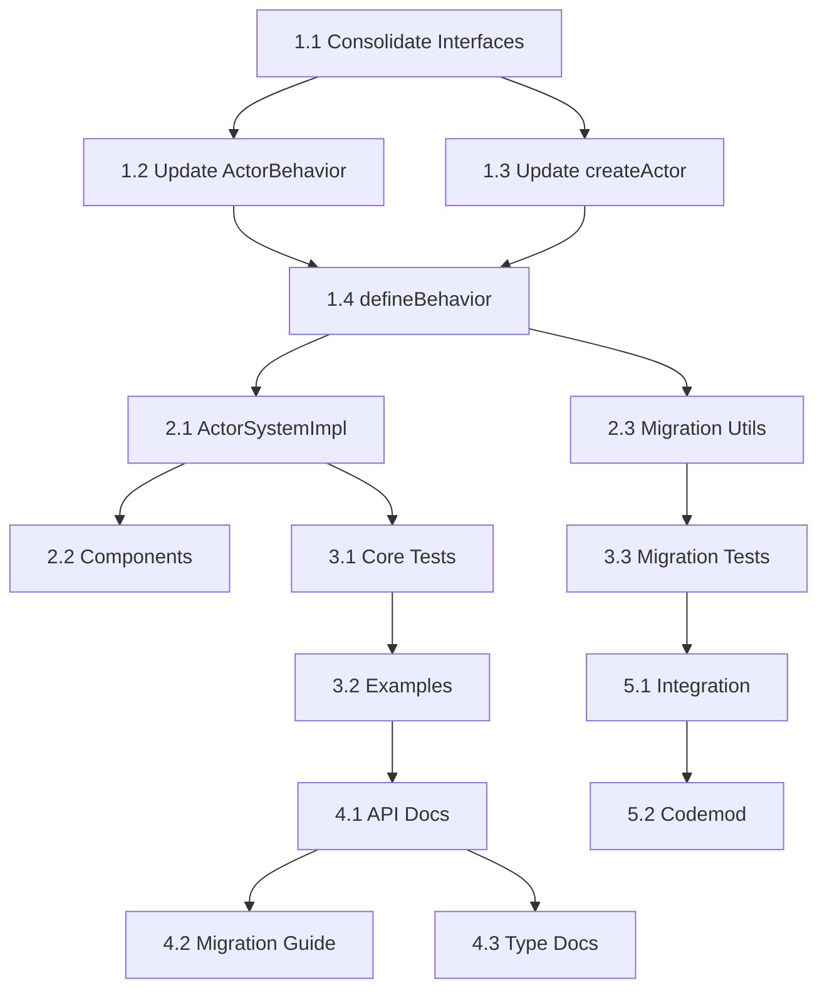

# Task List: Pure Actor Context Fix

## Implementation Phases

### Phase 1: Core Interface Updates (Day 1-2)

#### Task 1.1: Consolidate ActorBehavior and BehaviorActorConfig
**Dependency**: None  
**Estimate**: 3 hours  
**Files**: 
- `packages/actor-core-runtime/src/actor-system.ts`
- `packages/actor-core-runtime/src/create-actor.ts`

- [ ] Move unified ActorBehavior interface to actor-system.ts
- [ ] Add optional `types` field from BehaviorActorConfig
- [ ] Support sync/async return types in handlers
- [ ] Remove BehaviorActorConfig interface entirely
- [ ] Update all imports and references

**Definition of Done**:
- Single ActorBehavior interface exists
- No BehaviorActorConfig references remain
- All imports updated

#### Task 1.2: Update ActorBehavior Interface
**Dependency**: Task 1.1  
**Estimate**: 2 hours  
**Files**: `packages/actor-core-runtime/src/actor-system.ts`

- [ ] Remove `TContext` type parameter from ActorBehavior
- [ ] Remove `context?: TContext` field
- [ ] Update `onMessage` signature to remove context parameter
- [ ] Add `machine` and `dependencies` parameters
- [ ] Update return type to MessagePlan only

**Definition of Done**:
- Interface compiles without errors
- No context field exists
- Handler accepts machine parameter

#### Task 1.3: Update createActor Function
**Dependency**: Task 1.1, 1.2  
**Estimate**: 2 hours  
**Files**: `packages/actor-core-runtime/src/create-actor.ts`

- [ ] Remove createActorFromBehavior conversion function
- [ ] Update type guards for unified interface
- [ ] Remove BehaviorActorConfig type parameter
- [ ] Simplify CreateActorConfig union type
- [ ] Update all internal usage

**Definition of Done**:
- No conversion functions needed
- Type guards work with unified interface
- Simpler implementation

#### Task 1.4: Update defineBehavior Function
**Dependency**: Task 1.2, 1.3  
**Estimate**: 3 hours  
**Files**: `packages/actor-core-runtime/src/define-behavior.ts`

- [ ] Remove context handling from all type definitions
- [ ] Update EnhancedBehaviorResult to remove context options
- [ ] Modify processEnhancedBehaviorResult to handle only MessagePlans
- [ ] Add deprecation warnings for legacy usage
- [ ] Update all handler parameter types

**Definition of Done**:
- Function accepts no context in config
- Handlers receive machine parameter
- Legacy usage shows warnings

### Phase 2: Implementation Updates (Day 2-3)

#### Task 2.1: Update ActorSystemImpl Message Delivery
**Dependency**: Task 1.4  
**Estimate**: 4 hours  
**Files**: `packages/actor-core-runtime/src/actor-system-impl.ts`

- [ ] Remove context passing in deliverMessageLocal
- [ ] Update behavior.onMessage calls to pass machine
- [ ] Remove context storage and updates
- [ ] Fix onStart handler to not use context
- [ ] Remove normalizeBehavior function (no longer needed)

**Definition of Done**:
- No context passed to handlers
- Machine parameter provided correctly
- State updates happen through XState only

#### Task 2.2: Update Component Integration
**Dependency**: Task 2.1  
**Estimate**: 2 hours  
**Files**: 
- `packages/actor-core-runtime/src/component-behavior.ts`
- `packages/actor-core-runtime/src/create-component.ts`

- [ ] Verify ComponentBehaviorConfig doesn't expose context
- [ ] Update createComponent adapter if needed
- [ ] Ensure component actors work without behavior context
- [ ] Update ComponentBehaviorConfig to extend unified ActorBehavior

**Definition of Done**:
- Components work with new behavior signature
- No context leakage between layers
- Integration tests pass

#### Task 2.3: Create Migration Utilities
**Dependency**: Task 1.4  
**Estimate**: 3 hours  
**Files**: `packages/actor-core-runtime/src/migration-utils.ts` (new)

- [ ] Create migrateBehavior helper function
- [ ] Add runtime compatibility checks
- [ ] Implement deprecation warning system
- [ ] Create type helpers for migration
- [ ] Add BehaviorActorConfig to ActorBehavior converter

**Definition of Done**:
- Migration utilities compile and work
- Clear warnings in development
- Type-safe migration path

### Phase 3: Test Updates (Day 3-4)

#### Task 3.1: Update Core Test Files
**Dependency**: Task 2.1  
**Estimate**: 4 hours  
**Files**: All test files in `packages/actor-core-runtime/src/__tests__/`

- [ ] Remove context from test behaviors
- [ ] Update mock behaviors to use machine parameter
- [ ] Fix assertions that expect context
- [ ] Add tests for deprecation warnings
- [ ] Remove BehaviorActorConfig tests

**Definition of Done**:
- All core tests pass
- No context usage in tests
- Deprecation warnings tested

#### Task 3.2: Update Example Files
**Dependency**: Task 3.1  
**Estimate**: 2 hours  
**Files**: All files in `packages/actor-core-runtime/src/examples/`

- [ ] Update all example behaviors
- [ ] Show correct state access patterns
- [ ] Add migration examples
- [ ] Ensure examples are educational
- [ ] Remove BehaviorActorConfig examples

**Definition of Done**:
- Examples use new patterns
- Clear demonstration of state access
- No confusing legacy patterns

#### Task 3.3: Add Migration Tests
**Dependency**: Task 2.3  
**Estimate**: 2 hours  
**Files**: `packages/actor-core-runtime/src/__tests__/migration.test.ts` (new)

- [ ] Test migration utilities
- [ ] Test deprecation warnings
- [ ] Test compatibility layer
- [ ] Test error cases
- [ ] Test BehaviorActorConfig migration

**Definition of Done**:
- Migration path fully tested
- Edge cases covered
- Clear error messages verified

### Phase 4: Documentation Updates (Day 4-5)

#### Task 4.1: Update API Documentation
**Dependency**: Task 3.2  
**Estimate**: 3 hours  
**Files**: 
- `docs/API.md`
- `docs/XSTATE-VS-ONMESSAGE-ARCHITECTURE.md`
- `README.md`

- [ ] Update all code examples
- [ ] Explain state access pattern
- [ ] Remove context references
- [ ] Add migration section
- [ ] Document interface consolidation

**Definition of Done**:
- Documentation matches implementation
- Clear explanation of changes
- Migration guide included

#### Task 4.2: Create Migration Guide
**Dependency**: Task 4.1  
**Estimate**: 2 hours  
**Files**: `docs/MIGRATION-CONTEXT-REMOVAL.md` (new)

- [ ] Explain why change was made
- [ ] Show before/after examples
- [ ] Provide step-by-step migration
- [ ] Include troubleshooting tips
- [ ] Add interface consolidation benefits

**Definition of Done**:
- Comprehensive migration guide
- Real-world examples
- Common pitfalls addressed

#### Task 4.3: Update Type Documentation
**Dependency**: Task 4.1  
**Estimate**: 1 hour  
**Files**: JSDoc comments in source files

- [ ] Update all interface JSDoc
- [ ] Add @deprecated tags where needed
- [ ] Explain new patterns in comments
- [ ] Add migration hints
- [ ] Document unified interface benefits

**Definition of Done**:
- IntelliSense shows correct info
- Deprecation notices visible
- Helpful guidance in editors

### Phase 5: Final Integration (Day 5)

#### Task 5.1: Integration Testing
**Dependency**: All previous tasks  
**Estimate**: 2 hours  

- [ ] Run full test suite
- [ ] Test with real components
- [ ] Verify no performance regression
- [ ] Check bundle size impact
- [ ] Verify interface consolidation works end-to-end

**Definition of Done**:
- All tests pass
- Performance benchmarks pass
- Bundle size acceptable

#### Task 5.2: Create Codemod Tool
**Dependency**: Task 5.1  
**Estimate**: 4 hours  
**Files**: `tools/context-removal-codemod.ts` (new)

- [ ] Parse TypeScript AST
- [ ] Transform old patterns to new
- [ ] Handle edge cases
- [ ] Add dry-run mode
- [ ] Support BehaviorActorConfig to ActorBehavior migration

**Definition of Done**:
- Codemod successfully transforms code
- Preserves functionality
- Safe transformation

## Dependencies Matrix

## Time Estimates

### Daily Breakdown
- **Day 1**: Phase 1 (Tasks 1.1-1.4) - 10 hours
- **Day 2**: Phase 2 (Tasks 2.1-2.3) - 9 hours  
- **Day 3**: Phase 3 (Tasks 3.1-3.2) - 6 hours
- **Day 4**: Phase 3.3 + Phase 4 (Tasks 4.1-4.3) - 8 hours
- **Day 5**: Phase 5 (Tasks 5.1-5.2) - 6 hours

**Total**: 39 hours (5 days with interface consolidation)

## Risk Mitigation

### High Priority Tasks
- Task 1.1 (Interface Consolidation) - Foundation for everything
- Task 1.4 (defineBehavior) - Core functionality
- Task 2.1 (ActorSystemImpl) - Runtime behavior
- Task 2.3 (Migration Utils) - User experience

### Rollback Plan
- Feature flag for new behavior
- Git branch protection
- Comprehensive test coverage before merge

## Definition of Done (Overall)

### Code Quality
- [ ] Zero TypeScript errors
- [ ] Zero linting warnings  
- [ ] All tests pass
- [ ] No performance regression
- [ ] Single unified interface

### Documentation
- [ ] API docs updated
- [ ] Migration guide complete
- [ ] Examples demonstrate new pattern
- [ ] JSDoc comments accurate
- [ ] Interface consolidation documented

### User Experience
- [ ] Clear migration path
- [ ] Helpful error messages
- [ ] Deprecation warnings work
- [ ] Codemod tool available
- [ ] Simpler API with one interface

---

**Task List Approval Required**: This task breakdown must be reviewed for completeness before beginning implementation. 