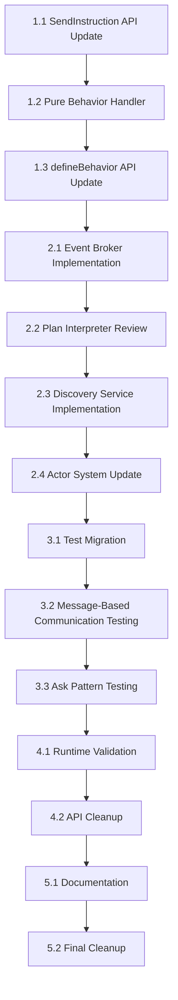

# Task List: Actor System API Migration

## Implementation Phases

### Phase 1: Foundation Infrastructure (Day 1)

#### Task 1.1: Update SendInstruction API for Pure Actor Model ⚠️ HIGH PRIORITY
**Dependency**: None (start task)  
**Estimate**: 3 hours  
**Files**: `/packages/actor-core-runtime/src/message-plan.ts`, `/packages/actor-core-runtime/src/plan-interpreter.ts`

- [ ] Update `SendInstruction` to use `tell` instead of `msg` property
- [ ] Ensure actors use business message types (not 'RESPONSE')
- [ ] Keep 'RESPONSE' handling internal to framework correlation management
- [ ] Update existing `SendInstruction` usage throughout codebase
- [ ] Test that ask patterns work with business message types

**Definition of Done**:
- [ ] SendInstruction uses `tell` property for better developer experience
- [ ] Actors only see business message types, never 'RESPONSE'
- [ ] Framework handles correlation matching internally
- [ ] All existing functionality preserved with cleaner API

#### Task 1.2: Pure Actor Behavior Handler Implementation ⚠️ CRITICAL PATH
**Dependency**: Task 1.1  
**Estimate**: 4 hours  
**Files**: `/packages/actor-core-runtime/src/pure-behavior-handler.ts`

- [ ] Create `PureActorBehaviorHandler` class
- [ ] Implement `handleMessage()` for pure behaviors only
- [ ] Integrate with MessagePlan processor
- [ ] Add error handling for malformed MessagePlans
- [ ] Write unit tests for all handler scenarios

**Definition of Done**:
- [ ] Handler processes pure behaviors with machine + dependencies
- [ ] MessagePlan responses processed correctly
- [ ] Business message correlation works for ask pattern
- [ ] Error handling provides clear diagnostic messages

#### Task 1.3: Update defineBehavior API ⚠️ HIGH PRIORITY
**Dependency**: Task 1.2  
**Estimate**: 3 hours  
**Files**: `/packages/actor-core-runtime/src/create-actor.ts`

- [ ] Remove context parameter from `defineBehavior` signature
- [ ] Enforce machine + dependencies only API
- [ ] Update `ActorBehavior` interface to pure actor model
- [ ] Add TypeScript constraints to prevent context usage
- [ ] Update all existing `defineBehavior` calls in tests

**Definition of Done**:
- [ ] `defineBehavior` only accepts pure actor handlers
- [ ] TypeScript prevents context-based patterns
- [ ] All test files updated to use new API
- [ ] Compilation errors guide developers to correct patterns

### Phase 2: Actor System Integration (Day 2)

#### Task 2.1: Event Broker Actor Implementation ⚠️ NEW HIGH PRIORITY
**Dependency**: Task 1.3
**Estimate**: 4 hours
**Files**: `/packages/actor-core-runtime/src/actors/event-broker-actor.ts`

- [ ] Create EventBrokerActor class with message-based pub/sub
- [ ] Implement PUBLISH, SUBSCRIBE, UNSUBSCRIBE message handlers
- [ ] Add wildcard topic matching support (e.g., 'user.*', 'orders.created.*')
- [ ] Implement fan-out logic with proper error handling
- [ ] Add supervision integration for broker restart strategies

**Definition of Done**:
- [ ] Event broker handles topic-based pub/sub through messages only
- [ ] Wildcard patterns work for flexible subscription matching
- [ ] Fan-out delivers events to all matching subscribers
- [ ] Broker integrates with supervision hierarchy for failure recovery
- [ ] No direct method calls - all interactions through messages

#### Task 2.2: Plan Interpreter Integration Review ⚠️ CRITICAL PATH
**Dependency**: Task 2.1  
**Estimate**: 3 hours  
**Files**: `/packages/actor-core-runtime/src/plan-interpreter.ts`

- [ ] Review existing plan interpreter implementation
- [ ] Ensure `AskInstruction` callbacks process correctly
- [ ] Verify `SendInstruction` routing works for ask responses with business messages
- [ ] Test ask pattern end-to-end with existing implementation
- [ ] Confirm business message correlation works without exposing 'RESPONSE' to actors

**Definition of Done**:
- [ ] Existing plan interpreter works with pure actor behaviors
- [ ] Ask pattern uses callback-based responses correctly
- [ ] SendInstruction can route business message responses back to asking actors
- [ ] No regression in existing MessagePlan processing

#### Task 2.3: Actor Discovery Service Implementation ⚠️ NEW HIGH PRIORITY
**Dependency**: Task 2.2  
**Estimate**: 3 hours  
**Files**: `/packages/actor-core-runtime/src/actors/actor-discovery-service.ts`

- [ ] Create ActorDiscoveryService class with message-based lookup
- [ ] Implement REGISTER, UNREGISTER, LOOKUP, LIST message handlers
- [ ] Support both well-known names and ephemeral PID patterns
- [ ] Add pattern-based listing (e.g., 'services.*')
- [ ] Integration with actor system for automatic cleanup on actor termination

**Definition of Done**:
- [ ] Discovery service handles registration/lookup through messages only
- [ ] Both ephemeral and well-known name patterns supported
- [ ] Pattern-based queries work for service discovery
- [ ] Automatic cleanup when actors terminate
- [ ] No direct method calls - all interactions through messages

#### Task 2.4: Actor System Implementation Update ⚠️ CRITICAL PATH
**Dependency**: Task 2.3  
**Estimate**: 6 hours  
**Files**: `/packages/actor-core-runtime/src/actor-system-impl.ts`

- [ ] Update `spawnActor()` to use `PureActorBehaviorHandler`
- [ ] Modify `deliverMessageLocal()` to support pure behaviors only
- [ ] Remove all context-based behavior handling
- [ ] Update `createDependencies()` to include machine reference
- [ ] Add proper error handling and logging
- [ ] Integrate EventBrokerActor and ActorDiscoveryService as system actors
- [ ] Add well-known actor registration system for core services

**Definition of Done**:
- [ ] Actor system supports only pure behaviors
- [ ] `deliverMessageLocal` calls pure behavior handler correctly
- [ ] Dependencies include machine reference for behaviors
- [ ] All context-based patterns removed
- [ ] Error handling provides clear diagnostic messages
- [ ] Event broker and discovery services automatically available as 'system.event-broker' and 'system.discovery'
- [ ] Core system actors properly supervised and restarted on failure

### Phase 3: Testing & Validation (Day 3)

#### Task 3.1: Test Migration to Pure Actor Model ⚠️ HIGH PRIORITY
**Dependency**: Task 2.2  
**Estimate**: 6 hours  
**Files**: All test files using `defineBehavior`

- [ ] Update all `defineBehavior` calls in test files to pure actor API
- [ ] Remove all context-based patterns from tests
- [ ] Replace context access with `machine.getSnapshot().context`
- [ ] Update ask pattern responses to use business message types with correlationId
- [ ] Ensure all MessagePlan responses are correctly structured

**Definition of Done**:
- [ ] All test files use pure actor model API
- [ ] Zero TypeScript compilation errors
- [ ] All tests can be executed (may still have runtime failures)
- [ ] Context-based patterns completely eliminated

#### Task 3.2: Message-Based Communication Testing ⚠️ NEW HIGH PRIORITY
**Dependency**: Task 3.1  
**Estimate**: 4 hours  
**Files**: Test files for event broker and discovery service

- [ ] Test event broker pub/sub functionality with multiple subscribers
- [ ] Test wildcard topic matching and subscription patterns
- [ ] Test discovery service registration and lookup for well-known names
- [ ] Test ephemeral PID registration and cleanup patterns
- [ ] Test location transparency - same APIs work for message-based patterns
- [ ] Replace any remaining direct method calls with message-based patterns

**Definition of Done**:
- [ ] Event broker correctly handles pub/sub with wildcard patterns
- [ ] Discovery service resolves both well-known and ephemeral names
- [ ] All subscription patterns use messages instead of direct calls
- [ ] Location transparency verified for all communication patterns
- [ ] No direct method calls remain for distributed operations

#### Task 3.3: Ask Pattern End-to-End Testing ⚠️ CRITICAL VALIDATION
**Dependency**: Task 3.2  
**Estimate**: 4 hours  
**Files**: Test validation and debugging

- [ ] Test `defineBehavior` + `system.spawn` + `actor.ask()` flow
- [ ] Verify correlation ID handling works correctly with business messages
- [ ] Debug any remaining timeout issues
- [ ] Test business message correlation to correlation manager
- [ ] Validate all ask pattern scenarios work with domain message types

**Definition of Done**:
- [ ] Ask pattern works reliably with pure behaviors
- [ ] No timeouts in ask pattern tests
- [ ] Correlation IDs handled correctly end-to-end using business messages
- [ ] Business message correlation processed correctly

### Phase 4: Final Validation & Cleanup (Day 4)

#### Task 4.1: Runtime Test Suite Validation ⚠️ CRITICAL VALIDATION
**Dependency**: Task 3.2  
**Estimate**: 6 hours  
**Files**: All existing runtime tests

- [ ] Run full runtime test suite (`pnpm test:runtime`)
- [ ] Fix any remaining test failures after pure actor migration
- [ ] Debug and resolve any timeout or correlation issues
- [ ] Verify all MessagePlan responses work correctly
- [ ] Ensure no performance regression in test execution

**Definition of Done**:
- [ ] All runtime tests pass consistently
- [ ] No timeouts or ask pattern failures
- [ ] Zero flaky or timing-dependent test failures
- [ ] Test execution time within 10% of baseline

#### Task 4.2: Type Safety and API Cleanup ⚠️ HIGH PRIORITY
**Dependency**: Task 4.1  
**Estimate**: 4 hours  
**Files**: Type definitions and API cleanup

- [ ] Remove all legacy behavior type definitions
- [ ] Clean up unused imports and exports
- [ ] Ensure zero TypeScript errors across all packages
- [ ] Run linter and fix all warnings
- [ ] Verify no `any` types introduced

**Definition of Done**:
- [ ] Clean, pure actor model API with no legacy remnants
- [ ] Zero TypeScript errors across entire codebase
- [ ] Zero linting warnings
- [ ] No `any` types in implementation

### Phase 5: Documentation & Cleanup (Day 5)

#### Task 5.1: API Documentation Update
**Dependency**: Task 4.2  
**Estimate**: 3 hours  
**Files**: Documentation files, README updates

- [ ] Update API documentation for `defineBehavior`
- [ ] Document pure actor model patterns using business messages only
- [ ] Add examples showing business message correlation for ask patterns
- [ ] Update TypeScript interface documentation
- [ ] Create migration guide emphasizing business message types

**Definition of Done**:
- [ ] Documentation accurately reflects pure actor model API
- [ ] Clear examples showing business message correlation
- [ ] Migration guide helps developers transition from context patterns
- [ ] All public APIs documented with business message emphasis

#### Task 5.2: Type Safety and Linting Cleanup
**Dependency**: Task 5.1  
**Estimate**: 2 hours  
**Files**: Various source files

- [ ] Run TypeScript compiler across all packages
- [ ] Fix any remaining type errors
- [ ] Run linter and fix all warnings
- [ ] Ensure no `any` types introduced
- [ ] Verify all imports/exports correct

**Definition of Done**:
- [ ] Zero TypeScript errors across entire codebase
- [ ] Zero linting warnings
- [ ] No `any` types used in implementation
- [ ] Clean import/export structure

## Dependencies Matrix

## Time Estimates

### Day 1: Foundation (10 hours)
- Task 1.1: Update SendInstruction API for Pure Actor Model (3 hours)
- Task 1.2: Pure Behavior Handler Implementation (4 hours)
- Task 1.3: defineBehavior API Update (3 hours)

### Day 2: Actor System Integration (13 hours)
- Task 2.1: Event Broker Actor Implementation (4 hours)
- Task 2.2: Plan Interpreter Integration Review (3 hours)
- Task 2.3: Actor Discovery Service Implementation (3 hours)
- Task 2.4: Actor System Implementation Update (6 hours)

### Day 3: Testing & Validation (14 hours)
- Task 3.1: Test Migration to Pure Actor Model (6 hours)
- Task 3.2: Message-Based Communication Testing (4 hours)
- Task 3.3: Ask Pattern End-to-End Testing (4 hours)

### Day 4: Final Validation (10 hours)
- Task 4.1: Runtime Test Suite Validation (6 hours)
- Task 4.2: Type Safety and API Cleanup (4 hours)

### Day 5: Documentation & Cleanup (5 hours)
- Task 5.1: API Documentation Update (3 hours)
- Task 5.2: Final Cleanup (2 hours)

**Total**: 5.5 days (52 hours - includes message-based communication and event broker implementation)

## Risk Mitigation

### High-Risk Tasks
- **Task 2.2 (Actor System Update)**: Core framework changes affecting message processing
  - **Mitigation**: Incremental rollout, extensive regression testing
  - **Fallback**: Maintain current implementation as backup

- **Task 3.2 (Ask Pattern Testing)**: Critical validation of business message correlation
  - **Mitigation**: Use wallaby for runtime debugging, comprehensive correlation scenarios
  - **Success Criteria**: Zero timeouts, 100% business message correlation success rate

### Medium-Risk Tasks  
- **Task 2.1 (Plan Interpreter Review)**: Must integrate with existing correlation systems
  - **Mitigation**: Test with current correlation manager using business messages
  - **Validation**: Side-by-side comparison with working ask patterns

- **Task 4.1 (Runtime Test Suite)**: Comprehensive validation of pure actor model
  - **Mitigation**: Systematic testing of each MessagePlan type and correlation scenario
  - **Success Criteria**: All tests pass with business message correlation

## Critical Path Analysis

**Critical Path**: Tasks 1.2 → 1.3 → 2.1 → 2.2 → 3.2 → 4.1
- This path represents the core functionality implementation
- Any delays in critical path affect overall timeline
- Focus resources on critical path tasks first

**Parallel Work Opportunities**:
- Task 1.1 can be done in parallel with 1.2
- Documentation (5.1) can be started during testing phases
- Type cleanup (4.2) can parallel runtime validation (4.1)

## Definition of Done (Overall)

### Functional Requirements
- [ ] Ask pattern works reliably with `defineBehavior` + `system.spawn` using business message correlation
- [ ] Pure actor model fully implemented (machine + dependencies only)
- [ ] All MessagePlan types process correctly with business message correlation
- [ ] No test timeouts or API mismatch errors
- [ ] Context-based patterns completely eliminated
- [ ] Event broker actor provides topic-based pub/sub with wildcard support
- [ ] Actor discovery service supports both well-known names and ephemeral PIDs
- [ ] All actor communication uses messages instead of direct method calls
- [ ] Location transparency maintained across all communication patterns

### Quality Requirements
- [ ] Zero TypeScript errors across all packages
- [ ] Zero linting warnings
- [ ] 100% test coverage maintained for updated functionality
- [ ] All tests pass consistently without timeouts
- [ ] Performance within 5% of baseline

### Migration Requirements
- [ ] All existing behaviors converted to pure actor model
- [ ] API documentation reflects business message patterns only
- [ ] Clear migration examples showing business message correlation
- [ ] Framework standards (@FRAMEWORK-STANDARD) strictly enforced
- [ ] No 'RESPONSE' types exposed to actor behaviors
- [ ] All subscription patterns converted from direct method calls to message-based
- [ ] Event broker and discovery services integrated with supervision hierarchy
- [ ] Location transparency examples demonstrate distributed readiness

---

**Task List Approval Required**: This task breakdown must be reviewed for completeness and realistic time estimates before beginning implementation. 