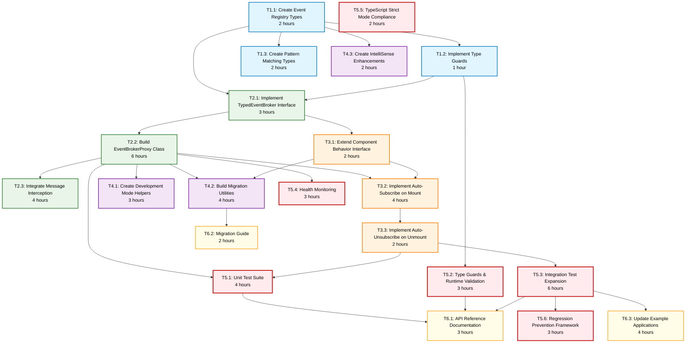

# Task List: Event Broker DX Improvement

## Implementation Phases

### Phase 1: Type System Foundation
**Timeline**: Days 1-3

- [ ] **T1.1: Create Event Registry Types**
  - **Dependency**: None (start task)
  - **Time**: 2 hours
  - **Acceptance**: 
    - EventRegistry interface with all system events defined
    - Type extraction utilities (EventType, EventPayload)
    - Template literal types for topic patterns
    - Zero `any` types

- [ ] **T1.2: Implement Type Guards**
  - **Dependency**: T1.1
  - **Time**: 1 hour
  - **Acceptance**:
    - isValidEvent() type guard with runtime validation
    - Type guards for all event payloads
    - Comprehensive error messages for validation failures
    - Unit tests for all type guards

- [ ] **T1.3: Create Pattern Matching Types**
  - **Dependency**: T1.1  
  - **Time**: 2 hours
  - **Acceptance**:
    - TopicPattern conditional type for wildcard matching
    - Type-safe pattern validation at compile time
    - Support for "domain.*" style patterns
    - Documentation with examples

### Phase 2: Core API Implementation
**Timeline**: Days 4-7

- [ ] **T2.1: Implement TypedEventBroker Interface**
  - **Dependency**: T1.1, T1.2
  - **Time**: 3 hours
  - **Acceptance**:
    - Full interface definition with generics
    - subscribe(), publish(), subscribePattern() methods
    - Proper return types (Promise<Unsubscribe>)
    - JSDoc documentation for all methods

- [ ] **T2.2: Build EventBrokerProxy Class**
  - **Dependency**: T2.1
  - **Time**: 6 hours
  - **Acceptance**:
    - Complete proxy implementation
    - Local handler registry management
    - Message translation (API calls → SUBSCRIBE/PUBLISH)
    - TOPIC_EVENT interception and routing
    - Memory-safe handler storage
    - Error boundary for handler exceptions

- [ ] **T2.3: Integrate Message Interception**
  - **Dependency**: T2.2
  - **Time**: 4 hours  
  - **Acceptance**:
    - Hook into component onMessage handler
    - Route TOPIC_EVENT to proxy handlers
    - Pass through non-event messages unchanged
    - Maintain message ordering guarantees
    - Zero interference with user handlers

### Phase 3: Declarative API & Framework Integration
**Timeline**: Days 8-10

- [ ] **T3.1: Extend Component Behavior Interface**
  - **Dependency**: T2.1
  - **Time**: 2 hours
  - **Acceptance**:
    - Add optional `subscriptions` field to ComponentBehavior
    - Type-safe subscription declarations
    - Support for both sync and async handlers
    - Backward compatible with existing behaviors

- [ ] **T3.2: Implement Auto-Subscribe on Mount**
  - **Dependency**: T3.1, T2.2
  - **Time**: 4 hours
  - **Acceptance**:
    - Detect declarative subscriptions in component mount
    - Create EventBrokerProxy if eventBroker dependency exists
    - Auto-subscribe all declared events
    - Store proxy reference for cleanup
    - Handle mount errors gracefully
    - Leverage XState v5 entry/exit actions for subscription setup
    - Support XState v5 invoke pattern for subscription lifecycle (replaces activities)

- [ ] **T3.3: Implement Auto-Unsubscribe on Unmount**
  - **Dependency**: T3.2
  - **Time**: 2 hours
  - **Acceptance**:
    - Track all active subscriptions per component
    - Automatic cleanup on component unmount
    - Handle partial failures during cleanup
    - No memory leaks from orphaned handlers

### Phase 4: Developer Experience Enhancements
**Timeline**: Days 11-12

- [ ] **T4.1: Create Development Mode Helpers**
  - **Dependency**: T2.2
  - **Time**: 3 hours
  - **Acceptance**:
    - Debug logging for subscription/publish flow
    - Event flow visualization in console
    - Subscription leak detection
    - Performance timing for event delivery

- [ ] **T4.2: Build Migration Utilities**
  - **Dependency**: T2.2, T3.1
  - **Time**: 4 hours
  - **Acceptance**:
    - Codemod to convert old patterns to new API
    - Side-by-side comparison examples
    - Deprecation warnings for old patterns
    - Migration validation tool

- [ ] **T4.3: Create IntelliSense Enhancements**
  - **Dependency**: T1.1
  - **Time**: 2 hours
  - **Acceptance**:
    - TypeScript declaration files
    - JSDoc examples on all public APIs
    - Quick-fix suggestions for common mistakes
    - Auto-complete for event topics

### Phase 5: Testing & Safeguards (MANDATORY)
**Timeline**: Days 13-15

- [ ] **T5.1: Unit Test Suite**
  - **Priority**: High
  - **Dependency**: T2.2, T3.3
  - **Time**: 4 hours (15% of implementation)
  - **Acceptance**:
    - [ ] Unit tests for EventBrokerProxy class
    - [ ] Type guard validation tests
    - [ ] Message translation verification
    - [ ] Handler registry management tests
    - [ ] Memory leak prevention tests
    - [ ] Minimum 95% code coverage

- [ ] **T5.2: Type Guards & Runtime Validation**
  - **Priority**: High
  - **Dependency**: T1.2
  - **Time**: 3 hours (10% of implementation)
  - **Acceptance**:
    - [ ] Type guards for all event payloads
    - [ ] Runtime validation of external events
    - [ ] Comprehensive error messages
    - [ ] No silent failures
    - [ ] Zero `any` types in guards

- [ ] **T5.3: Integration Test Expansion**
  - **Priority**: High
  - **Dependency**: T3.3
  - **Time**: 6 hours (20% of implementation)
  - **Acceptance**:
    - [ ] Full subscribe → publish → receive flow tests
    - [ ] Multi-component coordination tests
    - [ ] Cross-browser event delivery tests
    - [ ] Performance benchmarks (50%+ code reduction)
    - [ ] Backward compatibility tests

- [ ] **T5.4: Health Monitoring**
  - **Priority**: Medium
  - **Dependency**: T2.2
  - **Time**: 3 hours (10% of implementation)
  - **Acceptance**:
    - [ ] Subscription count monitoring
    - [ ] Event delivery latency tracking
    - [ ] Memory usage monitoring
    - [ ] Orphaned handler detection
    - [ ] Debug dashboard for development

- [ ] **T5.5: TypeScript Strict Mode Compliance**
  - **Priority**: Medium
  - **Dependency**: All implementation tasks
  - **Time**: 2 hours (5% of implementation)
  - **Acceptance**:
    - [ ] Enable all strict flags in tsconfig
    - [ ] Zero implicit `any` types
    - [ ] Strict null checks passing
    - [ ] No type assertions without guards
    - [ ] Clean `pnpm typecheck` output

- [ ] **T5.6: Regression Prevention Framework**
  - **Priority**: Medium
  - **Dependency**: T5.3
  - **Time**: 3 hours (10% of implementation)
  - **Acceptance**:
    - [ ] Pre-commit hooks for type checking
    - [ ] CI/CD integration test suite
    - [ ] Performance regression alerts
    - [ ] Breaking change detection
    - [ ] Automated migration testing

### Phase 6: Documentation & Examples
**Timeline**: Days 16-17

- [ ] **T6.1: API Reference Documentation**
  - **Dependency**: All implementation tasks
  - **Time**: 3 hours
  - **Acceptance**:
    - Complete API reference with all methods
    - Code examples for every API
    - Common patterns and recipes
    - Troubleshooting guide

- [ ] **T6.2: Migration Guide**
  - **Dependency**: T4.2
  - **Time**: 2 hours
  - **Acceptance**:
    - Step-by-step migration instructions
    - Before/after code comparisons
    - Common pitfalls and solutions
    - Rollback procedures

- [ ] **T6.3: Update Example Applications**
  - **Dependency**: All implementation tasks
  - **Time**: 4 hours
  - **Acceptance**:
    - Counter example using new API
    - Coffee shop example with declarative subscriptions
    - Performance comparison demo
    - Cross-tab communication example

## Dependencies

### External Dependencies
- Existing Event Broker Actor implementation
- Current ActorSystem and component framework
- XState v5 for state management

### Task Dependencies Diagram

## Time Estimates

### Phase Breakdown
- Phase 1 (Type System): 5 hours
- Phase 2 (Core API): 13 hours  
- Phase 3 (Framework Integration): 8 hours
- Phase 4 (DX Enhancements): 9 hours
- **Phase 5 (Testing): 23 hours (40% of total)**
- Phase 6 (Documentation): 9 hours

**Total Estimate**: 67 hours (~8-9 days at full capacity)

### Buffer Considerations
- Add 20% buffer for unforeseen complexity: +13 hours
- Add 10% for code review iterations: +7 hours
- **Total with Buffer**: 87 hours (~11 days)

## Definition of Done

### Feature Complete
- [ ] All tasks marked complete with acceptance criteria met
- [ ] Zero TypeScript errors with strict mode enabled
- [ ] All tests passing (unit, integration, type-level)
- [ ] Performance benchmarks show 50%+ code reduction
- [ ] Documentation complete and reviewed

### Quality Gates (ALL REQUIRED)
- [ ] **Zero TypeScript compilation errors with strict mode**
- [ ] **95%+ test coverage for new code**
- [ ] **All integration tests passing**
- [ ] **Health monitoring operational**
- [ ] **Pre-commit hooks prevent regressions**
- [ ] **No `any` types or type casting in production code**
- [ ] **Memory leak tests passing**
- [ ] **Backward compatibility verified**

### Ready for Release
- [ ] Migration guide tested by external developer
- [ ] All examples updated and working
- [ ] Performance benchmarks documented
- [ ] Breaking changes documented (should be none)
- [ ] Rollback plan documented
- [ ] Announcement blog post drafted

## Risk Mitigation

### Technical Risks
1. **Message interception breaks existing code**
   - Mitigation: Extensive backward compatibility testing
   - Fallback: Feature flag to disable new behavior

2. **Type definitions become too complex**
   - Mitigation: Progressive disclosure, good docs
   - Fallback: Simplified types for common cases

3. **Performance regression from proxy layer**
   - Mitigation: Benchmark early and often
   - Fallback: Direct pass-through for high-frequency events

### Schedule Risks
1. **Testing reveals design flaws**
   - Mitigation: Prototype risky parts first
   - Buffer: 20% time buffer included

2. **Migration tooling takes longer than expected**
   - Mitigation: Start with manual migration guide
   - Fallback: Community-contributed codemods later 