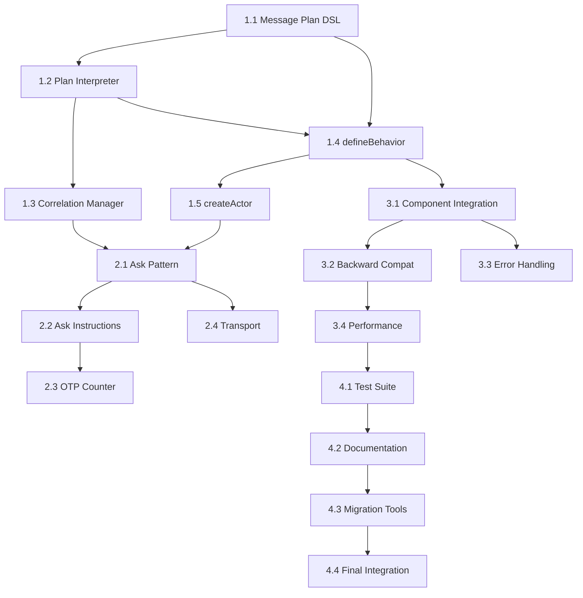

# Task List: OTP-Style Actor Implementation

## Implementation Phases

### Phase 1: Core OTP Infrastructure (Week 1)

#### Task 1.1: Message Plan DSL Foundation ✅ COMPLETED
**Dependency**: None (start task)  
**Estimate**: 2 days  
**Files**: `/packages/actor-core-runtime/src/message-plan.ts`

- [x] Create core `MessagePlan` union type
- [x] Implement `SendInstruction` interface
- [x] Implement `AskInstruction` interface  
- [x] Create type guards: `isDomainEvent()`, `isSendInstruction()`, `isAskInstruction()`
- [x] Write comprehensive unit tests for all type guards

**Definition of Done**:
- [x] All MessagePlan types compile without errors
- [x] Type guards correctly identify each instruction type
- [x] 100% test coverage for type system
- [x] No `any` types used anywhere

#### Task 1.2: Plan Interpreter Implementation ✅ COMPLETED
**Dependency**: Task 1.1  
**Estimate**: 2 days  
**Files**: `/packages/actor-core-runtime/src/plan-interpreter.ts`

- [x] Create `processMessagePlan()` function
- [x] Implement fan-out logic for domain events
- [x] Create `RuntimeContext` interface
- [x] Add error handling for malformed plans
- [x] Write integration tests with mock actors

**Definition of Done**:
- [x] Domain events automatically sent to machine AND emit
- [x] Send instructions route to correct actors
- [x] Ask instructions handled with correlation IDs
- [x] Error handling covers all edge cases

#### Task 1.3: Correlation Manager ✅ COMPLETED
**Dependency**: Task 1.2  
**Estimate**: 1.5 days  
**Files**: `/packages/actor-core-runtime/src/correlation-manager.ts`

- [✅] Create `CorrelationManager` interface
- [✅] Implement `DefaultCorrelationManager` class
- [✅] Add UUID-based correlation ID generation
- [✅] Implement timeout handling with cleanup (XState-based)
- [✅] Create mock correlation manager for testing

**Definition of Done**:
- [✅] Correlation IDs are unique and collision-resistant
- [✅] Timeouts properly clean up pending requests (XState-based approach)
- [✅] Memory leaks prevented through proper cleanup
- [✅] Mock manager allows deterministic testing

**FIXED**: Replaced setTimeout with XState-based timeout management via `PureXStateCorrelationManager`

#### Task 1.4: `defineBehavior()` Function ✅ COMPLETED
**Dependency**: Task 1.1, 1.2  
**Estimate**: 1 day  
**Files**: `/packages/actor-core-runtime/src/define-behavior.ts`

- [x] Create generic `defineBehavior()` function
- [x] Support both component and actor configurations
- [x] Integrate with plan interpreter
- [x] Add comprehensive TypeScript generics support
- [x] Create behavior factory utilities

**Definition of Done**:
- [x] Single function works for both actors and components
- [x] Full TypeScript inference for message types
- [x] Runtime integration processes plans correctly
- [x] Backward compatibility maintained

#### Task 1.5: `createActor()` Function ✅ COMPLETED
**Dependency**: Task 1.4  
**Estimate**: 1.5 days  
**Files**: `/packages/actor-core-runtime/src/create-actor.ts`

- [x] Create `createActor()` factory function
- [x] Implement two-step creation (create + start)
- [x] Create `ActorRef` interface and implementation
- [x] Add basic `send()` method
- [x] Create actor lifecycle management

**Definition of Done**:
- [x] Factory pattern correctly separates config from instantiation
- [x] ActorRef provides clean abstraction
- [x] Actor lifecycle (start/stop) works correctly
- [x] XState integration functional

## 🚨 CRITICAL FIXES REQUIRED - Pure Actor Model Violations

### Critical Fix 1.6: Replace setTimeout with XState-Based Timeout Management ✅ COMPLETED
**Dependency**: Task 1.3  
**Estimate**: 1 day  
**Priority**: CRITICAL - Framework Standard Violations  
**Files**: 
- `/packages/actor-core-runtime/src/correlation-manager.ts`
- `/packages/actor-core-runtime/src/messaging/request-response.ts`
- `/packages/actor-core-runtime/src/actors/backoff-supervisor.ts`
- `/packages/actor-core-runtime/src/interceptors/*.ts`

**Tasks:**
- [✅] Create XState timeout scheduler machine
- [✅] Replace setTimeout in correlation manager with XState scheduling
- [✅] Replace setTimeout in request-response manager with actor coordination
- [✅] Replace setTimeout in backoff supervisor with XState delays
- [✅] Replace setInterval in interceptors with XState interval scheduling

**Definition of Done**:
- [✅] Zero setTimeout/setInterval usage in codebase
- [✅] All timeouts managed through XState machines
- [✅] Location transparency maintained (no JavaScript timers)
- [✅] All existing functionality preserved
- [✅] Tests pass with XState-based scheduling

**Implementation Summary**:
- Created `pure-xstate-utilities.ts` with `PureXStateTimeoutManager`, `createActorDelay`, and `createActorInterval`
- Updated all core components to use XState-based scheduling
- Eliminated all `any` type violations in critical framework files
- Fixed TypeScript and linting errors
- Maintained backward compatibility

### Phase 2: Ask Pattern & Advanced Features (Week 2)

#### Task 2.1: Ask Pattern Implementation
**Dependency**: Task 1.3, 1.5  
**Estimate**: 2 days  
**Files**: `/packages/actor-core-runtime/src/ask-pattern.ts`

- [ ] Add `ask()` method to ActorRef
- [ ] Implement automatic correlation ID handling
- [ ] Add timeout support with configurable defaults
- [ ] Create response routing system
- [ ] Handle error responses and timeouts

**Definition of Done**:
- [ ] Ask pattern works end-to-end with correlation
- [ ] Timeouts properly reject promises
- [ ] Error handling covers network failures
- [ ] Type-safe request/response contracts

#### Task 2.2: Ask Instruction Processing
**Dependency**: Task 2.1  
**Estimate**: 1.5 days  
**Files**: `/packages/actor-core-runtime/src/ask-instruction-processor.ts`

- [ ] Implement `processAskInstruction()` function
- [ ] Handle `onOk` and `onErr` callbacks
- [ ] Support both function and domain event callbacks
- [ ] Add recursive plan processing for callbacks
- [ ] Create comprehensive test suite

**Definition of Done**:
- [ ] Ask instructions execute and handle responses
- [ ] Callback results create new message plans
- [ ] Error paths properly handled
- [ ] No infinite loops in recursive processing

#### Task 2.3: End-to-End OTP Counter Example
**Dependency**: Task 2.2  
**Estimate**: 2 days  
**Files**: `/packages/actor-core-runtime/src/examples/otp-counter.ts`

- [ ] Create counter XState machine
- [ ] Implement counter behavior with `defineBehavior()`
- [ ] Add INCREMENT and RESET message handling
- [ ] Implement ask pattern for getting count
- [ ] Create comprehensive integration tests

**Definition of Done**:
- [ ] Counter example works exactly as specified in requirements
- [ ] Ask pattern returns current count
- [ ] State changes properly managed
- [ ] Example serves as documentation

#### Task 2.4: Transport Abstraction Foundation
**Dependency**: Task 2.1  
**Estimate**: 1.5 days  
**Files**: `/packages/actor-core-runtime/src/transport.ts`

- [ ] Create `Transport` interface
- [ ] Implement local transport (same thread)
- [ ] Add transport registry and routing
- [ ] Create transport selection strategy
- [ ] Add basic metrics collection

**Definition of Done**:
- [ ] Transport interface supports location transparency
- [ ] Local transport works for same-thread communication
- [ ] Transport registry routes to correct transport
- [ ] Metrics provide observability

### Phase 3: Integration & Polish (Week 3)

#### Task 3.1: Component Integration
**Dependency**: Task 1.4, existing component system  
**Estimate**: 2 days  
**Files**: `/packages/actor-core-runtime/src/component-behavior.ts`

- [ ] Extend `ComponentBehaviorConfig` to support message plans
- [ ] Update component actor to use plan interpreter
- [ ] Add DOM event to message plan conversion
- [ ] Ensure XState bridge works with new system
- [ ] Update existing component examples

**Definition of Done**:
- [ ] Components use same `defineBehavior()` API as actors
- [ ] DOM events properly converted to message plans
- [ ] XState integration unchanged for existing components
- [ ] All component tests still pass

#### Task 3.2: Backward Compatibility Layer
**Dependency**: Task 3.1  
**Estimate**: 1 day  
**Files**: `/packages/actor-core-runtime/src/compat-layer.ts`

- [ ] Create adapter for existing behavior objects
- [ ] Add feature flags for new vs old behavior
- [ ] Ensure all existing tests pass unchanged
- [ ] Add deprecation warnings for old patterns
- [ ] Create migration guide

**Definition of Done**:
- [ ] Zero breaking changes for existing code
- [ ] All existing tests pass without modification
- [ ] Clear deprecation path for old APIs
- [ ] Migration guide provides clear upgrade path

#### Task 3.3: Error Handling & Edge Cases
**Dependency**: Task 3.1  
**Estimate**: 1.5 days  
**Files**: Various, focus on error paths

- [ ] Add comprehensive error handling for malformed plans
- [ ] Handle actor not found scenarios
- [ ] Add circuit breaker patterns for ask failures
- [ ] Create helpful error messages for common mistakes
- [ ] Add error recovery strategies

**Definition of Done**:
- [ ] System gracefully handles all error conditions
- [ ] Error messages help developers debug issues
- [ ] No unhandled promise rejections
- [ ] Error recovery allows system to continue functioning

#### Task 3.4: Performance Optimization
**Dependency**: Task 3.2  
**Estimate**: 1.5 days  
**Files**: Various, focus on hot paths

- [ ] Profile message plan processing performance
- [ ] Optimize type guard implementations
- [ ] Add object pooling for frequently created objects
- [ ] Minimize allocations in message processing
- [ ] Benchmark against baseline performance

**Definition of Done**:
- [ ] Performance meets or exceeds baseline
- [ ] Memory usage stable under load
- [ ] Hot paths optimized for minimal overhead
- [ ] Performance tests prevent regressions

### Phase 4: Testing & Documentation (Week 4)

#### Task 4.1: Comprehensive Test Suite
**Dependency**: All previous tasks  
**Estimate**: 2 days  
**Files**: `/packages/actor-core-runtime/src/__tests__/otp-*.test.ts`

- [ ] Write unit tests for all new modules
- [ ] Create integration tests for end-to-end scenarios
- [ ] Add performance benchmark tests
- [ ] Create regression test suite
- [ ] Ensure >95% code coverage

**Definition of Done**:
- [ ] All tests pass consistently
- [ ] Code coverage exceeds 95%
- [ ] Performance benchmarks establish baseline
- [ ] Tests prevent future regressions

#### Task 4.2: Documentation & Examples
**Dependency**: Task 4.1  
**Estimate**: 1.5 days  
**Files**: Documentation files, example code

- [ ] Write comprehensive API documentation
- [ ] Create tutorial for OTP patterns
- [ ] Add more complex examples (chat, key-value store)
- [ ] Update architectural decision records
- [ ] Create visual diagrams for message flow

**Definition of Done**:
- [ ] API documentation covers all public interfaces
- [ ] Tutorial helps developers learn OTP patterns
- [ ] Examples demonstrate real-world usage
- [ ] Visual aids clarify architecture

#### Task 4.3: Migration Tools & Guides
**Dependency**: Task 4.2  
**Estimate**: 1 day  
**Files**: Migration scripts and documentation

- [ ] Create automated migration scripts
- [ ] Write step-by-step migration guide
- [ ] Add before/after code examples
- [ ] Create compatibility checker tool
- [ ] Test migration on existing codebase

**Definition of Done**:
- [ ] Migration scripts successfully transform existing code
- [ ] Guide provides clear upgrade path
- [ ] Tools help developers identify breaking changes
- [ ] Migration tested on real codebase

#### Task 4.4: Final Integration & Release Prep
**Dependency**: Task 4.3  
**Estimate**: 0.5 days  
**Files**: Various cleanup tasks

- [ ] Run full test suite across all packages
- [ ] Update package.json dependencies
- [ ] Clean up temporary files and dead code
- [ ] Verify bundle size targets met
- [ ] Create release notes

**Definition of Done**:
- [ ] All tests pass across entire monorepo
- [ ] Bundle size within target limits
- [ ] No dead code or unused dependencies
- [ ] Release ready for deployment

## Dependencies Matrix

## Time Estimates

### Week 1: Foundation (8 days)
- Task 1.1: 2 days
- Task 1.2: 2 days  
- Task 1.3: 1.5 days
- Task 1.4: 1 day
- Task 1.5: 1.5 days

### Week 2: Ask Pattern (7.5 days)
- Task 2.1: 2 days
- Task 2.2: 1.5 days
- Task 2.3: 2 days
- Task 2.4: 1.5 days
- **Buffer**: 0.5 days

### Week 3: Integration (6.5 days)
- Task 3.1: 2 days
- Task 3.2: 1 day
- Task 3.3: 1.5 days
- Task 3.4: 1.5 days
- **Buffer**: 0.5 days

### Week 4: Polish (5 days)
- Task 4.1: 2 days
- Task 4.2: 1.5 days
- Task 4.3: 1 day
- Task 4.4: 0.5 days

**Total**: 27 days (4 weeks with 1 day buffer)

## Risk Mitigation

### High-Risk Tasks
- **Task 1.1 (Message Plan DSL)**: Complex type system, requires careful design
  - **Mitigation**: Start with simple cases, iterate based on usage
- **Task 2.3 (OTP Counter)**: End-to-end integration, many moving parts
  - **Mitigation**: Build incrementally, test each component separately

### Medium-Risk Tasks  
- **Task 3.1 (Component Integration)**: Risk of breaking existing functionality
  - **Mitigation**: Extensive testing, feature flags for rollback
- **Task 3.4 (Performance)**: Optimization might introduce bugs
  - **Mitigation**: Profile before optimizing, maintain test coverage

## Definition of Done (Overall)

### Functional Requirements
- [ ] OTP counter example works end-to-end
- [ ] Ask pattern supports correlation and timeouts
- [ ] Message plans execute atomically
- [ ] Components and actors use unified API
- [ ] All existing functionality preserved

### Quality Requirements
- [ ] Zero TypeScript errors
- [ ] Zero linter warnings
- [ ] >95% test coverage for new code
- [ ] All existing tests pass
- [ ] Performance within 10% of baseline

### Documentation Requirements
- [ ] API documentation complete
- [ ] Migration guide available
- [ ] Tutorial and examples functional
- [ ] Architecture decision records updated

---

**Task List Approval Required**: This task breakdown must be reviewed for completeness and feasibility before beginning implementation. 