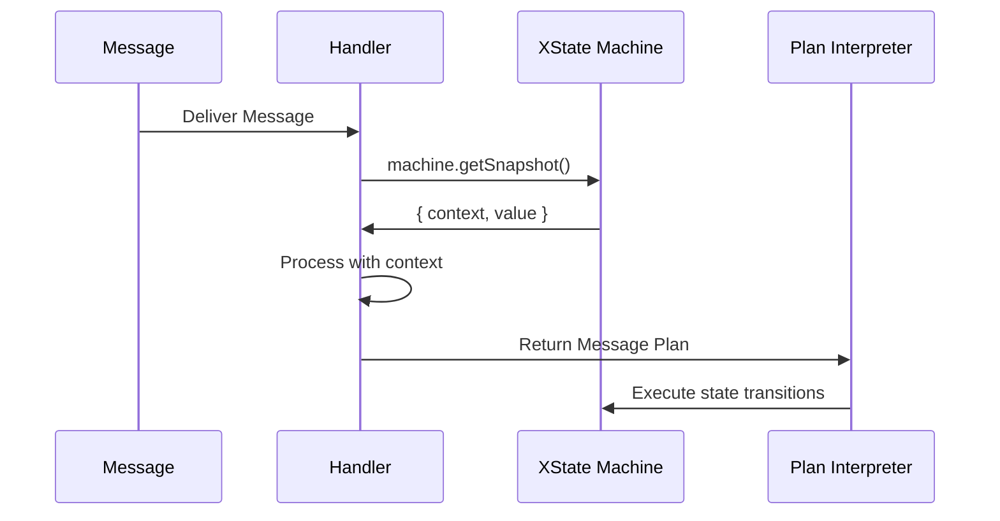

# Design Document: Pure Actor Context Fix

## Architecture Overview

The design removes the `context` parameter from all actor behavior handlers, ensuring that ALL state lives exclusively in XState machines. This aligns the framework with pure actor model principles where behaviors are stateless message transformers.

```mermaid
graph TB
    A[Message Arrives] --> B[onMessage Handler]
    B --> C{Access State?}
    C -->|Yes| D[machine.getSnapshot().context]
    C -->|No| E[Process Message Only]
    D --> F[Return Message Plan]
    E --> F
    F --> G[Runtime Executes Plan]
    
    style B fill:#e1f5fe
    style D fill:#ffebee
```

### Key Architectural Changes

1. **Behavior Interface**: Remove context from all handler signatures
2. **State Access**: All state accessed via `machine.getSnapshot().context`
3. **No Behavior State**: Behaviors become pure functions
4. **Type Safety**: Leverage TypeScript to prevent context usage
5. **Interface Consolidation**: Merge redundant ActorBehavior and BehaviorActorConfig

## Component Design

### 1. Core Interfaces to Update

#### Single ActorBehavior Interface (actor-system.ts)
```typescript
// BEFORE - Two redundant interfaces
export interface ActorBehavior<TMessage, TContext, TEmitted> {
  context?: TContext;
  onMessage(params: {
    message: TMessage;
    context: TContext;
  }): Promise<ActorBehaviorResult<TContext, TEmitted>>;
  onStart?(params: { context: TContext }): Promise<ActorBehaviorResult<TContext, TEmitted>>;
  onStop?(params: { context: TContext }): Promise<void>;
  supervisionStrategy?: SupervisionStrategy;
}

// AND
export interface BehaviorActorConfig<TMessage, TContext, TEmitted> {
  types?: { /* ... */ };
  context?: TContext;
  onMessage: (params: {
    message: TMessage;
    context: TContext;
  }) => Promise<ActorBehaviorResult<TContext, TEmitted>> | ActorBehaviorResult<TContext, TEmitted>;
  // ... same as above but with sync/async union types
}

// AFTER - Single unified interface
export interface ActorBehavior<TMessage, TEmitted> {
  // No context field - state lives in XState machine
  
  // Optional type hints for better DX (from BehaviorActorConfig)
  types?: {
    message?: TMessage;
    emitted?: TEmitted;
  };
  
  onMessage(params: {
    message: TMessage;
    machine: Actor<AnyStateMachine>;
    dependencies?: ActorDependencies;
  }): MessagePlan<TEmitted> | Promise<MessagePlan<TEmitted>>;
  
  onStart?(params: {
    machine: Actor<AnyStateMachine>;
    dependencies?: ActorDependencies;
  }): MessagePlan<TEmitted> | Promise<MessagePlan<TEmitted>>;
  
  onStop?(params: {
    machine: Actor<AnyStateMachine>;
    dependencies?: ActorDependencies;
  }): void | Promise<void>;
  
  supervisionStrategy?: SupervisionStrategy;
}
```

### 2. Functions to Update

#### defineBehavior (define-behavior.ts)
- Remove context parameter from all handler signatures
- Remove context field from configuration
- Update type parameters to remove TContext
- Remove BehaviorActorConfig type - just use ActorBehavior
- Ensure backward compatibility warnings

#### createActor (create-actor.ts)
- Remove createActorFromBehavior function (no conversion needed)
- Remove BehaviorActorConfig interface entirely
- Update type guards to work with unified interface
- Simplify the implementation

#### processEnhancedBehaviorResult (define-behavior.ts)
- Remove context handling logic
- Simplify to only process message plans
- Remove legacy behavior result support that includes context

### 3. Component Integration Updates

#### ComponentBehaviorConfig (component-behavior.ts)
- Already doesn't expose context directly (uses machine)
- Verify no hidden context dependencies
- Update examples and documentation
- Ensure it extends the simplified ActorBehavior

#### createComponent (create-component.ts)
- Ensure adapter correctly maps between APIs
- Remove any context passing between layers
- Use the unified ActorBehavior interface

### 4. Test Updates Required

All test files that mock behaviors need updating:
- Remove context from mock behaviors
- Update expectations to use machine.getSnapshot().context
- Add tests for migration warnings
- Remove tests for BehaviorActorConfig conversion

## Data Flow

### State Access Pattern



### Key Points
1. **Single Source of Truth**: XState machine holds all state
2. **Read-Only Access**: Handlers can read but not directly modify state
3. **Message Plans**: State changes happen through returned message plans
4. **No Side Effects**: Handlers are pure functions
5. **Unified Interface**: One behavior interface for all actors

## API Contracts

### Unified Handler Signature
```typescript
type MessageHandler<TMessage, TEmitted> = (params: {
  readonly message: TMessage;
  readonly machine: Actor<AnyStateMachine>;
  readonly dependencies?: ActorDependencies;
}) => MessagePlan<TEmitted> | Promise<MessagePlan<TEmitted>>;
```

### State Access Pattern
```typescript
// How to access state in the new pattern
const currentCount = machine.getSnapshot().context.count;
const isActive = machine.getSnapshot().value === 'active';
```

### Simplified Type System
```typescript
// Before: Confusing dual interfaces
const config: BehaviorActorConfig<Msg, Ctx, Emit> = { /* ... */ };
const behavior: ActorBehavior<Msg, Ctx, Emit> = defineBehavior(config);

// After: Single interface
const behavior: ActorBehavior<Msg, Emit> = {
  onMessage({ message, machine }) {
    const ctx = machine.getSnapshot().context;
    return { type: 'SOME_EVENT' };
  }
};
```

## Technology Choices

### TypeScript Strict Mode
- Use discriminated unions for handler types
- Leverage `never` type to catch legacy usage
- Conditional types for migration compatibility
- Single interface reduces type complexity

### Compatibility Layer
- Use Proxy pattern for gradual migration
- Runtime warnings in development mode
- Compile-time deprecation notices
- Helper to normalize old configs to new interface

### Testing Strategy
- Snapshot testing for behavior changes
- Integration tests for component behaviors
- Type tests for API contracts
- Verify interface consolidation works

## Risk Assessment

### High Risk
1. **Breaking Changes**
   - **Risk**: Existing code stops working
   - **Mitigation**: Compatibility layer with warnings
   - **Detection**: Comprehensive test suite
   - **Additional**: Interface consolidation is a breaking change

2. **Hidden Dependencies**
   - **Risk**: Code assumes context exists
   - **Mitigation**: TypeScript will catch most cases
   - **Detection**: Runtime checks in development

### Medium Risk
1. **Performance Impact**
   - **Risk**: Extra getSnapshot() calls
   - **Mitigation**: XState caches snapshots efficiently
   - **Detection**: Performance benchmarks

2. **Migration Friction**
   - **Risk**: Developers resist changes
   - **Mitigation**: Clear benefits documentation
   - **Detection**: Community feedback
   - **Additional**: Simpler API with one interface reduces confusion

### Low Risk
1. **Documentation Lag**
   - **Risk**: Docs don't match implementation
   - **Mitigation**: Update docs in same PR
   - **Detection**: Doc tests

## Implementation Phases

### Phase 1: Core Updates
1. Update interface definitions (consolidate to single ActorBehavior)
2. Remove BehaviorActorConfig entirely
3. Modify defineBehavior implementation
4. Add deprecation warnings

### Phase 2: Test Updates
1. Update test utilities
2. Fix failing tests
3. Add migration tests
4. Remove BehaviorActorConfig tests

### Phase 3: Documentation
1. Update API documentation
2. Create migration guide
3. Update all examples
4. Document interface consolidation benefits

### Phase 4: Compatibility
1. Implement compatibility layer
2. Add runtime warnings
3. Create codemod tool
4. Normalize old configs to new interface

## Validation Strategy

### Type Safety
```typescript
// This should fail to compile
const behavior = defineBehavior({
  context: { count: 0 }, // Error: 'context' does not exist
  onMessage({ context }) { // Error: no 'context' parameter
    return { context };
  }
});

// This should work
const behavior: ActorBehavior<MyMessage, MyEvent> = {
  onMessage({ message, machine }) {
    const context = machine.getSnapshot().context;
    return { type: 'RESPONSE', data: context.value };
  }
};
```

### Runtime Checks
```typescript
// Development mode warning for old patterns
if (process.env.NODE_ENV === 'development') {
  if ('context' in config) {
    console.warn('ActorBehavior.context is deprecated. Use XState machine context instead.');
  }
  // Check for BehaviorActorConfig pattern
  if (config.types && !config.machine) {
    console.warn('BehaviorActorConfig is deprecated. Use ActorBehavior directly.');
  }
}
```

### Migration Assistant
```typescript
// Codemod transforms this:
const config: BehaviorActorConfig<M, C, E> = {
  types: { message: {} as M, context: {} as C, emitted: {} as E },
  context: { count: 0 },
  onMessage({ message, context }) {
    return { context: { ...context, count: context.count + 1 } };
  }
};

// Into this:
const behavior: ActorBehavior<M, E> = {
  types: { message: {} as M, emitted: {} as E }, // context type removed
  onMessage({ message, machine }) {
    const context = machine.getSnapshot().context;
    return { type: 'INCREMENT' };
  }
};
```

## Benefits of Consolidation

1. **Simpler Mental Model**: One interface to learn instead of two
2. **Less Code**: Remove conversion functions and duplicate types
3. **Better DX**: No confusion about which interface to use
4. **Type Safety**: Fewer type conversions mean fewer places for errors
5. **Easier Migration**: One interface to update instead of two

---

**Design Approval Required**: This design must be reviewed for technical feasibility before proceeding to task list creation. 